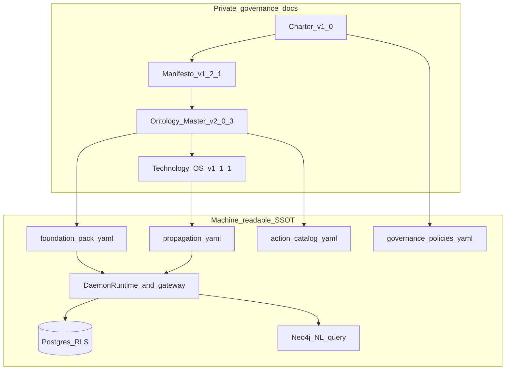

# Client definition from governance sources

## Goal

Produce a **client-ready definition pack** (scope, semantic model, operating model, governance obligations, and platform commitments) derived from the four attached sources, grounded in the **current daemon-sdk implementation**. Sources (versions from filenames):

| File | Role (per [docs/08-semantic-governance-alignment.md](docs/08-semantic-governance-alignment.md)) |
|------|--------------------------------|
| `Charter_ABC_Express_Group_v1_0.docx` | Highest precedence — mandate, boundaries, accountability |
| `Manifesto_ABC_Express_v1_2_1.docx` | Product principles and non-negotiables |
| `Ontology_Master_v2_0_3.pdf` | Tier 0A — entities, relations, junctions, action catalog |
| `Technology_OS_v1_1_1.pdf` | Operational layer — propagation, DAEMON vs ops systems |

**NDA constraint:** Keep counterparty names and document bodies in **gitignored** paths only. Public repo updates are limited to generic version pins and existing mapping tables in [docs/08-semantic-governance-alignment.md](docs/08-semantic-governance-alignment.md) (no new confidential prose in committed files).

## Current repo baseline (what “definition” can point to)

Implementation already aligns at a **foundation-first, sector-agnostic** level:



| Layer | Repo anchor |
|-------|-------------|
| Foundation entities | [configs/ontology/packs/foundation/](configs/ontology/packs/foundation/) — `Party`, `Organization`, `Case`, `Event`, `Link`, `Document` |
| Relations / junctions | [relations/Link.yaml](configs/ontology/packs/foundation/relations/Link.yaml), [junctions/CaseEvent.yaml](configs/ontology/packs/foundation/junctions/CaseEvent.yaml) |
| Propagation | [configs/governance/propagation.yaml](configs/governance/propagation.yaml) — `PropagationExecutor` wired in gateway |
| Governed actions | [configs/governance/action-catalog.yaml](configs/governance/action-catalog.yaml) + `@PolicyCheck` on gateway (incl. `ontology-nl`) |
| Policies / approvals | [configs/policies/governance-policies.yaml](configs/policies/governance-policies.yaml) |
| Public mapping doc | [docs/08-semantic-governance-alignment.md](docs/08-semantic-governance-alignment.md) |
| NL competency | [docs/09-ontology-competency-questions.md](docs/09-ontology-competency-questions.md), [docs/10-neo4j-graph-model.md](docs/10-neo4j-graph-model.md) |

The definition work is **not** a greenfield build; it is **interpretation + traceability** from client documents → what the platform **is**, **does**, and **does not** promise.

---

## Phase 1 — Private document vault (your chosen storage)

1. Add [`.gitignore`](.gitignore) entries:
   - `docs/private/**` (entire tree)
   - Optional: `docs/private/**/*.pdf`, `docs/private/**/*.docx` as explicit patterns

2. Scaffold (committed, non-confidential stubs only):

```
docs/private/
  README.md              # explains layout; no client secrets
  sources/               # gitignored — user copies the 4 files here
  extracted/             # gitignored — text/markdown extractions
  client-definition/     # gitignored — deliverable markdown bundle
```

3. **You copy** the four files into `docs/private/sources/` with stable names matching the attachments (or symlinks). Agent pass then runs extraction (e.g. `pdftotext`, `pandoc` for DOCX) into `docs/private/extracted/` for diffable review.

4. Add a **document register** (in `docs/private/README.md` or `client-definition/00-document-register.md`):

| ID | Filename | Version | Precedence | Extraction status |
|----|----------|---------|------------|-------------------|
| DOC-01 | Charter … v1_0 | 1.0 | 1 | pending |
| DOC-02 | Manifesto … v1_2_1 | 1.2.1 | 2 | pending |
| DOC-03 | Ontology Master … v2_0_3 | 2.0.3 | 3 | pending |
| DOC-04 | Technology OS … v1_1_1 | 1.1.1 | 4 | pending |

---

## Phase 2 — Extract and normalize (read-only analysis)

For each source, produce a **structured outline** in `docs/private/extracted/`:

- **Charter / Manifesto:** scope, stakeholders, success criteria, constraints, explicit out-of-scope
- **Ontology Master:** Tier 0A inventory — entity types, attributes, relations, junctions, action catalog entries, competency-style questions if present
- **Technology OS:** propagation triggers, surfaces (read models, audit, graph), role split (semantic control plane vs operational systems), tenant/domain rollout rules

Cross-check against repo:

- Flag **logistics-specific** or sector labels in PDFs that must **not** land in public `foundation` pack (per docs/08) — route to optional `configs/ontology/packs/extensions/<packId>/` only if client approves a separate extension pack (e.g. existing `aml-compliance` pattern in [ontology/packs/extension-pack-id.ts](ontology/packs/extension-pack-id.ts)).

---

## Phase 3 — Client definition deliverables (primary output)

Author under `docs/private/client-definition/` (exportable to PDF/DOCX for the client; stays private):

| Deliverable | Purpose |
|-------------|---------|
| `00-executive-summary.md` | One-page: what DAEMON semantic platform delivers for the engagement |
| `01-governance-precedence.md` | Charter > Manifesto > Ontology Master > Technology OS; conflict resolution |
| `02-manifesto-commitments.md` | Principles → measurable platform behaviors (audit, policy, tenancy, no silent writes) |
| `03-semantic-model-definition.md` | Business definitions of foundation types + properties; mapping table Ontology Master concepts → `foundation` YAML |
| `04-operating-model-definition.md` | Technology OS v1.1.1 → propagation surfaces, ingest/read/write/automation paths; diagram aligned with [docs/01-end-to-end-architecture.md](docs/01-end-to-end-architecture.md) |
| `05-governed-actions-and-policy.md` | Action catalog + production policy (`POLICY_ENGINE_URL`, fail-closed) — cite [docs/05-security-governance.md](docs/05-security-governance.md) |
| `06-data-authority-and-tenancy.md` | Semantic SSOT (YAML/CI) vs operational SSOT (Postgres/RLS/Neo4j); headers `X-Daemon-Tenant` / `X-Daemon-Domain` |
| `07-competency-and-query-scope.md` | NL query scope tied to [docs/09](docs/09-ontology-competency-questions.md) / [docs/10](docs/10-neo4j-graph-model.md) |
| `08-gap-and-roadmap-register.md` | Explicit **in scope / deferred / not in platform** (extension packs, sector entities, Palantir parity, etc.) |
| `09-traceability-matrix.csv` | Row per OM/TOS concept: document section → repo path → test/CI check → status |

**Tone:** Client-facing definitions (what things *mean* and *how they behave*), not implementation tickets. Implementation gaps live only in `08` and `09`.

---

## Phase 4 — Minimal public repo touch (optional, post-review)

Only after you approve private wording:

- Update [docs/08-semantic-governance-alignment.md](docs/08-semantic-governance-alignment.md) **version pin row** (generic labels, no counterparty name):

  - Ontology Master **v2.0.3** (internal)
  - Technology OS **v1.1.1** (internal)

- Do **not** commit PDFs/DOCX or client-definition bodies.

If Ontology Master v2.0.3 requires **new** foundation fields or propagation rules beyond current YAML, treat as a **separate implementation PR** (not part of the definition pack unless you explicitly expand scope).

---

## Validation checklist (definition complete)

- [ ] All four sources extracted and registered under `docs/private/sources/`
- [ ] Precedence rules documented and consistent with docs/08 tier table
- [ ] Every Tier 0A entity/relation/junction in Ontology Master is either mapped to `foundation` or listed in gap register with rationale
- [ ] Every Technology OS propagation concept maps to a rule in `propagation.yaml` or gap register
- [ ] Charter/Manifesto obligations map to gateway policy, audit, governance-policies, or explicit non-goal
- [ ] No confidential content in `git status` (only `.gitignore` + `docs/private/README.md` committed)
- [ ] Client can read `00`–`08` without opening the monorepo

---

## Execution order (after plan approval)

1. Scaffold `docs/private/` + `.gitignore`
2. You place files in `docs/private/sources/`
3. Extract text → outlines → client-definition bundle
4. Review gap register with you; optional follow-up PR for YAML/config deltas

No commits of governance PDFs/DOCX or client deliverables to `main`.
