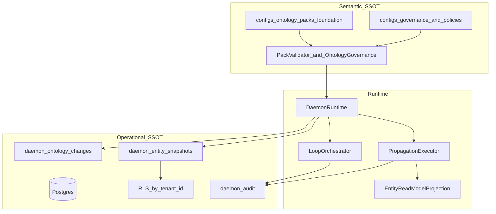

# Full commercial ontology governance and SSOT

## Current state (baseline)

You already have a **machine-readable semantic layer** documented in [docs/08-semantic-governance-alignment.md](docs/08-semantic-governance-alignment.md): foundation pack YAML, domain catalog, `propagation.yaml`, `action-catalog.yaml`, multi-tenant/domain headers, pack validation on ingest, and CI (`check:ontology-pack`, `check:tenancy-config`).

Durability v1 adds **operational persistence** when `DAEMON_POSTGRES_URL` is set: [data-platform/migrations/001_init.sql](data-platform/migrations/001_init.sql) (`daemon_entity_snapshots`, `daemon_audit`), [ontology/store/durable-ontology-store.ts](ontology/store/durable-ontology-store.ts), replay via [api/gateway/src/platform/daemon-runtime.ts](api/gateway/src/platform/daemon-runtime.ts).

**Gaps vs “full commercial”** (foundation-first, per your choice):

| Area | Today | Commercial target |
|------|--------|-------------------|
| Semantic SSOT | Entity YAML only; no `relations/` | Relations + junction rules in pack; validator enforces them |
| Technology OS propagation | [ontology/governance/ontology-governance.ts](ontology/governance/ontology-governance.ts) loads rules; **never executes** them | Register/patch drives projection refresh + audit surfaces per rule |
| Projections | [ontology/projections/read-models/entity-read-model.ts](ontology/projections/read-models/entity-read-model.ts) exists; **not wired** in gateway | `DaemonRuntime` owns read-model projection; reads can use it |
| Governance policies | [configs/policies/governance-policies.yaml](configs/policies/governance-policies.yaml) documented in [docs/05-security-governance.md](docs/05-security-governance.md); **not wired** | `assertSchemaChange` + approval gate for breaking pack/field changes |
| Extension packs | Catalog lists `aml-compliance`; [ontology/packs/pack-resolver.ts](ontology/packs/pack-resolver.ts) only returns foundation | **Deferred** to follow-up PR |
| Operational SSOT | Snapshots + best-effort journal upsert; in-memory default without env | Postgres authoritative in prod profile; **RLS** on tenant; optional append-only change log |
| Graph / relations at rest | `daemon_graph_edges` table unused | Link/register paths persist edges scoped by tenant/domain |

Architecture target from [.cursor/plans/sempurnakan_arsitektur_bc_ee86870a.plan.md](.cursor/plans/sempurnakan_arsitektur_bc_ee86870a.plan.md): semantic **~55–65%** done; this epic aims **~80–85%** on governance/SSOT and **operational SSOT ready for multi-tenant production**, without Palantir parity or `schema-per-tenant` (W3 DB item stays follow-up).

---

## Phase 1 — Foundation relations and junction SSOT

**Goal:** Pack is the authority for **entities + relations + junction constraints**, not only entity field models.

1. **Pack layout** under [configs/ontology/packs/foundation/](configs/ontology/packs/foundation/):
   - Add `relations/Link.yaml` (or split `Association` if you prefer) defining allowed `from`/`to` entity types and cardinality.
   - Add `junctions/` (e.g. `CaseEvent.yaml`) for Case↔Event many-to-many rules aligned with Ontology Master Tier 0A patterns in [docs/08-semantic-governance-alignment.md](docs/08-semantic-governance-alignment.md).

2. **Loader** — extend [ontology/packs/load-pack.ts](ontology/packs/load-pack.ts):
   - Parse relations/junctions into typed models (new small modules under `ontology/models/relations/` if needed).
   - Expose on `LoadedOntologyPack`: `relations`, `junctions`.

3. **Validator** — extend [scripts/validate-ontology-pack.mjs](scripts/validate-ontology-pack.mjs) and [tests/ontology/pack-compliance.test.ts](tests/ontology/pack-compliance.test.ts):
   - Junction endpoints reference declared entity types.
   - No orphan relation/junction files.
   - Semver in [configs/ontology/packs/foundation/pack.yaml](configs/ontology/packs/foundation/pack.yaml) bumped on structural changes.

4. **Runtime validation** — extend [ontology/governance/ontology-governance.ts](ontology/governance/ontology-governance.ts):
   - `validateRelation(...)` / `validateJunction(...)` called from ingest when `entityType === "Link"` or junction payloads are introduced (start with Link-only if junction ingest API is not ready).

---

## Phase 2 — Propagation engine (Technology OS)

**Goal:** `propagation.yaml` is executable policy, not documentation.

1. **New** `ontology/governance/propagation-executor.ts`:
   - Input: `{ trigger: "register" | "patch", record, scope }`.
   - Match rules from [configs/governance/propagation.yaml](configs/governance/propagation.yaml).
   - For `read-model-projection`: update attached projection.
   - For `audit-loop`: emit structured audit event (reuse `AuditPort`).

2. **Wire in** [api/gateway/src/platform/daemon-runtime.ts](api/gateway/src/platform/daemon-runtime.ts):
   - Construct `EntityReadModelProjection` once; `attach(registry)` on store inner registry (works with `DurableOntologyStore` delegating to same registry).
   - After successful `register`/`patch` (ingest path + `runWriteLoop`), call `PropagationExecutor.run(...)`.
   - Optional: route [read-write-loops/reads/read-router.ts](read-write-loops/reads/read-router.ts) list/get through projection for `foundation` reads (feature flag env `DAEMON_READ_FROM_PROJECTION=1` for safe rollout).

3. **Tests:**
   - Unit: patch updates projection row (existing pattern in [ontology/projections/read-models/entity-read-model.test.ts](ontology/projections/read-models/entity-read-model.test.ts)).
   - Integration: gateway or in-process runtime — register → projection contains entity; patch → property visible in projection.

---

## Phase 3 — Commercial governance gates (schema / pack changes)

**Goal:** [configs/policies/governance-policies.yaml](configs/policies/governance-policies.yaml) drives runtime, especially `approvalGates` for `schema-change`.

1. **Load governance policies** in `OntologyGovernance` (or `GovernancePolicyLoader` beside it) from `configs/policies/governance-policies.yaml`.

2. **Implement** `assertSchemaChange(packId, change: { type: "field_add" | "field_remove" | "type_rename", ... })`:
   - Breaking changes → require approval metadata (integrate with [read-write-loops/loop-controller/approval-gates.ts](read-write-loops/loop-controller/approval-gates.ts) or return `DaemonError` with obligation `collect-approvals`).
   - Non-breaking (minor semver) → allow with audit event `ontology.schema.change`.

3. **Admin-only path** (minimal commercial surface):
   - CLI or internal REST stub: `POST /v1/governance/pack/validate-change` (dev auth) — validates proposed YAML diff against gates; document in OpenAPI later.
   - For this epic, **CLI** via `@daemon/cli` is enough if REST scope is large.

4. **Audit alignment:** extend [security-governance/audit/postgres-audit-log.ts](security-governance/audit/postgres-audit-log.ts) actions: `ontology.register`, `ontology.patch`, `ontology.schema.change`, `propagation.applied`.

5. **Docs:** update [docs/05-security-governance.md](docs/05-security-governance.md) with “wired” vs “config-only” table; cross-link [docs/08-semantic-governance-alignment.md](docs/08-semantic-governance-alignment.md).

---

## Phase 4 — Operational SSOT (Postgres commercial)

**Goal:** With Postgres enabled, **no silent in-memory drift**; tenant isolation enforced at DB layer.

1. **Migration** `002_governance_ssot.sql`:
   - `daemon_ontology_changes` — append-only: `tenant_id`, `domain_id`, `ontology_id`, `entity_id`, `change_type`, `payload` JSONB, `pack_version`, `at`.
   - Alter `daemon_graph_edges`: add `tenant_id`, `domain_id`; unique key includes scope.
   - Enable **RLS** on `daemon_entity_snapshots`, `daemon_audit`, `daemon_ontology_changes` using `current_setting('app.tenant_id')` pattern (document session var set in [data-platform/operational-store/](data-platform/operational-store/) client wrapper).

2. **Journal hardening** — [data-platform/operational-store/entity-journal.ts](data-platform/operational-store/entity-journal.ts):
   - Await upsert in `DurableOntologyStore.persist` in production mode (or queue with backpressure); today fire-and-forget `.catch(() => undefined)` is not commercial-grade.
   - Insert into `daemon_ontology_changes` on each register/patch.

3. **Graph persistence** — when registering `Link` entities, upsert into `daemon_graph_edges` with tenant/domain.

4. **Production profile** — [packages/cli](packages/cli) / [docs/06-deployment-topology.md](docs/06-deployment-topology.md):
   - Document: prod requires `DAEMON_POSTGRES_URL`; dev may use in-memory.
   - Optional: `DAEMON_SSOT_MODE=postgres|memory` with gateway refusing writes in `memory` when `NODE_ENV=production`.

5. **Tests:**
   - Integration: RLS — tenant A session cannot read tenant B snapshots (set `app.tenant_id` per connection).
   - Replay still passes [tests/integration/ontology-durability.integration.test.ts](tests/integration/ontology-durability.integration.test.ts) after journal await fix.

---

## Phase 5 — CI, docs, and definition of done

**CI additions:**
- `check:ontology-pack` validates relations/junctions.
- `check:governance-policies` (new script) — parses governance-policies + propagation + action-catalog consistency.
- `test:repo` includes propagation + RLS tests (skip when Postgres unreachable, same helper as today).

**Docs:**
- [docs/08-semantic-governance-alignment.md](docs/08-semantic-governance-alignment.md) — add “Commercial SSOT” section: semantic vs operational authority, what is still PDF-only.
- [docs/02-ontology-system.md](docs/02-ontology-system.md) — relations, projections, propagation flow.
- [docs/00-overview.md](docs/00-overview.md) — new milestone bullet after Durability.

**Definition of done (this epic):**
- Foundation pack includes relations + junctions; CI green.
- Register/patch triggers propagation targets in `propagation.yaml` (projection + audit-loop).
- `governance-policies.yaml` gates breaking schema changes with audit + approval obligation.
- Postgres path: awaited writes, change log table, RLS on tenant for snapshots/audit/changes; Link rows persist to graph table.
- Extension packs (`aml-compliance`) **explicitly out of scope** — follow-up PR on [ontology/packs/pack-resolver.ts](ontology/packs/pack-resolver.ts) + [configs/ontology/domains/catalog.yaml](configs/ontology/domains/catalog.yaml).

**Explicitly deferred (next epics):**
- Sector extension packs and `PackResolver.merge`.
- `schema-per-tenant` / full W3 propagation per domain extension.
- `security-governance/data-governance/` module from reference spec (lineage catalog, retention jobs).
- NATS/event backbone for ontology propagation.

---

## Suggested execution order

1. Phase 1 (pack + validator + Link validation) — unblocks semantic completeness.
2. Phase 4 migration + journal await (operational SSOT) — can parallelize with Phase 2 once pack stable.
3. Phase 2 (propagation + projection wire).
4. Phase 3 (governance-policies + schema gates).
5. Phase 5 (CI/docs/DoD).

Estimated touch areas: `configs/ontology/packs/foundation/**`, `ontology/packs/*`, `ontology/governance/*`, `api/gateway/src/platform/daemon-runtime.ts`, `data-platform/migrations/`, `data-platform/operational-store/`, `security-governance/audit/`, `tests/integration/`, `docs/08`, `docs/05`, `package.json` scripts.
