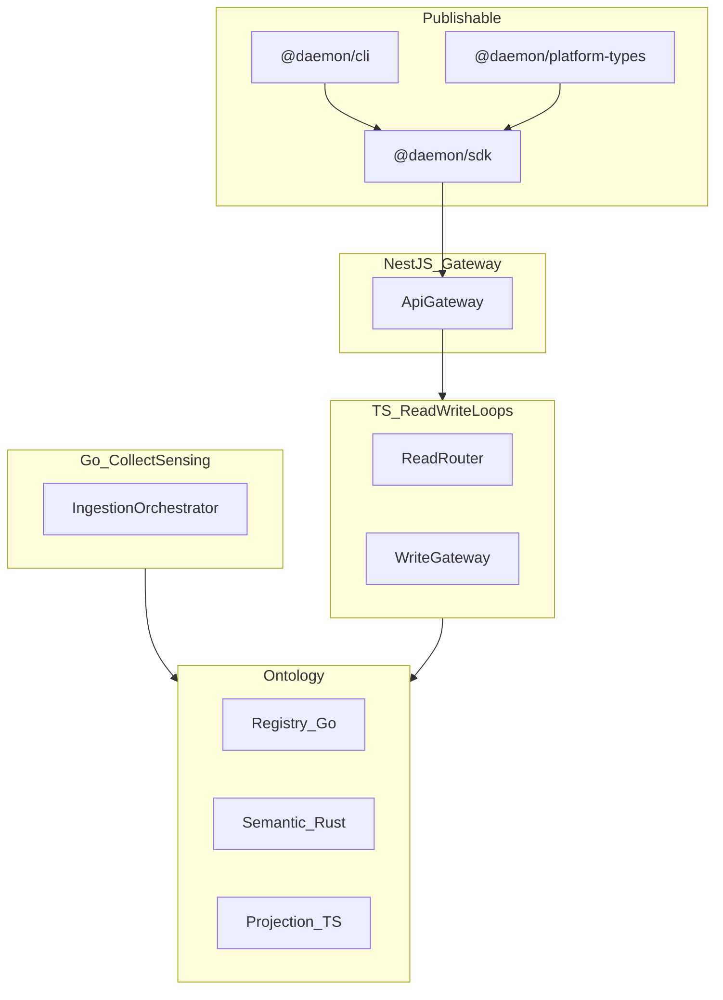

# Daemon ontology platform — full implementation plan

## Confirmed requirements (from clarifying Q&A)

| Decision | Your choice |
|----------|-------------|
| Repo layout | Monorepo tree at **root** of `daemon-sdk` (not nested `daemon-ontology-platform/`) |
| Done criteria | **Publishable npm packages** with versioning (Changesets) |
| Languages | **TypeScript + Go + Rust** — real code everywhere; **no stubs, no mocks, no filler** |
| API stack | **NestJS** gateway (`api/gateway`) |
| Spec file | Move to [`docs/reference/perplexity-architecture-spec.md`](docs/reference/perplexity-architecture-spec.md) |
| Scope | **Every file** in the merged spec tree (lines 839–1070) must exist and contain real implementations |
| npm phase 1 | **`@daemon/platform-types`**, **`@daemon/sdk`** (TS), **`@daemon/cli`** |

### Quality bar (non-negotiable)

- No placeholder files, `pass`-through handlers, or `// TODO` scaffolding committed as “implementation”.
- No `jest.mock` / in-memory fake stores for **integration or e2e** tests; use **testcontainers** (Postgres, Redis, NATS/Kafka where needed) or embedded engines (e.g. SQLite for dev-only with explicit env flag).
- No duplicate “AI slop” layers (redundant wrappers, unused abstractions, comment-only modules).
- Each module must compile, have at least one **behavioral test**, and respect **bounded-context rules** from the spec (lines 1316–1321).

## Context

- Source: [`Buat Susunan folder &amp; file dari input gambar t.md`](Buat Susunan folder &amp; file dari input gambar t.md) — merged tree + end-to-end Mermaid (1077–1280) + service/language split (1297–1310).
- Current repo: spec markdown only.

## Target layout (repo root)

Same domain map as before; every path from spec lines 839–1070 is created with the **filename extension implied by role**:

| Domain | Primary runtime | Notes |
|--------|-----------------|--------|
| `collect-sensing/` | **Go** | orchestrator, connectors, normalization, pipelines |
| `ontology/registry`, graph-heavy | **Go** + **Rust** | registry/versioning (Go); semantic/vector/graph (Rust) |
| `ontology/` TS-listed files | **TypeScript** | registry facades, projections API-facing |
| `read-write-loops/`, `action-runtime/`, `api/`, `products/` | **TypeScript** | NestJS, agents, workflows |
| `security-governance/policy`, `trust` | **Rust** + **Go** | policy engine (Rust); authn/federation hooks (Go) |
| `security-governance/` audit, guardrails (TS names in spec) | **TypeScript** | integrates with NestJS |
| `engine/` | **Rust** (core) + **Go/TS** shims | data/logic/action/security engines |
| `toolchain/sdk/` | **ts**, **go**, **rust**, **python** per spec folders |
| `language/` | Spec formats + **real parsers/validators** (not markdown-only) |
| `deployment/`, `observability/` | Real configs (Helm values, OTel, Prometheus rules) |

## Monorepo tooling

- **Node**: pnpm workspaces + Turborepo; **NestJS** app at `api/gateway`.
- **Go**: root `go.work` including modules under `collect-sensing/`, `toolchain/sdk/go`, selected `security-governance/`, `external-systems/`.
- **Rust**: root `Cargo.workspace` for `ontology/semantic-layer`, `ontology/vector-layer`, `engine/*`, `security-governance/policy`, `toolchain/sdk/rust`.
- **Changesets** for `@daemon/platform-types`, `@daemon/sdk`, `@daemon/cli` (private registry vs npmjs.com documented in README — no secrets in repo).
- **CI**: matrix job — `pnpm build/test`, `go test ./...`, `cargo test --workspace`; YAML config validation; optional `docker compose` integration job.

## Publishable packages

| Package | Responsibility |
|---------|----------------|
| `@daemon/platform-types` | Shared types: session, command envelope, ontology IDs, policy decision, error codes |
| `@daemon/sdk` | HTTP/gRPC clients for read/write/ingest APIs; config loading from `configs/` |
| `@daemon/cli` | `validate-config`, `ontology lint`, `local dev up` (compose), operator commands |

Gateway (`api/gateway`) stays **private** application package; SDK consumes its OpenAPI/contract.

## NestJS API gateway

- Modules aligned to boundaries: `HealthModule`, `ReadModule`, `WriteModule`, `IngestModule` (proxy to Go), `AuthModule` (policy check via Rust/TS policy client).
- Global guards: authn + policy from `security-governance` (real clients, not mocks).
- GraphQL optional sub-app under `api/graphql` if listed in spec; REST `/v1/*` required first.

## Documentation

Eight `docs/0x-*.md` files + Mermaid from spec; [`docs/07-sequence-flows.md`](docs/07-sequence-flows.md) with sequence diagrams for ingest → read → write → external write.

Relocate original spec → `docs/reference/perplexity-architecture-spec.md`.

## Configs

`configs/*.yaml` — **validated** by CLI (`@daemon/cli validate-config`); schemas in `language/` or `packages/platform-types`.

## Tests (no mocks)

| Suite | Approach |
|-------|----------|
| `tests/contract` | Pact or OpenAPI contract tests against running gateway |
| `tests/integration` | docker-compose: Postgres, Redis, NATS; real wire calls |
| `tests/policy` | Fixture YAML + real policy engine binary/lib |
| `tests/ontology` | Registry + semantic round-trip on test DB |
| `tests/e2e` | Full path: ingest (Go) → ontology → read (TS) → write (TS) → audit log |

## Milestones (execution order)

Because “every file, three languages, no mocks” is large, implementation proceeds in **dependency order** within one program of work (multiple PRs/sessions):

### M1 — Foundation

- Root tooling, docs, configs, `language/*` validators, `engine/*` minimal runnable engines, `data-platform/*` store clients (Postgres, Redis, graph/vector adapters with real drivers), `packages/platform-types`, Changesets.

### M2 — Ingest + ontology core

- Go: `collect-sensing` end-to-end ingest → canonical events.
- Go/Rust/TS: `ontology/registry`, models, semantic + vector pipelines, projections.

### M3 — Read/write + security

- TS: `read-write-loops` (read-router, write-gateway, loop-controller, external-writes).
- Rust/Go/TS: `security-governance` (IAM hooks, policy, audit, guardrails).

### M4 — Action + API + products

- TS: `action-runtime`, `products/*`, `external-systems` adapters.
- **NestJS** `api/gateway` wiring to M2/M3 services.
- `@daemon/sdk` + `@daemon/cli` complete against live gateway.

### M5 — Ops + toolchain + full tree completion

- `toolchain/*` (CLI plugins, SDKs in four langs), `observability/*`, `deployment/*`, remaining `sources/*` catalogs, all `tests/*` green without mocks.

## Explicitly out of scope (unless you add later)

- Production OIDC tenant / real SAP-Snowflake credentials.
- Hosted cloud apply of Terraform (configs only + `terraform validate`).
- Legal/compliance sign-off on ontology content.

## Risks

- **Scope vs time**: “Everything × 3 languages × no mocks” is multi-month team scale; milestones keep ordering clear; flag blockers per domain in `docs/00-overview.md`.
- **Repo name**: README explains `daemon-sdk` hosts the full ontology platform.
- **NDA**: Public docs stay generic; no counterparty names.

## How to proceed

Reply **`execute the plan`** (or **`go`**) when you want implementation to start. Until then, plan mode stays read-only.
