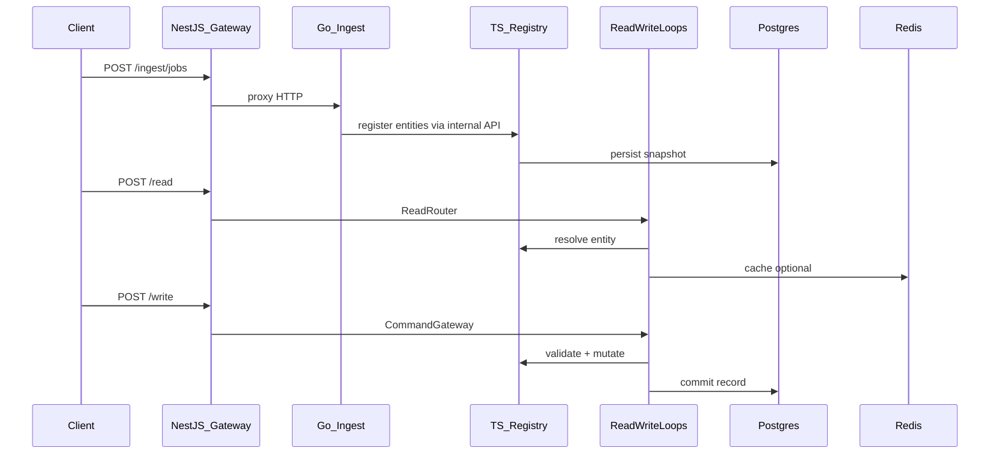

# Daemon platform — strict gap-completion plan

You chose **full strict** completion against the original scaffold plan ([`daemon_ontology_scaffold_54d985e8.plan.md`](file:///Users/macbook/.cursor/plans/daemon_ontology_scaffold_54d985e8.plan.md) — do not edit) and [`docs/reference/perplexity-architecture-spec.md`](docs/reference/perplexity-architecture-spec.md) tree (839–1070).

## Current state (baseline)

**Working today**

- Monorepo tooling: [`package.json`](package.json), [`pnpm-workspace.yaml`](pnpm-workspace.yaml), [`turbo.json`](turbo.json), [`.github/workflows/ci.yml`](.github/workflows/ci.yml)
- Publishable: [`packages/platform-types`](packages/platform-types), [`packages/sdk`](packages/sdk), [`packages/cli`](packages/cli)
- Core paths: [`read-write-loops/reads/read-router.ts`](read-write-loops/reads/read-router.ts), [`read-write-loops/writes/command-gateway.ts`](read-write-loops/writes/command-gateway.ts), [`read-write-loops/writes/mutation-validator.ts`](read-write-loops/writes/mutation-validator.ts), [`security-governance/policy-engine.ts`](security-governance/policy-engine.ts), [`action-runtime/workflow-engine/workflow-orchestrator.ts`](action-runtime/workflow-engine/workflow-orchestrator.ts), [`ontology/registry/ontology-registry.ts`](ontology/registry/ontology-registry.ts)
- Go ingest HTTP: [`collect-sensing/orchestrator/ingestion_orchestrator.go`](collect-sensing/orchestrator/ingestion_orchestrator.go) (`:8081`)
- NestJS gateway (partial): [`api/gateway/src/app.module.ts`](api/gateway/src/app.module.ts) — Health, Read, Write, Policy only
- Stores: [`data-platform/operational-store/postgres-client.ts`](data-platform/operational-store/postgres-client.ts), [`data-platform/cache/redis-client.ts`](data-platform/cache/redis-client.ts)

**Not meeting strict bar**

| Gap | Evidence |
|-----|----------|
| Empty bounded-context dirs | `products/`, `external-systems/`, `sources/`, `collect-sensing/connectors/*`, `ontology/models/*`, `ontology/projections/*`, `api/graphql`, `api/grpc`, `api/rest`, `api/websocket`, `toolchain/plugins/*` |
| Shell modules | ~27 `describe(): string` in [`read-write-loops`](read-write-loops), [`security-governance`](security-governance), [`action-runtime`](action-runtime) |
| Ontology stubs | 11 `U*` classes in [`ontology/semantic-layer`](ontology/semantic-layer), [`ontology/vector-layer`](ontology/vector-layer), [`ontology/logic-layer`](ontology/logic-layer), [`ontology/registry`](ontology/registry) |
| Language tree | Only [`language/data/schema-language/validator.ts`](language/data/schema-language/validator.ts); spec lists 16 sub-areas under `language/` |
| Gateway | No Ingest proxy, Auth, global guards; no alternate API apps |
| Tests | [`tests/e2e/ingest-read-write.test.ts`](tests/e2e/ingest-read-write.test.ts) in-process only; [`tests/contract/api-contract.test.ts`](tests/contract/api-contract.test.ts) not HTTP; [`tests/integration/stores.integration.test.ts`](tests/integration/stores.integration.test.ts) skips without env; **no** `tests/ontology/*` |
| CI | No compose-backed integration job |

## Target runtime (end-to-end)



## Implementation strategy

Use **extend existing automation** rather than hand-authoring 200+ files:

1. [`scripts/populate-spec-files.sh`](scripts/populate-spec-files.sh) — generate any missing spec paths with typed skeletons + co-located `*.test.ts` / `*_test.go` / `#[cfg(test)]`.
2. [`scripts/upgrade-domain-stubs.mjs`](scripts/upgrade-domain-stubs.mjs) — second pass: replace all `describe()` and remaining `U*` with the same pattern already used for ~38 modules (constructor `tag`, `run(input)`, deterministic output, Vitest/`node:test` or Go/Rust tests).
3. New **`scripts/spec-tree-manifest.json`** (or parse spec markdown section) — single source of truth for “file must exist” CI gate (`pnpm run spec:check`).

**Quality bar per module (repeatable template)**

- Export a class or pure functions with real branching (validation, state transition, or I/O adapter interface).
- At least one test asserting behavior change on input (not `expect(true).toBe(true)`).
- No `describe(): string` / `run(): string` placeholders in `src` (dist excluded).

---

## Phase 1 — Spec tree completeness + CI gate

**Goal:** Every path under spec 839–1070 exists and compiles.

- Extend [`scripts/bootstrap-tree.sh`](scripts/bootstrap-tree.sh) / `populate-spec-files.sh` to cover:
  - [`language/`](language/) — all `data/`, `logic/`, `action/`, `security/` subdirs (validators or parsers with YAML/JSON fixtures)
  - [`sources/`](sources/) — catalog types + connector config schemas (no live ERP credentials)
  - [`products/`](products/), [`external-systems/`](external-systems/) — product manifests + adapter interfaces per spec
  - [`collect-sensing/`](collect-sensing/) — TS files listed in spec (`ingestion-orchestrator.ts`, `source-registry.ts`, connectors, normalization, pipelines) **alongside** existing Go orchestrator
  - [`ontology/models/`](ontology/models/), [`ontology/projections/`](ontology/projections/)
  - [`read-write-loops/interfaces/`](read-write-loops/interfaces/) per spec
  - [`api/graphql`](api/graphql), [`api/grpc`](api/grpc), [`api/rest`](api/rest), [`api/websocket`](api/websocket) — minimal apps (GraphQL Yoga or `@nestjs/graphql` read-only schema; gRPC health + read stub; REST OpenAPI mirror; WS echo + event channel)
  - [`toolchain/plugins/`](toolchain/plugins/) — plugin host interface + one reference plugin
  - [`engine/`](engine/), [`data-platform/graph-store`](data-platform), vector, lakehouse, event-bus adapters per spec filenames
- Add root script `spec:check` in [`package.json`](package.json) failing CI if any manifest path missing.
- Wire new packages into [`pnpm-workspace.yaml`](pnpm-workspace.yaml) + [`turbo.json`](turbo.json) as needed.

---

## Phase 2 — Replace all shell TypeScript modules

**Goal:** Zero `describe(): string` in source; behavioral tests for each file.

| Area | Files to upgrade | Pattern |
|------|------------------|---------|
| read-write-loops | 11 modules (conflict-resolver, commit-manager, loop-controller, external-writes, reads helpers) | Wire to [`globalRegistry`](ontology/registry/ontology-registry.ts) + [`CommandGateway`](read-write-loops/writes/command-gateway.ts) where applicable |
| security-governance | 14 modules (identity, policy/rbac, guardrails, trust, audit helpers) | Delegate to [`policy-engine.ts`](security-governance/policy-engine.ts); Postgres audit backend in Phase 6 |
| action-runtime | 7 modules (agent-runtime, command-runtime helpers, compensation-handler) | Integrate with [`WorkflowOrchestrator`](action-runtime/workflow-engine/workflow-orchestrator.ts) |

Add **`read-write-loops/loop-controller/loop-orchestrator.ts`** implementation (spec names it; currently missing as behavior) orchestrating read → policy → write → optional external write.

---

## Phase 3 — Ontology depth (TS + Go + Rust)

**Goal:** Registry is system of record; semantic/vector/logic are functional, not stubs.

- Replace 11 `U*` classes in ontology TS layers with real logic (same upgrade script pattern).
- Add [`ontology/models/`](ontology/models/) entity/relation/event/state/trait types + registration API on [`ontology-registry.ts`](ontology/registry/ontology-registry.ts).
- Add [`ontology/projections/`](ontology/projections/) read-model builders fed from registry events.
- **Go:** new `ontology/registry/` package — HTTP CRUD mirroring TS registry semantics; used by ingest.
- **Rust:** expose semantic/vector crates via **FFI or sidecar HTTP** (pick one, document in [`docs/04-language-engine-toolchain.md`](docs/04-language-engine-toolchain.md)):
  - Recommended: thin HTTP shim in Rust (`:8082`) called from TS ingest normalization — avoids cgo complexity in CI.
- Add [`tests/ontology/registry.test.ts`](tests/ontology/) — namespace, version, entity lifecycle, projection refresh.

---

## Phase 4 — Collect-sensing: connectors + ingest → ontology

**Goal:** Real connector interfaces + ingest path in e2e.

- **Connectors** (TS or Go per spec folder):
  - `db-connectors`: Postgres read adapter using [`postgres-client`](data-platform/operational-store/postgres-client.ts)
  - `api-connectors`: HTTP pull with schema from [`sources/`](sources/)
  - `file-connectors`: JSONL/CSV ingest
  - `event-connectors`: NATS subscriber (compose service already in [`deployment/docker/compose.dev.yaml`](deployment/docker/compose.dev.yaml))
- **Normalization** (`canonical-mapper`, `schema-resolver`, `metadata-enricher`): map raw records → ontology entity payloads.
- **Pipelines** (`batch`, `stream`, `replay`): call orchestrator + normalization.
- Extend Go orchestrator: `POST /ingest/records` accepting batch → forward to TS registry internal endpoint (or Go registry).
- TS [`collect-sensing/orchestrator/ingestion-orchestrator.ts`](collect-sensing/orchestrator/ingestion-orchestrator.ts): facade coordinating Go job API + normalization.

---

## Phase 5 — NestJS gateway + API surfaces

**Goal:** Single entrypoint with auth/policy; optional API apps per spec.

Update [`api/gateway`](api/gateway):

- **`IngestModule`**: proxy to `DAEMON_INGEST_URL` (default `http://127.0.0.1:8081`)
- **`AuthModule`**: API-key or JWT dev mode from [`configs/platform.yaml`](configs/platform.yaml) / env — no production OIDC
- **Global guards**: `PolicyGuard` calling [`policy-engine`](security-governance/policy-engine.ts); `AuthGuard` on write/ingest
- **Wire modules** to workspace packages (`@daemon/read-write-loops`, `@daemon/ontology`) instead of duplicating logic

Additional apps (minimal but real):

- [`api/rest`](api/rest) — OpenAPI + same handlers as gateway
- [`api/graphql`](api/graphql) — Query `entity(id)`, `search(q)`
- [`api/grpc`](api/grpc) — proto + health + Read RPC
- [`api/websocket`](api/websocket) — job status stream from ingest

Update [`packages/sdk`](packages/sdk): load tenant/env from YAML; methods `ingest`, `subscribe` (WS URL); keep HTTP client tests with **mock HTTP server** only in sdk unit tests (allowed); platform integration tests use real compose.

Update [`packages/cli`](packages/cli): `dev up` runs `docker compose -f deployment/docker/compose.dev.yaml up -d` + health wait; `ontology lint` validates registry YAML + schema-language.

---

## Phase 6 — Data platform, audit, observability

**Goal:** No in-memory audit in integration path; stores used in e2e.

- Expand [`data-platform`](data-platform): graph-store adapter (in-memory **only** for unit tests; Postgres adjacency table for integration), vector adapter (calls Rust/TS vector HTTP), lakehouse writer interface, event-bus (NATS publish on write).
- Replace [`security-governance/audit/audit-log.ts`](security-governance/audit/audit-log.ts) with `PostgresAuditLog` when `DAEMON_POSTGRES_URL` set; keep in-memory for fast unit tests **outside** `tests/integration` and `tests/e2e`.
- [`observability/`](observability/): structured logger + metrics counters hooked in gateway middleware (Prometheus text endpoint optional).

---

## Phase 7 — Products, external-systems, sources, toolchain

**Goal:** Populate previously empty top-level contexts.

- **`sources/`**: typed connector manifests + validation CLI hook
- **`external-systems/`**: ERP/CRM/WMS **adapter interfaces** + fake in-repo “simulator” HTTP server for contract tests (not mock of domain logic — simulator is a test double **system**, per strict plan allowance for test harnesses)
- **`products/`**: at least one reference product package composing SDK + configs
- **`toolchain/plugins/`**: plugin manifest schema + loader; reference plugin registers one ontology entity type
- **Go/Rust SDK** ([`toolchain/sdk/go`](toolchain/sdk/go), [`toolchain/sdk/rust`](toolchain/sdk/rust)): parity methods with TS SDK (health, read, write)

---

## Phase 8 — Testing and CI (strict: no mocks in integration/e2e)

**Goal:** `pnpm run test:repo` exercises real services when compose is up.

| Test | Change |
|------|--------|
| [`tests/integration/stores.integration.test.ts`](tests/integration/stores.integration.test.ts) | Use **testcontainers** (Postgres + Redis) or documented `docker compose` prerequisite; remove silent skip when URL unset in CI job |
| New `tests/integration/gateway-http.test.ts` | Supertest against running `@daemon/api-gateway` |
| [`tests/e2e/ingest-read-write.test.ts`](tests/e2e/ingest-read-write.test.ts) | Start Go ingest + gateway (or test harness script); full chain ingest → read → write |
| [`tests/contract/api-contract.test.ts`](tests/contract/api-contract.test.ts) | Validate OpenAPI/JSON schema against live gateway responses |
| New `tests/ontology/*` | Registry + projection tests |
| Policy | [`tests/policy/policy-fixture.test.ts`](tests/policy/policy-fixture.test.ts) — extend fixtures from [`configs/policies/`](configs/policies/) |

**CI** ([`.github/workflows/ci.yml`](.github/workflows/ci.yml)):

- Job `integration`: `docker compose up -d`, wait health, `DAEMON_POSTGRES_URL` + `DAEMON_REDIS_URL` + `DAEMON_INGEST_URL`, run `pnpm run test:repo`
- Keep existing `build` + unit `test` jobs for fast feedback

---

## Phase 9 — Release and docs sync

- Run `changeset` for any public API changes to `@daemon/*`
- Update [`README.md`](README.md) and [`docs/06-testing.md`](docs/06-testing.md) with compose/testcontainers instructions
- Final verify:

```bash
pnpm run build && pnpm run test && pnpm run test:repo && pnpm run release:check
go test ./collect-sensing/... ./security-governance/... ./toolchain/sdk/go/...
cargo test --workspace
pnpm run spec:check
```

---

## Out of scope (unchanged)

- Production OIDC, real SAP/Oracle credentials, cloud Terraform apply, legal/compliance sign-off.

## Risk and sequencing note

Strict full-tree + all behavioral tests is large (~150+ new/changed files). Execute phases **1 → 8 sequentially**; do not merge Phase 8 until Phase 4–5 wire ingest/gateway, or integration tests will remain skipped.

## Key files to touch first (critical path)

1. [`scripts/populate-spec-files.sh`](scripts/populate-spec-files.sh) + `spec:check`
2. [`api/gateway/src/app.module.ts`](api/gateway/src/app.module.ts) — Ingest + Auth + guards
3. [`collect-sensing/orchestrator/ingestion_orchestrator.go`](collect-sensing/orchestrator/ingestion_orchestrator.go) — batch ingest endpoint
4. [`ontology/registry/ontology-registry.ts`](ontology/registry/ontology-registry.ts) — models + persistence hooks
5. [`.github/workflows/ci.yml`](.github/workflows/ci.yml) — compose integration job
