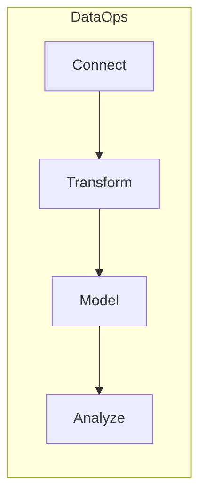
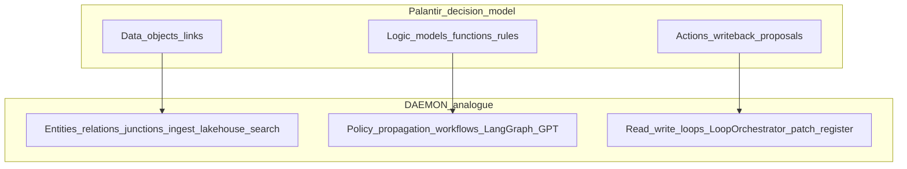
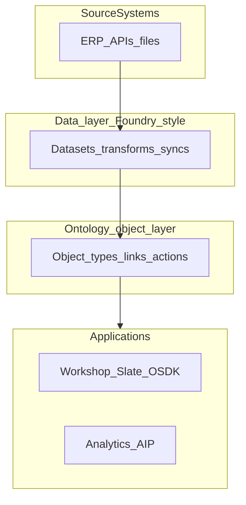
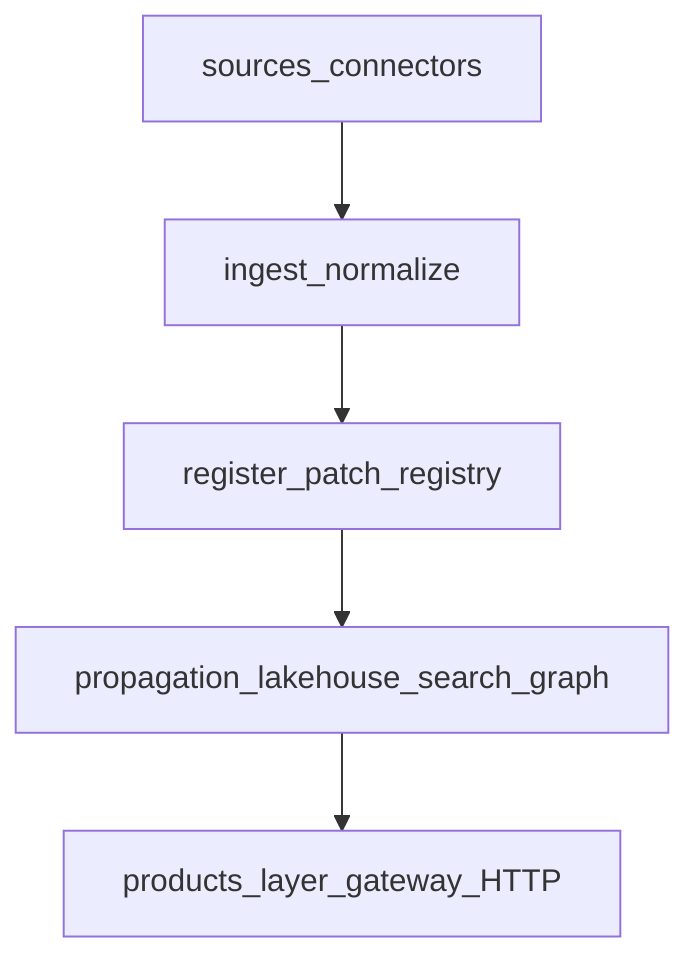
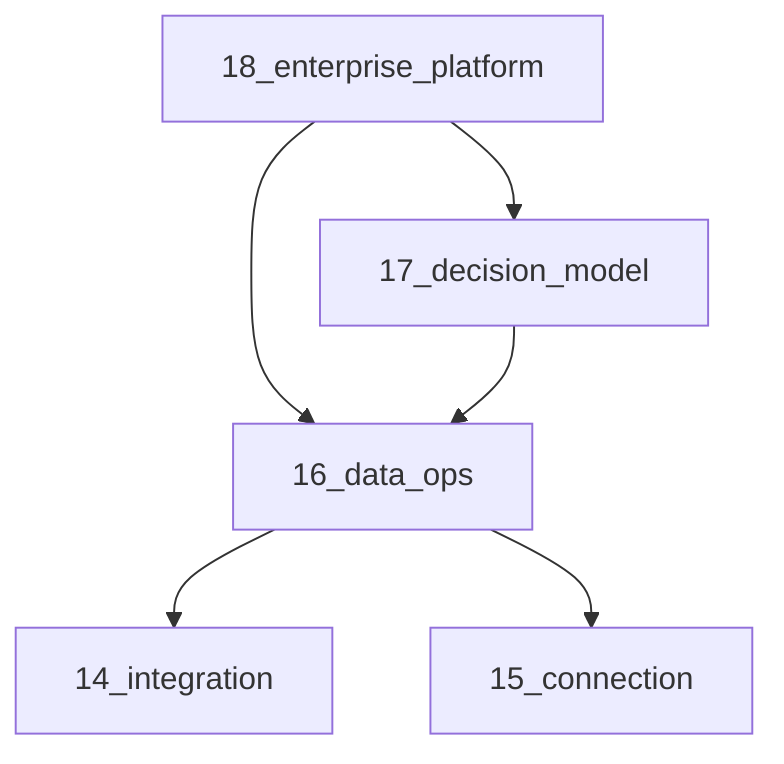

# Data Ops and Foundry platform maps (documentation)

## Goal

Create educational, repo-grounded maps for teams comparing **Palantir Foundry** ([platform overview](https://www.palantir.com/platforms/foundry/), [Pipeline Builder](https://www.palantir.com/docs/foundry/pipeline-builder/overview)) to daemon-sdk—without API compatibility claims. Wording uses “enterprise data OS” / “Foundry-style” in prose only (consistent with [docs/14-data-integration-map.md](docs/14-data-integration-map.md)).

Three doc deliverables:

| Doc | Focus |
|-----|--------|
| **16** | Data Ops lifecycle: Connect → Transform → Model → Analyze + four skills |
| **17** | Decision model: Data / Logic / Actions (user’s prior diagram) |
| **18** | Enterprise platform: two layers (data vs ontology), products, Apollo/AIP, Pipeline Builder |

## Doc 16 — Data Ops lifecycle

**File:** [docs/16-data-ops-lifecycle-map.md](docs/16-data-ops-lifecycle-map.md)

### Lifecycle (daemon-sdk)

| Phase | daemon-sdk | Foundry-style analogue (educational) |
|-------|------------|--------------------------------------|
| **Connect** | `sources.yaml`, connectors, `POST /v1/ingest/sources/:sourceId/run`, Pattern A/B ([15](docs/15-data-connection-map.md)) | Connectors, syncs, listeners, agent worker ([Data Connection](https://www.palantir.com/docs/foundry/data-integration/overview)) |
| **Transform** | `RecordNormalizer`, `ingest-pipeline.service.ts`, propagation → `lakehouse-bronze` | **Pipeline Builder** workflow (Inputs → Transform → Preview → Deliver → Outputs); Code Repositories transforms; batch/incremental/streaming ([Pipeline Builder overview](https://www.palantir.com/docs/foundry/pipeline-builder/overview)) |
| **Model** | Pack YAML, registry, `daemon_entity_snapshots`, silver/gold, Neo4j optional | Datasets → clean datasets → **Ontology** object/link types ([Ontology overview](https://www.palantir.com/docs/foundry/ontology/overview)) |
| **Analyze** | `GET /v1/search`, lakehouse APIs, `products/*` (see doc 18) | Quiver/Contour/Insight, Object Explorer, AIP retrieval |

**Pipeline Builder subsection (Transform phase):**

Foundry’s builder is a visual integration app with backend-generated transform code, schema checks, and outputs to datasets, media sets, or ontology components. In daemon-sdk today:

| Pipeline Builder concept | daemon-sdk today | Gap |
|--------------------------|------------------|-----|
| Graph: Inputs → Transform → Deliver | Linear: ingest run → register/patch → propagation rules | No visual DAG UI |
| Batch / incremental / streaming builds | Batch ingest + bronze append; streaming **deferred** | No Flink-style stream product |
| Outputs to datasets | `daemon_lakehouse_bronze` / silver | Postgres, not Iceberg datasets |
| Outputs to object types | Ingest validates pack then `register` | No direct “publish to ontology” wizard |
| Data expectations / health checks | `check:governance-policies`, `check:sources`, integration tests | No Data Health app |
| LLM-assisted transforms | — | — |

Topic index for Pipeline Builder doc tree (from uploaded TOC): syncs, listeners, branching, builds, schedules, Iceberg, CDC, virtual tables—cross-walk rows already in doc 14; doc 16 points to 14 for detail.

### Skill RACI (unchanged intent)

| Phase | data-manager | data-warehouse-engineer | database-schema-designer | data-system-ops-lead |
|-------|--------------|-------------------------|--------------------------|----------------------|
| Connect | **A** roadmap | C mapping | — | **A** ops / Pattern B |
| Transform | **A** quality SLAs | **A** ELT/bronze semantics | C payload vs columns | **A** pipeline failures |
| Model | **A** stewardship | **A** gold rollups | **A** migrations/RLS | C capacity |
| Analyze | **A** KPIs | C gold SQL perf | C read paths | C API SLOs |

### Logistics example + ops checklist

Keep as in prior plan (P0 entities, `logistics-pilot`, LQ-* competency).

---

## Doc 17 — Platform decision model

**File:** [docs/17-platform-decision-map.md](docs/17-platform-decision-map.md)

User’s flowchart (Palantir Data / Logic / Actions → daemon analogue):

| Pillar | Foundry (summary) | daemon-sdk paths |
|--------|-------------------|------------------|
| **Data** | Objects, links, backing datasets | Pack entities, `Link`, junctions, ingest, lakehouse, `ScopedOntologySearch`, Neo4j |
| **Logic** | Functions, rules, AIP Logic | `PolicyEngine`, `propagation.yaml`, `action-runtime/`, `products/ontology-query`, LangGraph |
| **Actions** | Action types, writeback, proposals | `LoopOrchestrator`, `action-catalog.yaml`, `POST /v1/write`, automations |

Link **Data pillar** → full Data Ops breakdown in doc 16.

**Gaps (document only):** Workshop/Slate, Global Branching, OMCP, function-backed columns, materialization datasets, Automate UI.

---

## Doc 18 — Enterprise platform and products (`@products`)

**File:** [docs/18-enterprise-platform-map.md](docs/18-enterprise-platform-map.md)

### Enterprise operating system (three platforms)

| Platform | Foundry role | daemon-sdk analogue |
|----------|--------------|---------------------|
| **Apollo** | CD, zero-downtime service upgrades | `compose/`, deployment docs ([06-deployment-topology.md](docs/06-deployment-topology.md)), CI (`pnpm run test:repo`, `check:architecture`) |
| **Foundry** | Data ops + ontology + apps | Gateway + ontology BC + collect-sensing + lakehouse + `products/` |
| **AIP** | LLM agents, evals, Logic | `products/customer-gpt`, `products/ontology-query`, OpenRouter env, hybrid search citations |

### Two-layer architecture (Foundry data flow)

daemon-sdk collapse (same flow, different names):

### Products layer mapping (`products/`)

Gateway exposes product operations via `ProductsModule` and [products/product-shell/product-router.ts](products/product-shell/product-router.ts) (`ProductRuntime` from `DaemonRuntime`).

| `ProductId` | Module | Foundry-style analogue | Gateway / API surface |
|-------------|--------|------------------------|------------------------|
| `analytics-workflows` | [products/analytics-workflows/](products/analytics-workflows/) | Quiver / Contour-style search & dashboard data | Analytics controller, QueryWizard + hybrid search |
| `customer-gpt` | [products/customer-gpt/gpt-orchestrator.ts](products/customer-gpt/gpt-orchestrator.ts) | AIP Chatbot + retrieval context | `POST /v1/products/customer-gpt/chat` |
| `ontology-query` | [products/ontology-query/](products/ontology-query/) (LangGraph) | Insight / Object Explorer + Ontology SQL (NL→Cypher) | Competency / graph QA paths ([09](docs/09-ontology-competency-questions.md)) |
| `automations` | [products/automations/](products/automations/) | Automate (conditions → actions) | `/v1/automations/*`, ties to `action-runtime` |
| `internal-applications` | [products/internal-applications/](products/internal-applications/) | Internal COP / Notepad-style snapshots | Dashboard snapshot ops |
| `admin-console` | [products/admin-console/](products/admin-console/) | Admin / project ops (loose) | List entities admin op |

**Not in `products/` today (gaps):** Workshop, Slate, OSDK-generated UI, Pilot, Contour-only dataset app, Fusion spreadsheet writeback, Palantir MCP/OMCP builders.

### MMDP / observability (short)

| Foundry | daemon-sdk |
|---------|------------|
| Iceberg / virtual tables | Postgres bronze; Iceberg **deferred** |
| Data Health / Workflow Lineage | `check:*`, lakehouse summary, audit journal |
| Log export to dataset | Audit tables + propagation audit-loop |

### External reference links (cite in doc 18 footer)

- [Foundry platform](https://www.palantir.com/platforms/foundry/)
- [Pipeline Builder](https://www.palantir.com/docs/foundry/pipeline-builder/overview)
- [Data integration overview](https://www.palantir.com/docs/foundry/data-integration/overview)
- [Ontology overview](https://www.palantir.com/docs/foundry/ontology/overview)
- [AIP overview](https://www.palantir.com/docs/foundry/aip/overview)

Do **not** commit the full user-pasted agent briefing as SSOT; optional trimmed topic index under `docs/reference/` only if useful (e.g. Pipeline Builder TOC mirroring uploaded `pipeline-builder-1.md` headings)—machine SSOT remains daemon configs + docs 14–18.

---

## Cross-links

| File | Change |
|------|--------|
| [docs/00-overview.md](docs/00-overview.md) | Milestones bullets for docs 16–18 |
| [docs/14-data-integration-map.md](docs/14-data-integration-map.md) | See also 16 (lifecycle), 18 (platform) |
| [docs/15-data-connection-map.md](docs/15-data-connection-map.md) | Connect phase → doc 16 |
| [docs/13-sdk.md](docs/13-sdk.md) | OSDK table + link to 16–18 |
| [docs/11-data-platform-lakehouse.md](docs/11-data-platform-lakehouse.md) | Phase placement in Data Ops |
| [docs/01-end-to-end-architecture.md](docs/01-end-to-end-architecture.md) | Optional one-line pointer to products layer doc 18 |

---

## Out of scope

- Implementing Pipeline Builder UI, Iceberg, schedules, or new product apps
- Committing confidential customer payloads or NDA partner names in public docs
- Full verbatim reproduction of Palantir marketing/agent overview in git

---

## Execution order

1. **doc 16** — Data Ops + Pipeline Builder transform mapping + skills
2. **doc 17** — Decision model D/L/A
3. **doc 18** — Enterprise OS + two layers + `products/` table + external links
4. Cross-link overview + 11/13/14/15
5. Optional learnings append (Agent mode)

