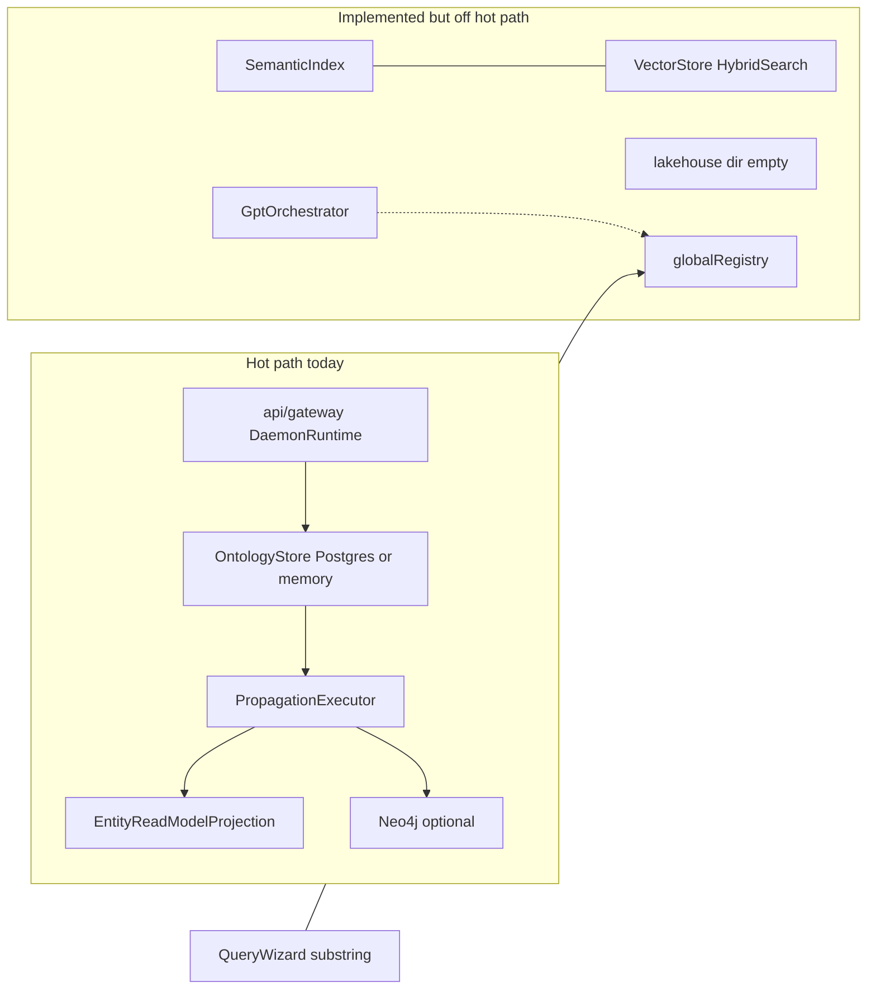
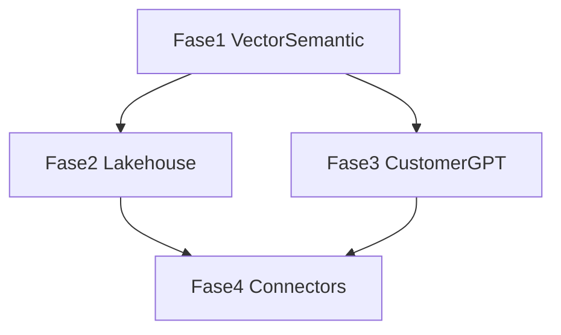

# Rencana: Data platform & produk pengalaman

## Konteks & gap saat ini



| Area | Ada di repo | Terhubung ke gateway |
|------|-------------|----------------------|
| Semantic + vector | [`ontology/semantic-layer/`](ontology/semantic-layer/), [`ontology/vector-layer/hybrid-search.ts`](ontology/vector-layer/hybrid-search.ts) | Tidak — analytics pakai substring di [`products/analytics-workflows/query-wizard.ts`](products/analytics-workflows/query-wizard.ts) |
| Lakehouse | Manifest [`data-platform/lakehouse/`](data-platform/lakehouse/) kosong; policy [`configs/policies/data-policies.yaml`](configs/policies/data-policies.yaml) sudah menyebut `lakehouse` | Tidak |
| Customer GPT | [`products/customer-gpt/gpt-orchestrator.ts`](products/customer-gpt/gpt-orchestrator.ts), routing di [`products/product-shell/product-router.ts`](products/product-shell/product-router.ts) | Tidak — [`api/gateway/src/app.module.ts`](api/gateway/src/app.module.ts) tidak import ProductsModule |
| Connectors | 4 tipe di [`collect-sensing/connectors/connector-factory.ts`](collect-sensing/connectors/connector-factory.ts); pipeline di [`api/gateway/src/ingest/ingest-pipeline.service.ts`](api/gateway/src/ingest/ingest-pipeline.service.ts) | `postgres-read` hanya jika `DAEMON_POSTGRES_URL`; **`http-pull` belum di-wire** (`httpFetch` tidak diset) |

**Keputusan Anda:** urutan default + lakehouse v1 = **Postgres bronze** (bukan Parquet dulu).

**Non-goals fase ini:** R3 ANTERO, P1 logistics entities, rewrite language/engine matrix, SAP/Snowflake connector penuh, UI Workbench.

---

## Fase 1 — Vector + semantic retrieval produksi

**Tujuan:** Setiap `register`/`patch` mengisi indeks; read path gateway menawarkan hybrid search scoped (tenant + domain).

### 1.1 Scoped search index service

- Tambah modul baru, mis. [`ontology/search/scoped-ontology-search.ts`](ontology/search/scoped-ontology-search.ts):
  - Kunci indeks: `tenantId/domainId/ontologyId/entityId`
  - Dokumen teks: `entityType` + serialisasi `properties` (sama pola [`query-wizard.ts`](products/analytics-workflows/query-wizard.ts))
  - Komponen: `SemanticIndex` + `VectorStore` + `EmbeddingPipeline` + `HybridSearch` (deterministic embed — sudah ada tes)
  - API: `index(record)`, `search(scope, query, { limit, ontologyId? })` → hits dengan `entityId`, skor, breakdown keyword/vector

### 1.2 Propagation targets

- Perluas [`ontology/governance/propagation-executor.ts`](ontology/governance/propagation-executor.ts) + `PropagationTargets` dengan `ontologySearch?: ScopedOntologySearch`
- Target baru: `semantic-vector-index` (satu target, hindari duplikasi rule)
- Tambah ke [`configs/governance/propagation.yaml`](configs/governance/propagation.yaml) untuk trigger `register`/`patch` pada rules foundation + logistics (entity types relevan atau wildcard per rule existing)

### 1.3 Wire di composition root

- Di [`api/gateway/src/platform/daemon-runtime.ts`](api/gateway/src/platform/daemon-runtime.ts):
  - Instansiasi `ScopedOntologySearch`
  - Pass ke `PropagationExecutor`
  - Expose `readonly search: ScopedOntologySearch` untuk modul Nest

### 1.4 Gateway HTTP + policy

- Modul baru [`api/gateway/src/search/`](api/gateway/src/search/): `GET /v1/search` query params `q`, `ontologyId?`, `limit?`, `mode=hybrid|keyword`
- Policy: tambah rule `query` / `ontology-search` di action catalog atau `DEFAULT_GATEWAY_POLICY_RULES`
- Refactor [`api/gateway/src/analytics/analytics.service.ts`](api/gateway/src/analytics/analytics.service.ts) + `QueryWizard`: injeksi search service dari `DaemonRuntime` (fallback substring hanya jika indeks kosong — opsional, bisa langsung hybrid)

### 1.5 Tes

- Unit: index + search parity (fixture 3 entity)
- Integration: register entity via gateway → `GET /v1/search` mengembalikan hit (`tests/integration/search-hybrid.integration.test.ts`)
- Update [`docs/02-ontology-system.md`](docs/02-ontology-system.md) — vector layer “production path when DAEMON_POSTGRES + propagation”

---

## Fase 2 — Lakehouse bronze (Postgres)

**Tujuan:** Jejak historis terstruktur untuk analytics/compliance, paralel dengan `daemon_ontology_changes`.

### 2.1 Schema

- Migration baru [`data-platform/migrations/004_lakehouse_bronze.sql`](data-platform/migrations/004_lakehouse_bronze.sql):
  - Tabel `daemon_lakehouse_bronze` (kolom: `tenant_id`, `domain_id`, `ontology_id`, `entity_id`, `entity_type`, `change_type`, `payload` JSONB, `indexed_at`, `source` opsional)
  - Index `(tenant_id, domain_id, at DESC)`; RLS selaras [`002_governance_ssot.sql`](data-platform/migrations/002_governance_ssot.sql)

### 2.2 Writer

- Implementasi [`data-platform/lakehouse/bronze-writer.ts`](data-platform/lakehouse/bronze-writer.ts):
  - `BronzeWriter.append(ctx, record, trigger)` — no-op tanpa `DAEMON_POSTGRES_URL`
  - Gunakan [`data-platform/operational-store/postgres-client.ts`](data-platform/operational-store/postgres-client.ts) + tenant session

### 2.3 Propagation + runtime

- Target `lakehouse-bronze` di executor + `propagation.yaml`
- `DaemonRuntime` construct `BronzeWriter.fromEnv()` dan pass ke propagation

### 2.4 Read API (minimal)

- `GET /v1/lakehouse/events` — filter tenant/domain, `since`, `limit` (read-only, policy `read` + `lakehouse`)

### 2.5 Tes & docs

- Integration: setelah upsert, baris bronze ≥ 1 (`tests/integration/lakehouse-bronze.integration.test.ts`)
- Doc singkat [`docs/11-data-platform-lakehouse.md`](docs/11-data-platform-lakehouse.md)
- Update [`docs/00-overview.md`](docs/00-overview.md) milestone baris lakehouse + perbaiki logistics “planned” → implemented

---

## Fase 3 — Customer GPT penuh (gateway)

**Tujuan:** Endpoint HTTP dengan policy, retrieval hybrid, LLM opsional (pola [`products/ontology-query/llm.ts`](products/ontology-query/llm.ts)).

### 3.1 Product runtime scoped

- Perluas [`products/shared/product-runtime.ts`](products/shared/product-runtime.ts) agar bisa dibuat dari `DaemonRuntime` (store scoped + search + policy gateway), bukan hanya `globalRegistry`

### 3.2 Orchestrator v2

- Upgrade [`products/customer-gpt/gpt-orchestrator.ts`](products/customer-gpt/gpt-orchestrator.ts):
  - **Retrieval:** `runtime.search` hybrid → load entities via `ReadRouter` / store list
  - **LLM:** jika `DAEMON_OPENROUTER_API_KEY` / `OPENROUTER_API_KEY` → jawaban + citations; else template deterministik (backward compatible)
  - Tetap `PromptGuard` pada input user

### 3.3 Gateway module

- [`api/gateway/src/products/products.module.ts`](api/gateway/src/products/products.module.ts):
  - `POST /v1/products/customer-gpt/chat` body: `{ turns, ontologyId?, limit? }`
  - Headers tenant/domain seperti modul lain
- Import `ProductsModule` di [`app.module.ts`](api/gateway/src/app.module.ts)

### 3.4 Session (v1 ringan)

- In-memory session map keyed by `x-session-id` (opsional) — simpan `entityIds` terakhir untuk multi-turn; dokumentasikan batasan (no Postgres session dulu)

### 3.5 Tes

- Unit: guard deny, retrieval dengan indexed entities
- Integration: chat endpoint 200 + citations (`tests/integration/customer-gpt.integration.test.ts`); skip LLM call jika no API key (mock `TextLlm` inject)

---

## Fase 4 — Connector enterprise catalog

**Tujuan:** “Matrix” operasional — katalog, contoh sumber, ingest path lengkap untuk tipe yang sudah ada.

### 4.1 Catalog & validasi

- [`configs/collect-sensing/connectors-catalog.yaml`](configs/collect-sensing/connectors-catalog.yaml) — metadata per `ConnectorType` (capabilities, required env, policy tier)
- Perluas [`configs/collect-sensing/sources.yaml`](configs/collect-sensing/sources.yaml): contoh `http-pull` + `postgres-read` (disabled by default atau fixture SQL)
- Script check: `pnpm run check:sources` (mirip `check:ontology-pack`) validasi catalog + sources

### 4.2 Ingest pipeline fixes

- [`api/gateway/src/ingest/ingest-pipeline.service.ts`](api/gateway/src/ingest/ingest-pipeline.service.ts): supply `httpFetch: fetch` default untuk `http-pull`
- Opsional: wrap `http-pull` dengan [`security-governance/trust/zero-trust-gateway.ts`](security-governance/trust/zero-trust-gateway.ts) untuk tier `internal` (config flag per source)

### 4.3 Dokumentasi & contract

- [`docs/12-connectors-catalog.md`](docs/12-connectors-catalog.md) — matrix 4 tipe + roadmap (S3, Kafka = deferred)
- Perluas [`tests/integration/gateway-http.test.ts`](tests/integration/gateway-http.test.ts) atau tes terpisah: `runSource` http-pull dengan mock HTTP server (bukan mock domain logic — test harness HTTP)

### 4.4 Spec manifest

- Tambah file placeholder di `data-platform/lakehouse/` jika spec:check membutuhkan file (mis. `.gitkeep` + `README.md`) — atau pastikan manifest hanya memerlukan direktori (sudah ada)

---

## Urutan dependensi



Fase 3 bergantung pada Fase 1 (retrieval). Fase 2 bisa paralel dengan Fase 3 setelah Fase 1 selesai. Fase 4 sebagian independen tetapi paling masuk akal di akhir.

---

## Validasi akhir (setiap fase)

```bash
pnpm run spec:check
pnpm run check:ontology-pack
pnpm run test:repo   # dengan compose + DAEMON_POSTGRES_URL untuk integration lakehouse/search
```

---

## Risiko & mitigasi

| Risiko | Mitigasi |
|--------|----------|
| Indeks in-memory hilang saat restart | Dokumentasikan; fase berikutnya: replay dari `daemon_entity_snapshots` ke search index on startup |
| Embedding deterministic ≠ semantic quality produksi | Terima untuk v1; interface `EmbeddingPipeline` swappable |
| ProductRuntime vs scoped store | Wajib injeksi dari `DaemonRuntime` di Fase 3 |
| Biaya/latency OpenRouter | GPT fallback tanpa key; tes tidak memanggil API live |
