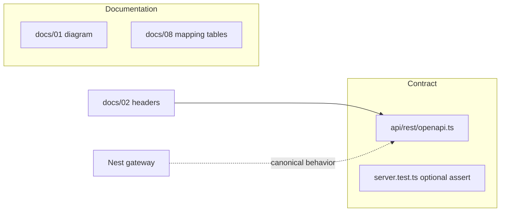

# Tutup celah DoD: docs/01, docs/08, OpenAPI headers

## Konteks

Verifikasi sebelumnya menandai tiga item **PARTIAL**:

| Celah | File utama | Masalah |
|-------|------------|---------|
| Diagram BC lengkap | [docs/01-end-to-end-architecture.md](docs/01-end-to-end-architecture.md) | Hanya 4 subgraph + gateway; **action-runtime** dan **cross-cutting** (`engine/`, `data-platform/`, `observability/`, `context-ports`) tidak ada di mermaid |
| Mapping governance | [docs/08-semantic-governance-alignment.md](docs/08-semantic-governance-alignment.md) | Layout/config ada, tetapi tidak ada tabel **Tier dokumen → repo** dan **konsep Ontology Master / Technology OS → modul** (sesuai §9 plan di [.cursor/plans/sempurnakan_arsitektur_bc_ee86870a.plan.md](.cursor/plans/sempurnakan_arsitektur_bc_ee86870a.plan.md)) |
| Kontrak HTTP | [api/rest/src/openapi.ts](api/rest/src/openapi.ts) | Tidak ada `X-Daemon-Tenant` / `X-Daemon-Domain`; default `ontologyId` query masih `"default"` (harus selaras dengan `foundation`) |

Gateway dan SDK sudah mendokumentasikan header di [docs/02-bounded-contexts.md](docs/02-bounded-contexts.md) dan [packages/sdk/src/client.ts](packages/sdk/src/client.ts). OpenAPI REST adalah gap kontrak yang tersisa.



## 1. Perluas [docs/01-end-to-end-architecture.md](docs/01-end-to-end-architecture.md)

**Tujuan:** Satu diagram end-to-end yang selaras dengan tabel di [docs/02-bounded-contexts.md](docs/02-bounded-contexts.md) (6 BC + cross-cutting).

**Perubahan pada blok mermaid (baris 3–36):**

- Tambah subgraph `action_runtime`:
  - `WorkflowOrchestrator` ([action-runtime/workflow-engine/workflow-orchestrator.ts](action-runtime/workflow-engine/workflow-orchestrator.ts))
  - Hubungan ke `products` (`AutomationsWorkflows` memanggil orchestrator — lihat [products/automations/automations-workflows.ts](products/automations/automations-workflows.ts))
- Tambah subgraph `cross_cutting` (dashed / label “infra”, bukan BC bisnis):
  - `engine` — validators, connectors
  - `data_platform` — operational store (audit opsional)
  - `observability` — logging/metrics
  - `context_ports` — `OntologyStore` / `AuditPort` contracts
- Tambah subgraph `products` (opsional ringan): `AnalyticsWorkflows`, `AutomationsWorkflows` di antara gateway dan action-runtime / read loops
- Edge yang disarankan:
  - `GW` → automations endpoints → `WorkflowOrchestrator`
  - `WorkflowOrchestrator` → `LOOP` (commit write via loop, bukan registry langsung)
  - `cross_cutting` → `RT` / `AUD` (dotted: ports + observability)
  - `context_ports` mendefinisikan kontrak yang diimplementasi `REG` + `AUD`

**Teks pendamping (2–3 kalimat):** Jelaskan bahwa **canonical HTTP** adalah Nest gateway + `DaemonRuntime`; REST standalone ([api/rest](api/rest)) mem-mirror read/write untuk kontrak/schema, bukan semua jalur ingest.

**Tidak mengubah** plan file.

## 2. Tambah tabel mapping di [docs/08-semantic-governance-alignment.md](docs/08-semantic-governance-alignment.md)

**Tujuan:** Memenuhi DoD “docs/08 memetakan Ontology Master + Technology OS → modul + config” tanpa melanggar NDA (tidak menamai counterparty; PDF hanya sebagai referensi manusia internal).

**Seksi baru (setelah “Purpose” atau sebelum “Layout”):**

### 2a. Document tier precedence (referensi manusia)

| Tier / sumber (internal) | Precedence | Peran di repo (machine-readable) |
|------------------------|------------|----------------------------------|
| Charter / Manifesto (PDF internal) | Tertinggi | Tidak di-commit; mengarahkan kebijakan produk |
| Ontology Master v2.x (PDF internal) | Di atas Technology OS | Metodologi Tier 0A: entitas, relasi, junction, action catalog |
| Technology OS (PDF internal) | Operasional / propagasi | [configs/governance/propagation.yaml](configs/governance/propagation.yaml) |

Catatan: **Tidak** menyalin entitas logistik (`Shipment`, dll.) ke pack publik; foundation pack sector-agnostic.

### 2b. Ontology Master (konsep) → modul & path

| Konsep (Tier 0A pattern) | Implementasi repo | Validasi |
|--------------------------|-------------------|----------|
| Entity types / field models | `configs/ontology/packs/foundation/entities/*.yaml` | `pnpm run check:ontology-pack` |
| Pack manifest / semver | `configs/ontology/packs/foundation/pack.yaml` | `tests/ontology/pack-compliance.test.ts` |
| Relations / junction rules | `configs/ontology/packs/foundation/` (+ relations jika ada) | pack validator |
| Action catalog (governed actions) | [configs/governance/action-catalog.yaml](configs/governance/action-catalog.yaml) | policy fixtures + gateway guards |
| Domain catalog | [configs/ontology/domains/catalog.yaml](configs/ontology/domains/catalog.yaml) | `check:tenancy-config` |
| Runtime validation | `ontology/governance/`, ingest/write via `DaemonRuntime` | HTTP 400 unknown type |

### 2c. Technology OS (konsep) → modul & path

| Konsep | Implementasi repo | Runtime hook |
|--------|-------------------|----------------|
| Propagation top-down (register/patch → surfaces) | [configs/governance/propagation.yaml](configs/governance/propagation.yaml) | projections / audit-loop rules (konseptual; W3 penuh di fase berikutnya) |
| DAEMON vs ops boundary | [docs/02-bounded-contexts.md](docs/02-bounded-contexts.md) | Gateway = semantic control plane; collect-sensing = ingest only |
| Multi-tenant / multi-domain rollout | [configs/tenancy.yaml](configs/tenancy.yaml) + headers | `TenantContextService`, scoped registry keys |
| Workflows / agents | [action-runtime/](action-runtime/) via [products/automations/](products/automations/) | `/v1/automations/*` (gateway) |

### 2d. Diagram propagasi (ringkas)

Satu `flowchart TB` kecil: PDF governance → YAML configs → `PackResolver` / `GovernanceValidator` → `DaemonRuntime` → gateway.

**Cross-link:** Tambah satu baris di [docs/00-overview.md](docs/00-overview.md) yang mengarah ke § mapping di docs/08 (opsional, 1 kalimat).

## 3. OpenAPI: header tenant/domain di [api/rest/src/openapi.ts](api/rest/src/openapi.ts)

**Tujuan:** Schema publik selaras dengan gateway dan SDK.

### 3a. `components.parameters` (baru)

```yaml
# Pseudocode — implement as OpenAPI object in openapi.ts
DaemonTenantHeader:
  name: X-Daemon-Tenant
  in: header
  required: false
  schema: { type: string, default: default }
  description: Tenant id from configs/tenancy.yaml (e.g. default, inst-alpha, ent-beta)

DaemonDomainHeader:
  name: X-Daemon-Domain
  in: header
  required: false
  schema: { type: string, default: foundation }
  description: Domain id from configs/ontology/domains/catalog.yaml; must be in tenant enabledDomains
```

### 3b. Terapkan ke operasi yang scoped

Tambahkan `$ref` ke kedua parameter pada:

- `GET /v1/entities/{id}` (ganti default `ontologyId` query dari `"default"` → `"foundation"`)
- `GET /v1/analytics/*` (3 operasi)
- `POST /v1/automations/*` (3 operasi)
- `POST /v1/write`

**Catatan implementasi:** REST [api/rest/src/server.ts](api/rest/src/server.ts) sudah membaca `x-daemon-tenant` di [session.ts](api/rest/src/session.ts) tetapi **belum** memvalidasi domain seperti gateway. Scope fase ini: **dokumentasi kontrak OpenAPI** + deskripsi di `info.description` bahwa perilaku penuh tenant/domain enforcement ada di Nest gateway. Wire domain validation di REST server hanya jika diperlukan untuk parity — bisa dicatat sebagai opsional/out-of-scope agar diff tetap kecil.

### 3c. Tes

Perbarui [api/rest/src/server.test.ts](api/rest/src/server.test.ts) (atau tambah test kecil):

- `GET /openapi.json` → assert `components.parameters.DaemonTenantHeader` dan `DaemonDomainHeader` ada
- Assert minimal satu path (mis. `POST /v1/write`) mereferensikan kedua parameter

Jalankan: `pnpm --filter @daemon/api-rest test` atau `node --test` pada file tersebut setelah build.

## 4. Verifikasi akhir

Dari repo root:

```bash
pnpm run check:architecture
pnpm --filter @daemon/api-rest build
pnpm --filter @daemon/api-rest test  # atau path test yang ada
```

Tidak wajib mengubah [.cursor/plans/sempurnakan_arsitektur_bc_ee86870a.plan.md](.cursor/plans/sempurnakan_arsitektur_bc_ee86870a.plan.md). Opsional: centang manual item DoD di plan oleh user setelah review.

## Ruang lingkup sengaja di luar

- Implementasi ingest paths di OpenAPI (gateway punya `/v1/ingest` — REST mirror belum lengkap)
- Postgres RLS / enforcement domain di REST handler
- E2E dua domain aktif pada satu tenant di `tenancy.yaml` (item terpisah dari permintaan ini)
- Perubahan besar [docs/reference/perplexity-architecture-spec.md](docs/reference/perplexity-architecture-spec.md)

## Estimasi diff

| Area | Files | ~LOC |
|------|-------|------|
| Diagram + prose | `docs/01-end-to-end-architecture.md` | +40–60 |
| Mapping tables | `docs/08-semantic-governance-alignment.md` | +80–120 |
| OpenAPI + test | `api/rest/src/openapi.ts`, `api/rest/src/server.test.ts` | +50–80 |
| Link opsional | `docs/00-overview.md` | +2 |
