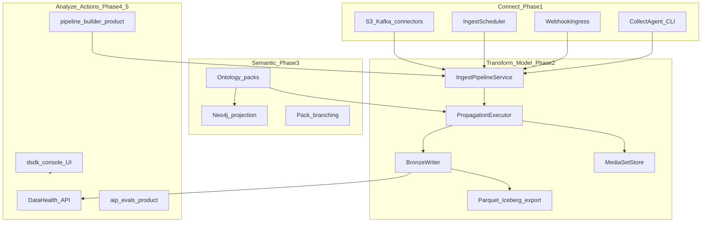

# DSDK production E2E — implementasi gap dokumentasi

## Konteks dan batasan

Anda memilih **scope penuh termasuk aplikasi enterprise**, diimplementasikan sebagai **daemon-sdk (DSDK)** — bukan replika Foundry API. Dokumen [14](docs/14-data-integration-map.md), [15](docs/15-data-connection-map.md), [16](docs/16-data-ops-lifecycle-map.md), [17](docs/17-platform-decision-map.md), [18](docs/18-enterprise-platform-map.md) secara eksplisit memisahkan **“daemon-sdk today”** vs **deferred**.

**Sudah ada (tidak diulang):** ingest HTTP, 4 connector types, propagation → bronze/silver/gold Postgres, hybrid search, `DaemonRuntime`, products (`analytics-workflows`, `customer-gpt`, `automations`, …), `@daemon/sdk`, logistics P0 pack, gateway `QueryModule` untuk ontology-query.

**Aturan arsitektur (wajib di setiap fase):**
- Gateway: hanya [api/gateway/src/platform/daemon-runtime.ts](api/gateway/src/platform/daemon-runtime.ts) — tidak import `globalRegistry` / `CommandGateway` di controller/service ([`pnpm run check:architecture`](package.json)).
- Ingest tetap di **collect-sensing**; truth di ontology; writes di **read-write-loops**.
- Integration/e2e: Postgres nyata, hindari `jest.mock` kecuali `DAEMON_USE_EMBEDDED=1` ([docs/06-testing.md](docs/06-testing.md)).

---

## Fase 0 — Production baseline (prasyarat semua gap)

**Tujuan:** Lingkungan prod yang sama dengan yang diasumsikan docs [04](docs/04-deployment.md), [05](docs/05-observability.md), [06](docs/06-deployment-topology.md).

| Deliverable | Lokasi / aksi |
|-------------|----------------|
| **Prod compose/profile** | Perluas [deployment/docker/compose.dev.yaml](deployment/docker/compose.dev.yaml) atau tambah `compose.prod.yaml`: Postgres wajib, Redis/NATS, gateway, collect-sensing ingest, policy-server, OTel collector (sudah direferensikan di docs). |
| **Helm/K8s** | Lengkapi [deployment/kubernetes/](deployment/kubernetes/) + [deployment/helm/daemon-platform/](deployment/helm/daemon-platform/) — probes, resources, secrets via env, migrasi job init. |
| **Terraform** | [deployment/terraform/](deployment/terraform/) — modul minimal (VPC-agnostic): K8s provider hook + dokumentasi `apply` di docs (bukan hanya `validate`). |
| **Observability prod** | Wire [api/gateway/src/observability/](api/gateway/src/observability/) ke OTel; tambah dashboard JSON atau doc runbook Grafana; alert rules contoh (lakehouse stale, ingest fail). |
| **Security ops** | Template webhook SIEM dari audit events; paging env vars di [configs/environments/prod.yaml](configs/environments/) — primitif sudah ada di [05-security-governance.md](docs/05-security-governance.md). |
| **Neo4j prod profile** | Dokumen + `compose` service Neo4j opsional; env `DAEMON_ONTOLOGY_QUERY_ENABLED` + `DAEMON_NEO4J_URI` di prod example — mengaktifkan jalur [09](docs/09-ontology-competency-questions.md) / [10](docs/10-neo4j-graph-model.md). |

**Gate:** `pnpm run test:repo` hijau dengan `DAEMON_POSTGRES_URL`; `pnpm run check:architecture`; migrasi `data-platform/migrations/*` applied.

---

## Fase 1 — Connect (gap docs 12, 14, 15, 16)

Menutup baris deferred: schedules, S3, Kafka, agent worker, webhook ingress.

### 1.1 Connector S3 dan Kafka

- Perluas [collect-sensing/orchestrator/source-catalog.ts](collect-sensing/orchestrator/source-catalog.ts) + [connector-factory.ts](collect-sensing/connectors/connector-factory.ts):
  - **`s3`**: list/prefix + JSONL/CSV (AWS SDK v3 atau MinIO-compatible); config di [configs/collect-sensing/connectors-catalog.yaml](configs/collect-sensing/connectors-catalog.yaml).
  - **`kafka`**: consumer batch (kafkajs atau consumer di Go ingest); mapping topic → records; idempotent `recordId`.
- Update [docs/12-connectors-catalog.md](docs/12-connectors-catalog.md) — hapus “Deferred” untuk tipe yang diimplementasi.
- Integration: `tests/integration/ingest-connectors.integration.test.ts` (MinIO/Redpanda di testcontainers atau skip flag).

### 1.2 Scheduled ingest (cron produk)

- Schema: `daemon_ingest_schedules` (tenant, domain, source_id, cron_expr, enabled, last_run, last_status) — migration di [data-platform/migrations/](data-platform/migrations/).
- Modul gateway: `api/gateway/src/ingest/ingest-scheduler.service.ts` — `@nestjs/schedule` atau worker loop; panggil logika yang sama dengan [IngestPipelineService](api/gateway/src/ingest/ingest-pipeline.service.ts).
- API: `POST/GET/PATCH /v1/ingest/schedules` + policy resources baru di [configs/policies/](configs/policies/).
- SDK: metode di [packages/sdk](packages/sdk) + OpenAPI regenerate.

### 1.3 Webhook / listener ingress

- `POST /v1/ingest/webhooks/:sourceId` — HMAC signature, normalisasi payload → `ingestRecords`.
- Opsional NATS subject bridge ke `event-subscriber` pattern yang sudah ada di factory.

### 1.4 Collect agent (Pattern B — MVP produksi)

- Paket baru `collect-sensing/agent/` atau `toolchain/collect-agent/`: CLI `daemon-agent push` — baca file lokal / tail Kafka ringan, POST ke gateway ingest dengan API key.
- **Bukan** WebSocket/private-link/installer enterprise penuh di fase ini; dokumentasikan sebagai v2 di [15](docs/15-data-connection-map.md).

---

## Fase 2 — Transform / Model / Data plane (gap docs 11, 14, 16, 18 MMDP)

### 2.1 Parquet dataset export + katalog

- Job/service: `data-platform/lakehouse/export/parquet-exporter.ts` — baca bronze/silver scoped, tulis Parquet ke path lokal atau S3 (reuse connector config).
- API: `POST /v1/lakehouse/export` (async job id) + `GET /v1/lakehouse/exports/:id`.
- Tabel katalog: `daemon_dataset_catalog` (name, format, location_uri, tenant, domain, refreshed_at).

### 2.2 Iceberg (incremental setelah Parquet)

- **MVP produksi:** metadata Iceberg atas file Parquet yang sama (library Node `@apache/iceberg` atau job sidecar dokumentasi).
- Update [docs/11-data-platform-lakehouse.md](docs/11-data-platform-lakehouse.md) dan baris Iceberg di [14](docs/14-data-integration-map.md).

### 2.3 Media sets (unstructured)

- Tabel `daemon_media_objects` (uri, checksum, mime, tenant, domain) + upload via presigned S3 atau gateway multipart.
- Propagation target opsional `media-index` (metadata only v1).
- Tautkan ke entity properties sebagai `mediaRef[]`.

### 2.4 Data Health (Foundry-style monitoring, DSDK-native)

- Product atau modul gateway: agregasi `check:sources`, lakehouse summary freshness, schedule failures → `GET /v1/data-health/summary`.
- ProductId baru `data-health` di [products/product-shell/product-router.ts](products/product-shell/product-router.ts) (opsional thin wrapper).

**Sengaja ditunda ke fase terpisah (dokumen saja):** Flink streaming, JDBC CDC SAP/Snowflake native, git-style dataset branching UI.

---

## Fase 3 — Semantic / Logic (gap docs 08, 09, 10, 17)

### 3.1 Logistics-commercial P1 (PRD)

Per [docs/PRD-logistics-commercial-extension.md](docs/PRD-logistics-commercial-extension.md) — P0 sudah ([configs/ontology/packs/extensions/logistics-commercial/](configs/ontology/packs/extensions/logistics-commercial/)).

| P1 item | Implementasi |
|---------|----------------|
| Entitas komersial tambahan | YAML baru (mis. `Opportunity`, `Conversation`) + propagation rules di [configs/governance/propagation.yaml](configs/governance/propagation.yaml) |
| Neo4j | Pastikan sync label untuk tipe baru; tes integration dengan Neo4j testcontainer |
| Competency | Perluas [docs/09-ontology-competency-questions.md](docs/09-ontology-competency-questions.md) + tes `tests/integration/ontology-query*.test.ts` |

### 3.2 Pack branching (bukan git UI)

- Konsep `packBranch` + `environment` di [configs/tenancy.yaml](configs/tenancy.yaml) / domain catalog — resolver memilih pack version per tenant/env ([ontology/packs/](ontology/packs/)).
- API read: `GET /v1/ontology/pack-resolution` untuk debugging.

### 3.3 Ontology MCP (konsumen agen, bukan Palantir builder)

- MCP server ringan `toolchain/mcp/ontology-mcp/` — tools: `search`, `getEntity`, `lakehouseEvents`, `queryAsk` (proxy gateway).
- Dokumentasi di [17](docs/17-platform-decision-map.md) — tutup gap “no OMCP product”.

**Tetap out of repo:** parser PDF Ontology Master; function-backed Workshop columns.

---

## Fase 4 — Actions / products backend (gap docs 17, 18)

### 4.1 Pipeline builder (DSDK)

- Paket `products/pipeline-builder/`: DAG YAML (nodes: source, map, filter, deliver-lakehouse/register) dieksekusi via gateway orchestrator — **backend dulu**, UI di Fase 5.
- Persist `daemon_pipeline_runs` + API `POST /v1/pipelines/:id/run`.
- Analogi doc 16 Pipeline Builder tanpa codegen Spark.

### 4.2 AIP Evals

- Paket `products/aip-evals/`: dataset pertanyaan + scorer (rules + optional LLM judge); API `POST /v1/evals/run` untuk `customer-gpt` / `ontology-query` chains.
- Tutup gap “AIP Evals —” di [18](docs/18-enterprise-platform-map.md).

### 4.3 Automations / Logic surface

- Perluas [products/automations/](products/automations/) — expose evaluate/approve via HTTP jika belum lengkap di OpenAPI; dokumentasikan “Automate UI” sebagai operasi API + console.

### 4.4 Product router

Tambah `ProductId` dan operasi di [product-router.ts](products/product-shell/product-router.ts):

- `data-health`, `pipeline-builder`, `aip-evals` (dan wire ke [ProductRuntime](products/shared/product-runtime.ts) dari `DaemonRuntime`).

**Catatan:** `ontology-query` tetap via [api/gateway/src/query/](api/gateway/src/query/) — bukan ProductId ([products/README.md](products/README.md)).

---

## Fase 5 — DSDK Console (Workshop / Slate / analytics shell)

Tidak ada `apps/` hari ini — buat **satu** aplikasi web monorepo:

- `apps/dsdk-console/` (Next.js atau Vite + React): modul
  - **Connect:** daftar sources, jadwal ingest, status agent
  - **Pipeline:** editor DAG (form/YAML) + run history
  - **Ontology:** browse entity types (pack), search
  - **Lakehouse:** events, summary charts, export trigger
  - **AIP:** chat (`customer-gpt`), query ask, evals dashboard
- Auth: API key / session headers `X-Daemon-Tenant`, `X-Daemon-Domain`
- Deploy: static + `pnpm run build` di CI; host di samping gateway

Ini menutup gap **Workshop / Slate / OSDK-generated apps** di [17](docs/17-platform-decision-map.md) / [18](docs/18-enterprise-platform-map.md) pada tingkat **DSDK console**, bukan low-code widget builder penuh.

**Fase 5b (opsional later):** visual widget composer, Pilot NL app generator — di luar “production v1” kecuali Anda memperluas scope lagi.

---

## Fase 6 — SDK, OpenAPI, docs, dan matrix tes produksi

| Area | Aksi |
|------|------|
| **SDK** | [packages/sdk](packages/sdk) + [docs/13-sdk.md](docs/13-sdk.md) — semua endpoint baru |
| **OpenAPI** | Regenerate spec; `pnpm run spec:check` |
| **Docs 14–18** | Ubah tabel “Deferred” → “Implemented (DSDK)” dengan link ke API/paket |
| **Docs 00** | Milestone baru: scheduled ingest, S3/Kafka, export, console, MCP |
| **Tests** | Satu integration test per fase; e2e smoke: schedule → ingest → bronze → export → search |
| **Learnings** | Append [.superstack/learnings.md](.superstack/learnings.md) |

---

## Urutan eksekusi yang disarankan (satu gelombang “production”)

Karena Anda meminta **full E2E production** sekaligus, urutan dependensi minimal:

1. Fase 0 (infra + gates)
2. Fase 1 + 2.4 (connect + data health) — data masuk dan terpantau
3. Fase 2.1–2.3 (export + media)
4. Fase 3.1–3.3 (semantic + MCP)
5. Fase 4 (products backend)
6. Fase 5 (console UI)
7. Fase 6 (parity + docs)

Estimasi: **beberapa PR besar** (disarankan split per fase di atas, bukan satu PR monolitik).

---

## Yang tetap di luar cakupan v1 (tetap didokumentasikan)

| Item | Alasan |
|------|--------|
| Private link / VPC endpoints | Infra cloud account-specific |
| Marketplace sync packaging | Distribusi komersial, bukan runtime |
| Flink / stream processing product | Compute platform terpisah |
| JDBC ERP connectors penuh | Gunakan http-pull / postgres-read interim |
| PDF → ontology otomatis | Governance human-only per [08](docs/08-semantic-governance-alignment.md) |
| Federated operational write-back (PRD P2) | Desain terpisah R3 |
| P1 logistics entitas yang belum disetujui governance | Butuh amendment internal sebelum YAML |

---

## Risiko utama

- **Iceberg + Kafka + S3** di CI membutuhkan testcontainers atau env flags — rencanakan `DAEMON_INTEGRATION_*` skip.
- **UI console** adalah produk terbesar setelah backend; jangan blokir Fase 1–4 menunggu UI.
- **Scope creep:** setiap fase harus lulus `check:architecture` + integration Postgres sebelum lanjut.
