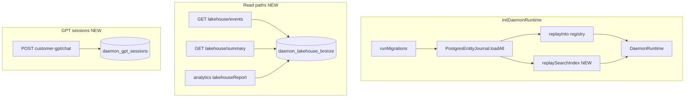

# Operational hardening v2

## Scope (this plan)

You asked to focus on **operational hardening** only:

1. **Search replay** — hybrid index survives gateway restart when Postgres SSOT is enabled.
2. **Lakehouse read paths / analytics** — query and report on **existing** `daemon_lakehouse_bronze` (and optional read-only SQL views); no silver propagation or Parquet.
3. **Persistent GPT sessions** — replace in-memory `Map` in Customer GPT with Postgres.

## Deferred (separate plan)

| Item | Reason |
|------|--------|
| Production embeddings (OpenRouter / swappable embedder) | Quality upgrade, not restart durability; replay can stay on deterministic v1 until then |
| Lakehouse silver/gold **write** path (SilverWriter, propagation `lakehouse-silver`) | Materialization layer; not required for read/analytics over bronze |

---

## Context

Phases 1–4 of the data platform / experience plan are done ([`docs/02-ontology-system.md`](docs/02-ontology-system.md), [`docs/11-data-platform-lakehouse.md`](docs/11-data-platform-lakehouse.md)). Registry hydration on restart already exists via [`replayInto`](ontology/store/replay-into.ts) + [`daemon_load_entity_snapshots()`](data-platform/migrations/003_rls_app_role.sql). [`ScopedOntologySearch`](ontology/search/scoped-ontology-search.ts) is still empty after restart until new writes hit propagation target `semantic-vector-index`.

Today lakehouse exposure is write-heavy bronze + a single read: [`GET /v1/lakehouse/events`](api/gateway/src/lakehouse/lakehouse.controller.ts). Analytics ([`api/gateway/src/analytics`](api/gateway/src/analytics)) uses live registry + hybrid search only — not bronze history.



**Non-goals:** foundation/logistics pack YAML; Parquet; SAP/Snowflake connectors; silver/gold writers; embedding provider changes; UI Workbench.

**Delivery order:** (1) search replay → (2) GPT sessions → (3) lakehouse read/analytics (can parallelize 2 and 3 after 1).

---

## 1. Search index replay on startup

### Design

After Postgres store is created, iterate `journal.loadAll()` and call `ScopedOntologySearch.index(record, scope)` for each row (scope from `record.tenantId` / `record.domainId` on [`EntityRecord`](packages/context-ports)).

### Implementation

| Change | Location |
|--------|----------|
| New `replaySearchIndex(search, journal)` | [`ontology/search/replay-search-index.ts`](ontology/search/replay-search-index.ts) — export from [`ontology/package.json`](ontology/package.json) |
| Wire after runtime construct | [`api/gateway/src/platform/daemon-runtime.ts`](api/gateway/src/platform/daemon-runtime.ts) `initDaemonRuntime`: `PostgresEntityJournal.fromEnv`, `createOntologyStoreFromEnv`, then `await replaySearchIndex(singleton.search, journal)` when journal present |
| Kill-switch | `DAEMON_SEARCH_REPLAY=0` skips replay (dev only); default replay when journal exists |
| Structured log | `search_index_replay` with `count`, `durationMs` |
| Unit test | In-memory journal fake + fresh `ScopedOntologySearch` |
| Integration test | New [`tests/integration/search-replay.integration.test.ts`](tests/integration/search-replay.integration.test.ts): ingest → `resetDaemonRuntimeForTests` → `initDaemonRuntime` → search without re-ingest (Postgres + migrations) |

**Note:** Replay does **not** re-fire propagation (avoids duplicate bronze rows).

### Docs

- [`docs/02-ontology-system.md`](docs/02-ontology-system.md) — document replay behavior and `DAEMON_SEARCH_REPLAY`.

---

## 2. Persistent GPT sessions (Postgres)

### Design

Replace module-level `Map` in [`api/gateway/src/products/products.service.ts`](api/gateway/src/products/products.service.ts) with `GptSessionStore` (no-op without `DAEMON_POSTGRES_URL`, same pattern as [`BronzeWriter`](data-platform/lakehouse/bronze-writer.ts)).

### Schema (migration `005_gpt_sessions.sql`)

Table `daemon_gpt_sessions`:

| Column | Notes |
|--------|--------|
| `tenant_id`, `domain_id`, `session_id` | Composite PK |
| `citations` | JSONB (entity id list — current behavior) |
| `updated_at` | TIMESTAMPTZ |
| RLS | Align with [`002_governance_ssot.sql`](data-platform/migrations/002_governance_ssot.sql) |

**Out of scope:** persisting full `turns` history (citations-only v1).

### Implementation

| Change | Location |
|--------|----------|
| `GptSessionStore` | [`data-platform/product-sessions/gpt-session-store.ts`](data-platform/product-sessions/gpt-session-store.ts) |
| Wire | `ProductsService` — `getCitations` / `upsertCitations`; keep `x-session-id` contract |
| Optional | Return generated `sessionId` in response when header omitted (document in API) |
| Integration test | Two chat calls, same `x-session-id`, `priorCitations` populated on second call |
| Export | [`data-platform/package.json`](data-platform/package.json) |

---

## 3. Lakehouse read paths and analytics

### Design

**Read-only** expansion on bronze — no new propagation targets, no silver table.

### Data layer

Extend [`BronzeWriter`](data-platform/lakehouse/bronze-writer.ts) or add [`bronze-reader.ts`](data-platform/lakehouse/bronze-reader.ts) with tenant-scoped queries:

| Method | Purpose |
|--------|---------|
| `listEvents` | Existing — add optional filters: `entityType`, `ontologyId`, `changeType` |
| `summarize(scope, since?)` | Distinct `entity_type` counts (from latest row per entity key in window, or simple event counts by type) |
| `changeVolumeByDay(scope, since?)` | `DATE(indexed_at)`, `change_type`, `COUNT(*)` for compliance/analytics dashboards |

Optional migration `006_lakehouse_read_views.sql` (read-only):

- `daemon_lakehouse_v_change_volume` — view over bronze for daily volume
- `daemon_lakehouse_v_entity_type_counts` — view for type breakdown

Views keep application SQL simple; reader can query views or inline SQL.

### Gateway APIs

| Endpoint | Behavior |
|----------|----------|
| `GET /v1/lakehouse/events` | Extend query params: `entityType`, `ontologyId`, `changeType` (backward compatible) |
| `GET /v1/lakehouse/summary` | `{ entityTypeCounts, changeVolumeByDay, window }` — policy `read` + `lakehouse` |
| `GET /v1/lakehouse/entities/latest` (optional) | If cheap: latest payload per `entity_id` from bronze via `DISTINCT ON` — document as approximate vs SSOT snapshots |

Prefer **summary + filtered events** as MVP; add `entities/latest` only if DISTINCT ON perf is acceptable for expected row counts.

### Analytics integration

Wire bronze summaries into product surface without replacing hybrid search:

| Change | Location |
|--------|----------|
| `LakehouseAnalytics` helper | [`products/analytics-workflows/lakehouse-analytics.ts`](products/analytics-workflows/lakehouse-analytics.ts) — builds report from bronze reader via `ProductRuntime` or gateway-injected reader |
| Gateway | [`analytics.service.ts`](api/gateway/src/analytics/analytics.service.ts) — new method `lakehouseSummary(headers, { since })` → `GET /v1/analytics/lakehouse-summary` |
| Policy | Reuse `query:analytics` (already used by [`AnalyticsWorkflows`](products/analytics-workflows/analytics-workflows.ts)) |

[`QueryWizard`](products/analytics-workflows/query-wizard.ts) stays on live search; lakehouse report is **complementary** (change history / volume), not a duplicate search path.

### Tests and docs

- Integration: register/patch → bronze rows → `GET summary` returns non-zero counts; filtered `events` matches type
- Update [`docs/11-data-platform-lakehouse.md`](docs/11-data-platform-lakehouse.md) — read API table, analytics endpoint, bronze vs snapshots note
- [`configs/governance/action-catalog.yaml`](configs/governance/action-catalog.yaml) if new action ids needed for observability

---

## Validation

```bash
pnpm run build
pnpm run spec:check
pnpm run db:migrate          # applies 005; 006 if views added
pnpm run test:repo           # Postgres-gated integration tests
```

---

## Risk summary

| Risk | Mitigation |
|------|------------|
| Startup latency scales with entity count | Log replay duration; `DAEMON_SEARCH_REPLAY=0` for local dev |
| Bronze shorter than snapshots | Document that lakehouse analytics reflect **change stream since bronze enabled**, not full SSOT; optional backfill script as doc-only |
| DISTINCT ON latest-from-bronze expensive | Ship summary/volume first; defer `entities/latest` if needed |
| GPT session table growth | TTL/cleanup job deferred; document manual retention policy |
