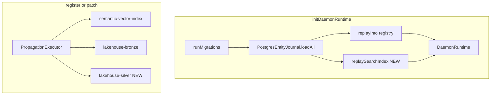

# Experience layer v2 — durability and lakehouse depth

## Context

Phases 1–4 of the data platform / experience plan are done ([`docs/02-ontology-system.md`](docs/02-ontology-system.md), [`docs/11-data-platform-lakehouse.md`](docs/11-data-platform-lakehouse.md)). Registry hydration on restart already exists via [`replayInto`](ontology/store/replay-into.ts) + [`daemon_load_entity_snapshots()`](data-platform/migrations/003_rls_app_role.sql), but [`ScopedOntologySearch`](ontology/search/scoped-ontology-search.ts) is still empty after restart until new writes hit propagation target `semantic-vector-index`.



**Non-goals:** foundation/logistics pack YAML changes; Parquet/S3 silver; SAP/Snowflake connectors; UI Workbench.

**Recommended delivery order:** (1) search replay → (2) embeddings + replay uses same embedder → (3) GPT sessions → (4) silver/gold.

---

## 1. Search index replay on startup

### Design

Mirror registry replay: after Postgres store is created, iterate `journal.loadAll()` and call `ScopedOntologySearch.index(record, scope)` for each row (scope from `record.tenantId` / `record.domainId` — already on [`EntityRecord`](packages/context-ports) via [`rowToRecord`](data-platform/operational-store/entity-journal.ts)).

### Implementation

| Change | Location |
|--------|----------|
| New `replaySearchIndex(search, journal)` | [`ontology/search/replay-search-index.ts`](ontology/search/replay-search-index.ts) (export from [`ontology/package.json`](ontology/package.json)) |
| Wire after runtime construct | [`api/gateway/src/platform/daemon-runtime.ts`](api/gateway/src/platform/daemon-runtime.ts) `initDaemonRuntime`: keep `PostgresEntityJournal.fromEnv`, `createOntologyStoreFromEnv`, then `await replaySearchIndex(singleton.search, journal)` when journal present |
| Structured log | Reuse `StructuredLogger` pattern from read-parity (`search_index_replay`, `count`) |
| Unit test | Index 2 records via `index()`, clear semantic state by new `ScopedOntologySearch` instance + replay from in-memory journal fake |
| Integration test | Extend [`tests/integration/search-hybrid.integration.test.ts`](tests/integration/search-hybrid.integration.test.ts) or new `search-replay.integration.test.ts`: ingest entity, `resetDaemonRuntimeForTests`, second `initDaemonRuntime` with same `DAEMON_POSTGRES_URL`, search without re-ingest still returns hit (requires Postgres + migrations) |

**Note:** Replay does not re-fire propagation (avoids duplicate bronze rows). Only in-memory search structures are rebuilt.

---

## 2. Production embeddings (swappable embedder)

### Design

Keep deterministic hashing as **default** (CI and local dev unchanged). Opt in via env:

- `DAEMON_EMBEDDING_PROVIDER=deterministic` (default) | `openrouter`
- `DAEMON_EMBEDDING_MODEL` — OpenRouter embedding model id (when provider is openrouter)
- Reuse existing key resolution from [`products/ontology-query`](products/ontology-query/ontology-query-chain.ts) / [`resolveOpenRouterApiKey`](products/customer-gpt/gpt-orchestrator.ts) pattern

Introduce a small **`TextEmbedder`** interface (`embed(text): number[]`, `readonly dimension: number`). [`EmbeddingPipeline`](ontology/vector-layer/embedding-pipeline.ts) implements it unchanged. Add [`ontology/vector-layer/create-embedder-from-env.ts`](ontology/vector-layer/create-embedder-from-env.ts) returning deterministic or HTTP OpenRouter embeddings (sync `fetch` with timeout; no live calls in default tests).

[`ScopedOntologySearch`](ontology/search/scoped-ontology-search.ts): constructor accepts optional `TextEmbedder`; default `createEmbedderFromEnv()`.

### Operational contract

- Changing provider or model **invalidates** vector geometry; document that operators must **restart gateway** (replay rebuilds all vectors with the active embedder).
- Keyword leg of hybrid search remains deterministic and unaffected.
- Dimension: OpenRouter model defines vector size — set `DAEMON_EMBEDDING_DIMENSION` or derive from first embed response; `VectorStore` must use embedder.dimension.

### Tests

- Factory unit test: unset env → deterministic; mock `fetch` for openrouter path.
- Existing [`embedding-pipeline.test.ts`](ontology/vector-layer/embedding-pipeline.test.ts) / [`scoped-ontology-search.test.ts`](ontology/search/scoped-ontology-search.test.ts) stay green.
- No OpenRouter key required in CI.

### Docs

- Update [`docs/02-ontology-system.md`](docs/02-ontology-system.md): replay + embedding env vars.

---

## 3. GPT sessions in Postgres

### Design

Replace module-level `Map` in [`api/gateway/src/products/products.service.ts`](api/gateway/src/products/products.service.ts) with a small store backed by Postgres (no-op without `DAEMON_POSTGRES_URL`, same pattern as [`BronzeWriter`](data-platform/lakehouse/bronze-writer.ts)).

### Schema (migration `005_gpt_sessions.sql`)

Table `daemon_gpt_sessions`:

| Column | Notes |
|--------|--------|
| `tenant_id`, `domain_id`, `session_id` | Composite PK |
| `citations` | JSONB array of entity ids (current in-memory shape) |
| `updated_at` | TIMESTAMPTZ |
| RLS | Align with [`002_governance_ssot.sql`](data-platform/migrations/002_governance_ssot.sql) / `app.tenant_id` |

Optional later: store full `turns` — **out of scope** for v2; citations-only matches current behavior.

### Implementation

| Change | Location |
|--------|----------|
| `GptSessionStore` | [`data-platform/product-sessions/gpt-session-store.ts`](data-platform/product-sessions/gpt-session-store.ts) — `get`, `upsertCitations` |
| Wire | `ProductsService` uses store; generate `session_id` UUID on first allow if header absent (optional UX improvement) or require client `x-session-id` as today |
| Policy | No new resource if reads/writes stay inside existing customer-gpt chat policy |
| Integration test | Postgres: two chat calls with same `x-session-id`, second response `priorCitations` non-empty |
| Export | [`data-platform/package.json`](data-platform/package.json) export path |

---

## 4. Lakehouse silver and gold (Postgres only)

Per your choice: **no Parquet** in this phase.

### Silver — curated latest entity state

Table `daemon_lakehouse_silver_entity` (migration `006_lakehouse_silver.sql`):

- Same identity keys as snapshots: `(tenant_id, domain_id, ontology_id, entity_id)` PK
- Columns: `entity_type`, `properties` JSONB, `version`, `source_updated_at`, `materialized_at`
- **Upsert** on each register/patch (not append-only like bronze)

New [`SilverWriter`](data-platform/lakehouse/silver-writer.ts) + propagation target `lakehouse-silver` in [`configs/governance/propagation.yaml`](configs/governance/propagation.yaml) and [`propagation-executor.ts`](ontology/governance/propagation-executor.ts) (same pattern as bronze at lines 128–133).

Wire in [`daemon-runtime.ts`](api/gateway/src/platform/daemon-runtime.ts) constructor targets (like `lakehouseBronze`).

### Gold — analytics-facing rollups

Start with **SQL views** (no separate writer) over silver/bronze, e.g.:

- `daemon_lakehouse_gold_entity_counts` — entity counts by `entity_type` per tenant/domain
- `daemon_lakehouse_gold_change_volume` — bronze events per day (from `daemon_lakehouse_bronze.indexed_at`)

Optional read API (if useful for demos): `GET /v1/lakehouse/summary` returning gold view rows — policy `read` + `lakehouse` (already in gateway policy list).

### Backfill (one-time)

Script or documented SQL: `INSERT ... SELECT DISTINCT ON ... FROM daemon_entity_snapshots` to populate silver from existing SSOT without replaying bronze history (bronze may be shorter than snapshots).

### Tests and docs

- Integration: register entity → silver row exists with latest properties; bronze row count ≥ 1
- Update [`docs/11-data-platform-lakehouse.md`](docs/11-data-platform-lakehouse.md) with silver/gold semantics and diagram
- [`data-platform/lakehouse/README.md`](data-platform/lakehouse/README.md) — bronze vs silver vs gold

---

## Validation

```bash
pnpm run build
pnpm run spec:check
pnpm run db:migrate          # applies 005, 006
pnpm run test:repo           # new integration tests gated on DAEMON_POSTGRES_URL
```

---

## Risk summary

| Risk | Mitigation |
|------|------------|
| Startup latency scales with entity count | Log replay duration; optional `DAEMON_SEARCH_REPLAY=0` kill-switch for dev |
| OpenRouter embedding latency/cost on replay | Default deterministic; openrouter opt-in; document full re-embed on restart |
| Silver upsert doubles write load | Same transaction pattern as bronze (fire-and-forget void append); monitor Postgres |
| Embedding dimension mismatch | Factory validates dimension before constructing `VectorStore` |
