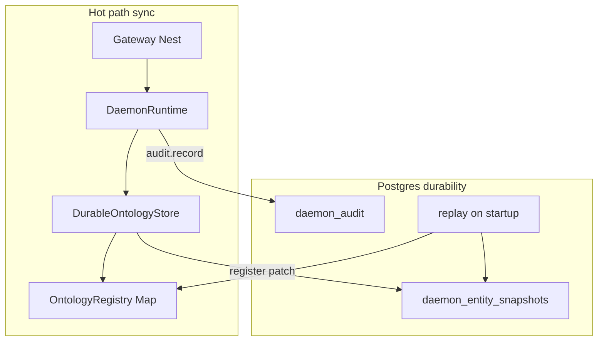

# Fase data / durability

## Konteks

Setelah fase arsitektur ([`.cursor/plans/sempurnakan_arsitektur_bc_ee86870a.plan.md`](.cursor/plans/sempurnakan_arsitektur_bc_ee86870a.plan.md)), entitas masih hidup di [`ontology/registry/ontology-registry.ts`](ontology/registry/ontology-registry.ts) (`Map` in-memory). Postgres sudah dipakai untuk:

- Ping koneksi — [`tests/integration/stores.integration.test.ts`](tests/integration/stores.integration.test.ts)
- Audit mirror parsial — [`security-governance/audit/postgres-audit-log.ts`](security-governance/audit/postgres-audit-log.ts) (tanpa `tenant_id` / `domain_id` / `metadata`)
- Graph edges — [`data-platform/graph-store/postgres-graph-store.ts`](data-platform/graph-store/postgres-graph-store.ts)

[`DaemonRuntime`](api/gateway/src/platform/daemon-runtime.ts) default ke `globalRegistry`; CI **sudah** menyediakan Postgres di job `integration` ([`.github/workflows/ci.yml`](.github/workflows/ci.yml) baris 46–87).

**Keputusan:** pola **write-through journal + replay** (pilihan Anda) — loop tetap sinkron; durability = data bertahan di Postgres dan di-hydrate saat proses gateway start.



---

## Milestone 1 — Migrasi SQL & skema audit lengkap

**Tujuan:** Satu sumber skema versioned; audit selaras dengan [`AuditPortAdapter`](security-governance/audit/audit-port-adapter.ts).

| Artefak | Lokasi |
|---------|--------|
| Migrasi awal | `data-platform/migrations/001_init.sql` — `daemon_audit`, `daemon_entity_snapshots`, `daemon_graph_edges` (selaras graph store) |
| Runner | `data-platform/migrations/run-migrations.ts` + script root `pnpm run db:migrate` |
| Apply di dev/CI | Panggil dari `PostgresClient` helper atau sekali di awal integration test / `DaemonRuntime` factory |

**Perubahan `daemon_audit`:**

```sql
-- kolom baru (ALTER aman untuk tabel existing)
tenant_id TEXT,
domain_id TEXT,
metadata JSONB
```

Update [`postgres-audit-log.ts`](security-governance/audit/postgres-audit-log.ts): `append` / `list` baca-tulis kolom baru; tetap `CREATE IF NOT EXISTS` + migrasi idempotent untuk dev lokal.

Update [`audit-port-adapter.ts`](security-governance/audit/audit-port-adapter.ts): mirror ke Postgres memasukkan `tenantId`, `domainId`, `metadata` (bukan subset 4 field saja).

**Test:** perluas [`tests/integration/audit-postgres.integration.test.ts`](tests/integration/audit-postgres.integration.test.ts) — assert `tenantId` / `metadata` round-trip.

---

## Milestone 2 — Entity journal + `DurableOntologyStore`

**Tujuan:** Setiap `register` / `patch` menulis snapshot ke Postgres; restart gateway memuat ulang registry.

**Tabel `daemon_entity_snapshots`:**

| Kolom | Catatan |
|-------|---------|
| `tenant_id`, `domain_id`, `ontology_id`, `entity_id` | PK komposit |
| `entity_type`, `properties` (JSONB), `version`, `updated_at` | Mirror [`EntityRecord`](packages/context-ports/ontology-store.ts) |

**Implementasi baru** (di `ontology/store/` atau `data-platform/operational-store/`):

- `PostgresEntityJournal` — `upsert(record)`, `loadAll()`, `loadScope(scope)` (async, pakai [`PostgresClient`](data-platform/operational-store/postgres-client.ts))
- `DurableOntologyStore` — implements `OntologyStore`; delegasi ke `OntologyRegistry`; pada mutasi: `registry` dulu lalu `void journal.upsert(...).catch(log)` (atau await di factory init saja untuk replay)
- `replayInto(registry, journal)` — urutan deterministik (`updated_at`, `entity_id`)

**Factory env:**

```ts
// ontology/store/create-ontology-store.ts
export function createOntologyStoreFromEnv(env): OntologyStore {
  if (!env.DAEMON_POSTGRES_URL) return new OntologyRegistry();
  const reg = new OntologyRegistry();
  const journal = PostgresEntityJournal.fromEnv(env);
  void replayInto(reg, journal); // atau await di bootstrap async factory
  return new DurableOntologyStore(reg, journal);
}
```

**Wire composition root:**

- [`daemon-runtime.ts`](api/gateway/src/platform/daemon-runtime.ts): `this.store = options.store ?? createOntologyStoreFromEnv(process.env)`
- [`getDaemonRuntime()`](api/gateway/src/platform/daemon-runtime.ts): singleton tetap; dokumentasikan bahwa replay terjadi sekali per proses
- Tambah dependensi `@daemon/data-platform` di [`ontology/package.json`](ontology/package.json)

**Unit test** (tanpa Postgres): `DurableOntologyStore` dengan journal in-memory fake (objek test double **bukan** mock domain — hanya port persistence).

---

## Milestone 3 — Integration & durability E2E

**Tujuan:** Bukti restart-survives di CI (job `integration` sudah set `DAEMON_POSTGRES_URL`).

File baru: [`tests/integration/ontology-durability.integration.test.ts`](tests/integration/ontology-durability.integration.test.ts)

1. `db:migrate` + tulis entity via `DurableOntologyStore` / `DaemonRuntime` untuk `inst-alpha` / `foundation`
2. Buat `OntologyRegistry` kosong + `replayInto` dari journal
3. Assert `get` mengembalikan record yang sama; tenant `ent-beta` tidak melihat entity tenant A

Opsional: perluas [`tests/integration/gateway-http.test.ts`](tests/integration/gateway-http.test.ts) dengan env Postgres di job integration saja (write HTTP → replay registry baru → read) — hanya jika tidak memperlambat CI signifikan.

Perbarui [`stores.integration.test.ts`](tests/integration/stores.integration.test.ts): setelah ping, jalankan `db:migrate` dan assert tabel ada.

---

## Milestone 4 — Dokumentasi & operasi

| Dokumen | Perubahan |
|---------|-----------|
| [`docs/06-testing.md`](docs/06-testing.md) | `pnpm run db:migrate`, alur durability, env vars |
| [`docs/06-deployment-topology.md`](docs/06-deployment-topology.md) | Postgres sebagai journal + audit; memory = cache proses |
| [`docs/07-sequence-flows.md`](docs/07-sequence-flows.md) | Diagram singkat: write → journal → replay on boot |
| [`docs/00-overview.md`](docs/00-overview.md) | Satu paragraf “durability milestone” |

Root [`package.json`](package.json): script `db:migrate`.

---

## Sengaja di luar fase ini (follow-up)

Selaras arsitektur plan **W3** dan DoD sebelumnya:

- **RLS / `schema_per_tenant`** di Postgres ([`configs/platform.yaml`](configs/platform.yaml)) — isolasi DB per tenant via `search_path`; butuh `PostgresClient.withTenant()` + kebijakan per request
- **Postgres sebagai SSOT read langsung** (tanpa memory) — butuh port `OntologyStore` async + refactor [`read-write-loops/`](read-write-loops/)
- NATS publish on write, Redis read-through cache, graph edges scoped by tenant
- REST handler parity domain validation

---

## Verifikasi sebelum selesai

```bash
pnpm run db:migrate   # dengan DAEMON_POSTGRES_URL
pnpm run build
pnpm run check:architecture
pnpm run check:ontology-pack
pnpm run test:repo    # lokal: export DAEMON_POSTGRES_URL + DAEMON_INTEGRATION_REQUIRED=1
```

CI job `integration` harus menjalankan test durability baru tanpa skip.

---

## Risiko & mitigasi

| Risiko | Mitigasi |
|--------|----------|
| Replay async vs singleton sync | Factory `await replay` sebelum `listen()` di bootstrap Nest, atau dokumentasi “first request after ready” |
| Race fire-and-forget journal | Integration test + log error; opsional flag `DAEMON_DURABILITY_STRICT=1` yang throw on journal failure |
| Skema lama `daemon_audit` | Migrasi ALTER idempotent; test integration create fresh DB (CI service container) |
