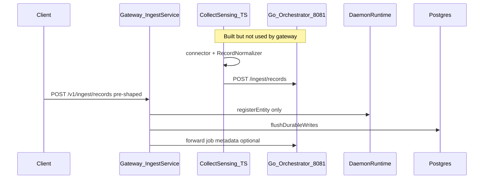
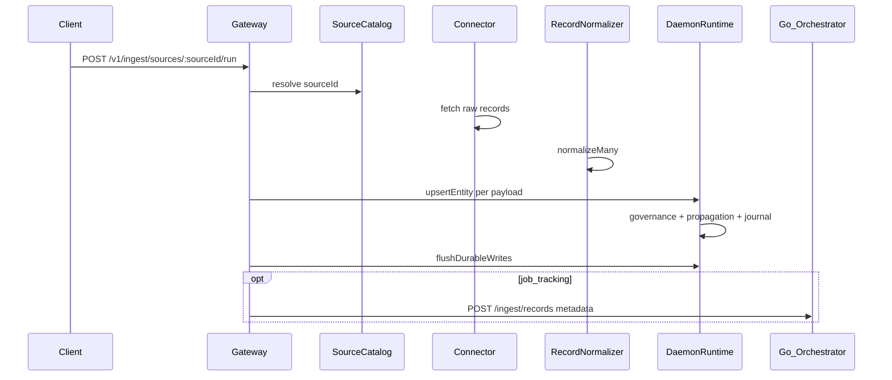

# Wire collect-sensing into durable ontology ingest

## Current state (gap)



- [`api/gateway/src/ingest/ingest.service.ts`](api/gateway/src/ingest/ingest.service.ts) already calls `registerOntologyRecords` → [`DaemonRuntime.registerEntity`](api/gateway/src/platform/daemon-runtime.ts) → `flushDurableWrites()` before proxying to Go.
- [`@daemon/collect-sensing`](collect-sensing/package.json) is **not** a gateway dependency; [`IngestionOrchestratorClient.ingestFromConnector`](collect-sensing/orchestrator/ingestion-orchestrator.ts) posts to an external base URL and never touches `DaemonRuntime`.
- Go [`IngestRecords`](collect-sensing/orchestrator/ingestion_orchestrator.go) only increments a job counter — it does not build ontology (diagram in [`docs/01-end-to-end-architecture.md`](docs/01-end-to-end-architecture.md) `ING --> REG` is aspirational).
- Re-ingest with the same `entityId` always **overwrites** via `register` (version stays 1); no **patch** path for updates ([`ontology-registry.ts`](ontology/registry/ontology-registry.ts) `registerScoped`).

## Target flow (user choice: source-run endpoint)



## Implementation plan

### 1. Source configuration (YAML SSOT)

Add [`configs/collect-sensing/sources.yaml`](configs/collect-sensing/sources.yaml) (new) describing each ingest source:

- `id`, `connector` (`type: file | http-pull | postgres-read | event-subscriber`, type-specific fields)
- `normalize`: `ontologyId`, `entityType`, `mapping`, optional `idField`, `meta`
- Optional `enabled: false` for CI-safe fixtures

Add a small fixture under [`tests/fixtures/ingest/`](tests/fixtures/ingest/) (e.g. `parties.jsonl`) referenced by a `demo-parties` source for tests.

### 2. collect-sensing: catalog + factory + exports

| File | Purpose |
|------|---------|
| [`collect-sensing/orchestrator/source-catalog.ts`](collect-sensing/orchestrator/source-catalog.ts) | Load/validate YAML; `require(sourceId)` |
| [`collect-sensing/connectors/connector-factory.ts`](collect-sensing/connectors/connector-factory.ts) | Map config → existing connectors ([`file-ingest-connector.ts`](collect-sensing/connectors/file-connectors/file-ingest-connector.ts), [`http-pull-connector.ts`](collect-sensing/connectors/api-connectors/http-pull-connector.ts), etc.) |
| [`collect-sensing/normalization/record-normalizer.ts`](collect-sensing/normalization/record-normalizer.ts) | Add optional `entityType` on `RecordNormalizerConfig`; merge into `properties.entityType` (and top-level ingest field) |

Update [`collect-sensing/package.json`](collect-sensing/package.json) exports (not only `"."`) so gateway can import catalog, factory, and normalizer without deep paths.

Keep **no** dependency from `@daemon/collect-sensing` → gateway (one-way: gateway → collect-sensing).

### 3. Gateway: dependency and ingest pipeline

- Add `"@daemon/collect-sensing": "workspace:*"` to [`api/gateway/package.json`](api/gateway/package.json).

New module/service (suggested split):

- [`api/gateway/src/ingest/ingest-pipeline.service.ts`](api/gateway/src/ingest/ingest-pipeline.service.ts) — `runSource(ctx, sourceId)`: catalog → connector → `RecordNormalizer` → persist batch
- Refactor [`api/gateway/src/ingest/ingest.service.ts`](api/gateway/src/ingest/ingest.service.ts) — extract shared `persistIngestRecords(ctx, records)` used by existing `POST /v1/ingest/records` and the pipeline

New controller route in [`api/gateway/src/ingest/ingest.controller.ts`](api/gateway/src/ingest/ingest.controller.ts):

```ts
@Post("sources/:sourceId/run")
@Protected()
@PolicyCheck("ingest", "ingest-source")
runSource(@Headers() headers, @Param("sourceId") sourceId: string)
```

Wire provider in [`api/gateway/src/ingest/ingest.module.ts`](api/gateway/src/ingest/ingest.module.ts).

### 4. Durable register **or** patch (ontology build)

Add [`DaemonRuntime.upsertEntity`](api/gateway/src/platform/daemon-runtime.ts):

1. `store.get(scope, ontologyId, entityId)`
2. If missing → existing `registerEntity` (propagation via registry listener unchanged)
3. If present → `validateEntityForPack` on merged/patch properties → `store.patch` with property delta (not full replace unless you merge in service)

Use `upsertEntity` from ingest persist path instead of always `registerEntity`.

Journal already records `changeType` `register` vs `patch` in [`durable-ontology-store.ts`](ontology/store/durable-ontology-store.ts).

### 5. Go orchestrator role (unchanged semantics, clearer contract)

After successful ontology persist:

- If `DAEMON_INGEST_SKIP_UPSTREAM` → return local job result (same as today)
- Else → `POST /ingest/records` to Go with **normalized** payloads for job bookkeeping only

Document in [`docs/07-sequence-flows.md`](docs/07-sequence-flows.md): canonical ontology write is gateway; Go is optional job ledger.

### 6. Tests and CI

| Test | What it proves |
|------|----------------|
| Unit: `source-catalog.test.ts` | YAML load + unknown source |
| Unit: `connector-factory.test.ts` | file connector from config |
| Unit: `record-normalizer` | `entityType` injection |
| Gateway unit or integration | `POST /v1/ingest/sources/demo-parties/run` registers Party, read returns entity; second run **patches** (version &gt; 1 or property change) |
| Extend [`tests/e2e/ingest-read-write-http.test.ts`](tests/e2e/ingest-read-write-http.test.ts) or new integration test behind `DAEMON_INTEGRATION_REQUIRED` | End-to-end source-run → read |

Existing [`tests/integration/gateway-http.test.ts`](tests/integration/gateway-http.test.ts) ingest tests stay valid for pre-shaped `/records`.

### 7. Documentation

- Update [`docs/07-sequence-flows.md`](docs/07-sequence-flows.md) with **source-run** sequence (replace abstract “normalize → OntologyRegistry” with gateway path).
- Short section in [`docs/02-bounded-contexts.md`](docs/02-bounded-contexts.md) or [`docs/06-testing.md`](docs/06-testing.md): how to run `demo-parties` source ingest locally.
- Clarify [`docs/01-end-to-end-architecture.md`](docs/01-end-to-end-architecture.md) edge: `ING` (Go) is job metadata; **ontology build** is `Gateway → DaemonRuntime`.

## Out of scope (follow-ups)

- Rust semantic shim in normalization path ([`docs/04-language-engine-toolchain.md`](docs/04-language-engine-toolchain.md))
- Stream/replay pipelines auto-scheduling (batch only in first wire)
- Replacing Go orchestrator entirely
- Link/graph persistence from ingest (only if normalized payloads include `Link` entities with valid relation fields)

## Risk notes

- **Tenant headers** required on source-run (same as `/records`); connector fetch is tenant-agnostic — scope applies only at persist.
- **Path resolution** for file connectors: resolve relative paths from repo root or `configs/collect-sensing/` explicitly in catalog loader.
- **Pack validation**: normalized properties must satisfy foundation `Party` (or configured type) or ingest returns 400 before partial batch commit — decide fail-fast on first invalid row vs collect errors (recommend fail-fast for v1).
