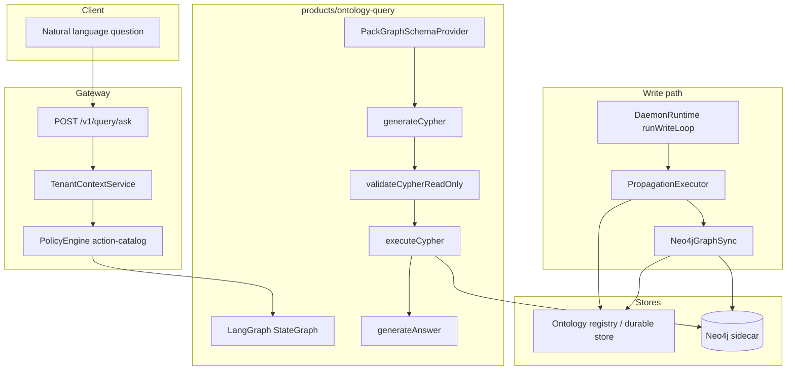

# LangGraph + Neo4j ontology natural-language query

## Goal

Deliver an **NL → Cypher → execute → answer** path aligned with [LangChain JS graph QA](https://js.langchain.com/docs/tutorials/graph) and [SQL QA / LangGraph state](https://js.langchain.com/docs/tutorials/sql_qa), grounded in the daemon **foundation pack** ([`configs/ontology/packs/foundation/`](configs/ontology/packs/foundation/)) and governed like other gateway actions.

You chose **NL query chain** + **Neo4j sidecar** (not OWL-only artifacts in v1).

## Locked decisions

| Decision | Choice | Notes |
|----------|--------|--------|
| LLM provider | **OpenRouter** | Same model-routing story as [daemon-intelligence](file:///Users/macbook/.agents/skills/daemon-intelligence/SKILL.md) (300+ models, OpenAI-compatible). Use **`@langchain/openrouter`** `ChatOpenRouter` (preferred over generic `ChatOpenAI` + `baseURL`). |
| Neo4j sync scope | **Entities + links** | Sync on all entity `register`/`patch` (nodes) and `Link` register/patch (rels), not links-only. |
| Historical backfill | **v1 backfill job** | One-shot / CLI job reads Postgres `daemon_graph_edges` (+ entity rows from durable store) and upserts into Neo4j when `DAEMON_NEO4J_URI` is set. Idempotent MERGE-style upserts. |
| Query router (v1) | **Cypher-only** | LangGraph linear chain only; hybrid Cypher vs `QueryPlanner` deferred to v1.1. |
| CI / tests | **Mock LLM + gated Neo4j** | Unit tests mock `ChatOpenRouter`; integration uses `skipUnlessNeo4jReady()`; no API keys in CI. |

### OpenRouter configuration (implementation contract)

**Environment (dev / gateway):**

- `OPENROUTER_API_KEY` — required when ontology query is enabled (LangChain reads this by default; also accept `DAEMON_OPENROUTER_API_KEY` as alias in gateway config loader for consistency with other `DAEMON_*` vars).
- `DAEMON_ONTOLOGY_QUERY_MODEL` — OpenRouter model id, e.g. `anthropic/claude-sonnet-4.5` or a free-tier model for local dev (`arcee-ai/trinity-large-preview:free` per daemon-intelligence).
- Optional attribution (OpenRouter headers): `DAEMON_OPENROUTER_SITE_URL`, `DAEMON_OPENROUTER_SITE_NAME` → pass to `ChatOpenRouter` `siteUrl` / `siteName`.

**LangGraph nodes:**

```typescript
import { ChatOpenRouter } from "@langchain/openrouter";

const model = new ChatOpenRouter({
  model: process.env.DAEMON_ONTOLOGY_QUERY_MODEL ?? "anthropic/claude-sonnet-4.5",
  temperature: 0,
  maxTokens: 2048,
  siteUrl: process.env.DAEMON_OPENROUTER_SITE_URL,
  siteName: process.env.DAEMON_OPENROUTER_SITE_NAME ?? "daemon-sdk",
});
```

Use the same model instance (or separate instances with different `temperature`) in `generate-cypher` and `generate-answer` nodes.

**Future (out of v1):** route through platform `daemon-ai` chat completions (`daemon_*` key) for billing/tiers — ontology-query stays on direct OpenRouter in v1 to avoid coupling gateway to Railway.

## Current baseline (what we extend)

| Layer | Today | Role in this plan |
|-------|--------|-------------------|
| Pack SSOT | YAML entities/relations ([`docs/02-ontology-system.md`](docs/02-ontology-system.md)) | Becomes **graph schema + LLM semantic layer** |
| Writes | [`DaemonRuntime`](api/gateway/src/platform/daemon-runtime.ts) + propagation | **Feeds Neo4j** on `Link` via `graph-edge-sync` |
| Postgres edges | [`PostgresGraphStore`](data-platform/graph-store/postgres-graph-store.ts) | Keep for durability/integration; **Neo4j is query-optimized read model** |
| In-memory graph | [`RelationGraph`](ontology/semantic-layer/relation-graph.ts) | Optional parity; not the NL target |
| Analytics search | [`QueryWizard`](products/analytics-workflows/query-wizard.ts) (substring) | Complementary; NL path is graph + structured filters |
| Agents | [`ToolRunner`](action-runtime/agent-runtime/tool-runner.ts) (framework-agnostic) | Optional phase-2 tool wrapper; not required for v1 API |

**No LangChain packages exist today** — this is a new workspace surface.

## Architecture



## Phase 0 — Ontology-engineer foundation (docs + schema contract)

Follow the **ontology-engineer** workflow (scope → reuse → conceptual model → formalization → validation), adapted to **property graphs** instead of OWL in v1.

**Deliverables (repo artifacts, not PDFs):**

1. **`docs/09-ontology-competency-questions.md`** — 8–12 questions the NL layer must answer, e.g.:
   - Which parties are linked to case X?
   - What is the shortest path between two entities?
   - List cases with status Y for tenant T
2. **`docs/10-neo4j-graph-model.md`** — node/relationship model:
   - Node label `Entity` + secondary label per `entityType` (`Party`, `Case`, …)
   - Relationship `LINK` with `linkType`, `ontologyId`, `tenantId`, `domainId`
   - Required properties on nodes: `entityId`, `entityType`, `ontologyId`, `tenantId`, `domainId`, plus pack fields as properties
3. **`ontology/graph-schema/pack-graph-schema.ts`** — loads foundation pack YAML and emits:
   - Neo4j **constraints/indexes** (unique `(tenantId, domainId, ontologyId, entityId)`)
   - **Prompt-safe schema summary** (labels, rel types, property types) for the LLM

**Reuse assessment (ontology-engineer):** document alignment to schema.org-style naming where helpful; **do not** import full OWL in v1 — keep pack YAML as SSOT.

## Phase 1 — Neo4j sidecar and sync

### Infrastructure

- Extend [`deployment/docker/compose.dev.yaml`](deployment/docker/compose.dev.yaml) with `neo4j:5` (HTTP + Bolt), auth via env, volume for dev data.
- Env vars (document in [`docs/06-testing.md`](docs/06-testing.md)):
  - `DAEMON_NEO4J_URI` (e.g. `bolt://127.0.0.1:7687`)
  - `DAEMON_NEO4J_USER` / `DAEMON_NEO4J_PASSWORD`
  - `DAEMON_NEO4J_QUERY_USER` (optional read-only user for the QA chain)
  - `OPENROUTER_API_KEY` / `DAEMON_ONTOLOGY_QUERY_MODEL` (see **OpenRouter configuration** above)
  - `DAEMON_ONTOLOGY_QUERY_ENABLED` (gateway feature flag)

### Sync implementation

New module under **`data-platform/graph-store/`** (or `ontology/graph-sync/`):

- **`neo4j-graph-store.ts`** — Bolt driver wrapper: `upsertEntity`, `upsertLink`, `ensureSchema`, read-only `runReadQuery(cypher, params)`
- **`neo4j-graph-sync.ts`** — implements propagation target behavior (mirror [`GraphEdgeSyncPort`](ontology/governance/propagation-graph-sync.ts))

**Wiring:**

- Register target `neo4j-graph-sync` in [`configs/governance/propagation.yaml`](configs/governance/propagation.yaml) alongside `graph-edge-sync` for **`Link` register/patch** and **`default-register` / per-entity register+patch** so **Entity nodes exist before LINK rels** (locked: full entity + link sync).
- Extend [`PropagationExecutor`](ontology/governance/propagation-executor.ts) to call sync when `DAEMON_NEO4J_URI` is set (no-op when unset, same pattern as [`PostgresGraphStore.fromEnv`](data-platform/graph-store/postgres-graph-store.ts)).

**Tenant isolation (critical):** sync writes `tenantId` / `domainId` on every node and rel. The query layer **injects** `WHERE n.tenantId = $tenantId AND n.domainId = $domainId` (or uses subquery wrapper) — never rely on the model to scope tenancy.

### Backfill (v1)

**`ontology/graph-sync/neo4j-backfill.ts`** (or `tools/cli` command `daemon-cli graph backfill-neo4j`):

1. **Sources:** `PostgresGraphStore` / SQL on `daemon_graph_edges`; entity snapshots from durable ontology store (same fields propagation uses).
2. **Behavior:** batched upserts via `Neo4jGraphSync`; `MERGE` on node key `(tenantId, domainId, ontologyId, entityId)` then rels; safe to re-run (idempotent).
3. **Flags:** `--tenant-id`, `--domain-id`, `--dry-run`, `--batch-size`; skip when Neo4j unset.
4. **Test:** integration test seeds Postgres edges, runs backfill, asserts Neo4j counts (gated).

Run after enabling Neo4j in dev or after migration; document in `docs/06-testing.md` and `docs/10-neo4j-graph-model.md`.

## Phase 2 — LangGraph NL query product

### New package

**`products/ontology-query/`** (workspace package `@daemon/ontology-query`):

| File | Responsibility |
|------|----------------|
| `state.ts` | LangGraph `Annotation` state: `question`, `cypher`, `cypherParams`, `rawResult`, `answer`, `error` |
| `nodes/generate-cypher.ts` | LLM with pack schema + few-shot examples from competency doc |
| `nodes/validate-cypher.ts` | Block `CREATE`, `DELETE`, `MERGE`, `SET`, `DROP`, `LOAD`, `CALL dbms`, multi-statement |
| `nodes/execute-cypher.ts` | `Neo4jGraphStore.runReadQuery` with timeout + row limit |
| `nodes/generate-answer.ts` | LLM summarizes results in natural language |
| `graph.ts` | `StateGraph` wiring (linear chain first; optional router later for entity-only vs graph questions) |
| `ontology-query-chain.ts` | Public `ask(req): Promise<AskResult>` |

**Dependencies (add only to this package):** `@langchain/langgraph`, `@langchain/core`, **`@langchain/openrouter`** (`ChatOpenRouter`), `neo4j-driver`. Prefer a **custom LangGraph graph** over baking in deprecated chain APIs; mirror the [graph tutorial](https://js.langchain.com/docs/tutorials/graph) behavior (generate → execute → answer) with an explicit validation node (stricter than stock `GraphCypherQAChain`). See [LangChain ChatOpenRouter](https://docs.langchain.com/oss/javascript/integrations/chat/openrouter).

**Optional:** thin adapter that wraps LangChain’s `GraphCypherQAChain` if the JS package version in use still exports it — validate during implementation and default to custom nodes if typings/API drift.

### Gateway surface

- Nest module under [`api/gateway/src/`](api/gateway/src/): `POST /v1/query/ask` body `{ question, ontologyId? }`
- Resolve tenant/domain from [`TenantContextService`](api/gateway/src/platform/tenant-context.ts)
- Policy: extend [`configs/governance/action-catalog.yaml`](configs/governance/action-catalog.yaml) with e.g. `query` / `ontology-nl` / `allow`; load via existing [`action-catalog-loader`](ontology/governance/action-catalog-loader.ts)
- Return `{ answer, cypher?, resultPreview?, plan? }` — include generated Cypher in dev mode only (env flag)

### Hybrid routing (v1.1 — not in v1)

Deferred: LangGraph **router node** that sends graph-shaped questions to Cypher and others to [`QueryPlanner`](ontology/projections/query-optimizers/query-planner.ts). v1 always runs the Cypher chain (competency questions should be graph-shaped).

## Phase 3 — Safety, governance, and tests

**Security (from LangChain graph tutorial warnings):**

- Dedicated **read-only** Neo4j role for execute step
- **Cypher validator** + max rows + query timeout (e.g. 5s)
- **No write Cypher** even if the model hallucinates it

**Tests:**

| Test | Location |
|------|----------|
| Cypher validator unit | `products/ontology-query/*.test.ts` |
| Pack schema generation | `ontology/graph-schema/pack-graph-schema.test.ts` |
| Neo4j sync on Link register | `tests/integration/ontology-neo4j-sync.integration.test.ts` (skip unless `DAEMON_NEO4J_URI`) |
| NL ask E2E (mock LLM or recorded fixtures) | `tests/integration/ontology-query.integration.test.ts` |
| Gateway contract | extend [`tests/contract/api-contract.test.ts`](tests/contract/api-contract.test.ts) |

**CI:** extend `pnpm run test:repo` only if Neo4j tests are gated with `skipUnlessNeo4jReady()` (same pattern as [`tests/helpers/postgres-integration.ts`](tests/helpers/postgres-integration.ts)).

## Phase 4 — Documentation and ops

- Update [`docs/07-sequence-flows.md`](docs/07-sequence-flows.md) with NL query sequence (parallel to existing read/write flows)
- Update [`docs/08-semantic-governance-alignment.md`](docs/08-semantic-governance-alignment.md) table: competency questions → `ontology-query`; graph model → Neo4j sync
- CLI: `daemon-cli dev up` message lists Neo4j URL when service added

## Out of scope (v1)

- Full OWL/RDF export and SPARQL endpoint (ontology-engineer formalization deferred)
- Replacing Postgres `daemon_graph_edges` (keep dual-write for now)
- Arbitrary SQL generation against operational tables (LangChain SQL QA pattern **not** applied to Postgres in v1)
- Production billing via daemon-ai platform gateway — v1 uses **direct OpenRouter** env keys only

## Key files to touch

- [`deployment/docker/compose.dev.yaml`](deployment/docker/compose.dev.yaml)
- [`configs/governance/propagation.yaml`](configs/governance/propagation.yaml)
- [`ontology/governance/propagation-executor.ts`](ontology/governance/propagation-executor.ts)
- [`api/gateway/src/platform/daemon-runtime.ts`](api/gateway/src/platform/daemon-runtime.ts) (wire sync client + query service)
- New: `data-platform/graph-store/neo4j-*.ts`, `ontology/graph-sync/neo4j-backfill.ts`, `products/ontology-query/**`, `api/gateway/src/query/**`, `docs/09-*`, `docs/10-*`

## Risk notes

- **Schema drift:** pack YAML changes must regenerate prompt schema (run `check:ontology-pack` in CI; add `check:graph-schema` if needed).
- **Dual graph stores:** Postgres edges vs Neo4j — document reconciliation; integration test should assert Link register appears in both when configured.
- **LLM cost/latency:** gate behind feature flag `DAEMON_ONTOLOGY_QUERY_ENABLED` for gateway.
