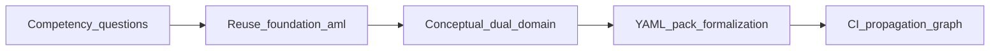
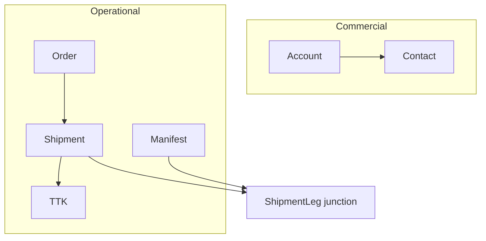

# Logistics-commercial ontology extension (R1 + R2)

## Authority and scope

| Source | Role |
|--------|------|
| [docs/private/client-definition/00-executive-summary.md](docs/private/client-definition/00-executive-summary.md) | Platform boundary: DAEMON = semantic SSOT; operational execution stays downstream |
| [docs/private/client-definition/03-semantic-model-definition.md](docs/private/client-definition/03-semantic-model-definition.md) | Dual-domain mapping; **ShipmentLeg** junction; pack id `logistics-commercial` |
| [docs/private/client-definition/08-gap-and-roadmap-register.md](docs/private/client-definition/08-gap-and-roadmap-register.md) | R1 pack → R2 propagation/Neo4j → R3 federated read (out of this plan) |
| [docs/private/client-definition/PRD-logistics-ontology-extension.md](docs/private/client-definition/PRD-logistics-ontology-extension.md) | KR1–KR4, Appendix A P0/P1 |
| [docs/PRD-logistics-commercial-extension.md](docs/PRD-logistics-commercial-extension.md) | Public committable stub (already on `main`) |

**Defaults** (user skipped scope questions): **P0-only v1**; **OM canonical `entityType` names** (`Account`, `Shipment`, `ShipmentLeg`, …) to align with [09-traceability-matrix.csv](docs/private/client-definition/09-traceability-matrix.csv).

**Non-goals:** foundation changes; ANTERO/federated write-back (R3); Layer 6+ entities; new governed actions unless OM mandates.

---

## Ontology-engineer workflow (adapted to DAEMON)



### 1. Competency questions (scope)

Draft **5–8 questions** the v1 pack must answer (private doc first, then selective public add to [docs/09-ontology-competency-questions.md](docs/09-ontology-competency-questions.md)):

- Which **Account** is linked to a **Contact**?
- What **Shipments** exist for an **Order**?
- Which **Manifest** rows connect to a **Shipment** via **ShipmentLeg**?
- What **TTK** documents reference a **Shipment**?

Explicit **negative competency** (from [07-competency-and-query-scope.md](docs/private/client-definition/07-competency-and-query-scope.md)): TP/pricing/Signal stages remain unanswerable until P1 entities + graph scope exist.

### 2. Reuse assessment

| Reuse | Use |
|-------|-----|
| Foundation `Party` / `Organization` | Optional future `Link` to `Account`; v1 does not duplicate Party as Account |
| `aml-compliance` pattern | Template for [configs/ontology/domains/catalog.yaml](configs/ontology/domains/catalog.yaml) + merge tests |
| `CaseEvent` junction pattern | Template for `ShipmentLeg` endpoints `[Shipment, Manifest]` |
| `Link` relation | Optional v1.1 typed links (Account–Contact); v1 can use foundation `Link` with `fromEntityType`/`toEntityType` |

No OWL/RDF export unless requested later; **YAML + CI** is the formalization layer per [docs/08-semantic-governance-alignment.md](docs/08-semantic-governance-alignment.md).

### 3. Conceptual model (v1 P0)



**ShipmentLeg** is a **junction** (not a free-standing operational entity), matching OM two-hierarchy doctrine in `03`.

---

## R1 — Extension pack + domain + CI

### Pack layout (mirror `aml-compliance`)

Create:

```
configs/ontology/packs/extensions/logistics-commercial/
  pack.yaml
  entities/
    Account.yaml
    Contact.yaml
    Order.yaml
    Shipment.yaml
    TTK.yaml
    Manifest.yaml          # required for ShipmentLeg endpoints in P0
  junctions/
    ShipmentLeg.yaml
```

Reference implementations:

- [configs/ontology/packs/extensions/aml-compliance/pack.yaml](configs/ontology/packs/extensions/aml-compliance/pack.yaml) — `ontologyId: foundation`, `entityTypes` list
- [configs/ontology/packs/foundation/entities/Party.yaml](configs/ontology/packs/foundation/entities/Party.yaml) — field schema (`name`, `type`, `required`)
- [configs/ontology/packs/foundation/junctions/CaseEvent.yaml](configs/ontology/packs/foundation/junctions/CaseEvent.yaml) — `endpoints: [A, B]`

**`pack.yaml` (sketch):**

- `ontologyId: foundation` (required by [ontology/packs/merge-packs.ts](ontology/packs/merge-packs.ts))
- `version: 0.1.0`
- `entityTypes`: Account, Contact, Order, Shipment, TTK, Manifest
- `junctionTypes`: ShipmentLeg

**Minimal fields (steward can expand from OM PDF):** ids/refs, `displayName` or `name`, `status`, `externalRef`, timestamps as optional strings—keep v1 small to unblock CI and ingest tests.

### Domain catalog + tenancy

Extend [configs/ontology/domains/catalog.yaml](configs/ontology/domains/catalog.yaml):

```yaml
- id: logistics
  label: Logistics commercial extension
  packIds: [foundation]
  extensionPack: logistics-commercial
```

Extend [configs/tenancy.yaml](configs/tenancy.yaml): add `logistics` to `enabledDomains` for at least one tenant (recommend new `logistics-pilot` test tenant **or** `inst-alpha`—avoid changing `default` until sign-off).

### Runtime merge (no code change expected)

[PackResolver](ontology/packs/pack-resolver.ts) already merges when `domain.extensionPack` is set. Verify:

- `listKnownExtensionPackIds()` picks up new directory ([ontology/packs/extension-pack-id.ts](ontology/packs/extension-pack-id.ts))
- Merge rejects duplicate entity names ([ontology/packs/merge-packs.ts](ontology/packs/merge-packs.ts)) — **Activity** is safe (foundation has `Event`, not `Activity`)

### Tests (R1 gate)

| Test | File / command |
|------|----------------|
| Pack merge includes logistics types | Extend [tests/ontology/pack-compliance.test.ts](tests/ontology/pack-compliance.test.ts) (pattern: aml-compliance test at L32–44) |
| Extension id validation | [ontology/packs/extension-pack-id.test.ts](ontology/packs/extension-pack-id.test.ts) |
| Tenancy domain enabled | [tests/tenancy/isolation.test.ts](tests/tenancy/isolation.test.ts) |
| Gateway ingest with `X-Daemon-Domain: logistics` | Extend [tests/integration/gateway-http.test.ts](tests/integration/gateway-http.test.ts) (pattern: aml-compliance at L268) |
| CI | `pnpm run check:ontology-pack`, `pnpm run check:tenancy-config` |

**KR1 acceptance:** P0 types validate; sample ingest of Account + Shipment + ShipmentLeg membership passes governance validator.

---

## R2 — Propagation, graph, NL scope

### Propagation rules

Append to [configs/governance/propagation.yaml](configs/governance/propagation.yaml) explicit rules for P0 types (register + patch), e.g.:

- `Account`, `Contact` → `read-model-projection`, `neo4j-graph-sync`, `audit-loop` on patch
- `Order`, `Shipment`, `TTK`, `Manifest` → same pattern
- `ShipmentLeg` → junction-specific surfaces if executor supports junction triggers; else rely on `default-register` / `default-patch` and document in gap register

Add integration test: register/patch `Shipment` fires propagation surfaces (mirror existing Case tests if present).

### Graph schema + Neo4j (domain-aware)

Today [buildPackGraphSchema](ontology/graph-schema/pack-graph-schema.ts) defaults to **foundation only**; [OntologyQueryChain](products/ontology-query/ontology-query-chain.ts) uses that static summary; [generate-cypher.ts](products/ontology-query/nodes/generate-cypher.ts) hardcodes foundation labels in the system prompt.

**Required changes:**

1. Resolve **merged pack** per `(tenantId, domainId)` via `PackResolver` when building schema for NL query and optional `ensureSchema`.
2. Pass merged pack into `buildPackGraphSchema(pack)` so `promptSchemaSummary` lists `Account`, `Shipment`, etc.
3. Relax or replace hardcoded label list in `generate-cypher.ts` to derive allowed type labels from `schemaSummary` / pack manifest.
4. Update [docs/10-neo4j-graph-model.md](docs/10-neo4j-graph-model.md) with extension type labels (generic wording, no client names).
5. Integration: [tests/integration/ontology-neo4j-sync.integration.test.ts](tests/integration/ontology-neo4j-sync.integration.test.ts) — ingest logistics domain entity, assert `:Entity:Shipment` node.

### Competency + public docs

| Doc | Action |
|-----|--------|
| Private `client-definition/07` | Mark in-scope questions for P0 |
| [docs/09-ontology-competency-questions.md](docs/09-ontology-competency-questions.md) | Add logistics section (sanitized) |
| [docs/08-semantic-governance-alignment.md](docs/08-semantic-governance-alignment.md) | Change planned extension row from **Not started** → **In progress** / **Done** per phase |
| [docs/PRD-logistics-commercial-extension.md](docs/PRD-logistics-commercial-extension.md) | Check off success criteria when shipped |

### Traceability (private)

Update [09-traceability-matrix.csv](docs/private/client-definition/09-traceability-matrix.csv) rows for DOC-03 commercial/operational entities: `repo_path` → `configs/ontology/packs/extensions/logistics-commercial/...`, `status` → `in_scope` as each lands.

---

## R3 (explicitly out of scope here)

Federated read from operational SSOT ([08](docs/private/client-definition/08-gap-and-roadmap-register.md) item 4) — separate design; no API work in this plan.

---

## P1 follow-up wave (after P0 merge)

When approved, add entities from private PRD Appendix A P1: Lead, Opportunity, Pipeline, Conversation, Activity, AccountPlan, Signal, Trip, Dispatch, RoutingDecision — plus propagation + competency updates. Keeps first PR reviewable.

---

## Validation checklist (ontology-engineer)

- [ ] Competency questions documented and answerable via pack + graph for P0
- [ ] No orphan YAML files (manifest lists match disk — enforced by [load-pack.ts](ontology/packs/load-pack.ts))
- [ ] No foundation entity name collisions after merge
- [ ] `pnpm run check:ontology-pack` + pack-compliance + gateway integration green
- [ ] NL query does not claim logistics answers when `domainId=foundation`
- [ ] Private traceability rows updated; public docs sanitized

---

## Risk notes

| Risk | Mitigation |
|------|------------|
| `Activity` vs `Event` confusion | Distinct `entityType`; document in competency |
| NL schema still foundation-only | R2 domain-aware `buildPackGraphSchema` is mandatory for KR4 |
| Bottom-up Supabase columns | Block ingest without pack validation (KR3) |
| NDA in public commits | Only generic names in public docs; OM names in YAML are logistics-standard, not client trademark |
