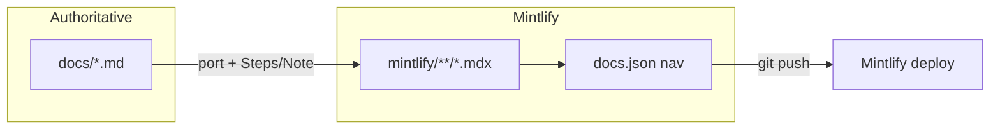

# Mintlify documentation and go-live guide

## Context

The repo maintains **two documentation surfaces**:

| Surface | Path | Role |
|---------|------|------|
| Authoritative Markdown | [`docs/`](docs/) | CI references, deep engineering, parity evidence |
| Published site | [`mintlify/`](mintlify/) | Mintlify deploy at `/mintlify` per [`mintlify/README.md`](mintlify/README.md) |

[`mintlify/guides/engineering-docs-index.mdx`](mintlify/guides/engineering-docs-index.mdx) maps sources through `12-connectors-catalog.md` only. **Six newer docs are not published:**

- [`docs/14-data-integration-map.md`](docs/14-data-integration-map.md)
- [`docs/15-data-connection-map.md`](docs/15-data-connection-map.md)
- [`docs/16-data-ops-lifecycle-map.md`](docs/16-data-ops-lifecycle-map.md)
- [`docs/17-platform-decision-map.md`](docs/17-platform-decision-map.md)
- [`docs/18-enterprise-platform-map.md`](docs/18-enterprise-platform-map.md)
- [`docs/19-product-parity-matrix.md`](docs/19-product-parity-matrix.md)

Also missing from Mintlify nav: [`docs/13-sdk.md`](docs/13-sdk.md), [`docs/05-observability-runbook.md`](docs/05-observability-runbook.md) (distinct from [`docs/05-observability.md`](docs/05-observability.md) → [`mintlify/operations/observability.mdx`](mintlify/operations/observability.mdx)).

[`mintlify/architecture/overview.mdx`](mintlify/architecture/overview.mdx) is behind [`docs/00-overview.md`](docs/00-overview.md) (no parity matrix, DSDK production E2E, or maps 14–18 links).



## Writing rules (reconcile attached skills)

Apply skills in this order so they do not fight each other:

| Skill | Apply where | Constraint for this project |
|-------|-------------|---------------------------|
| [tech-writer-researcher](file:///Users/macbook/.claude/skills/tech-writer-researcher/SKILL.md) | IA, doc type, review checklist | Runbooks/how-tos may use **Mintlify `Steps`**, tables, and `Warning`/`Note`** per [`mintlify/AGENTS.md`](mintlify/AGENTS.md) |
| [technical-writing](file:///Users/macbook/.claude/skills/technical-writing/SKILL.md) | Prose sections in `docs/` | Peer tone, how/why, no filler words; **paragraph-first** in source Markdown |
| [content-humanizer](file:///Users/macbook/.claude/skills/content-humanizer/SKILL.md) | Final MDX pass only | **Light pass**: remove AI tells, add specificity from repo paths/commands; **no** blog personality on runbooks |

Mintlify house style (already in AGENTS.md): second person, active voice, no emoji in body, root-relative links (`/operations/deployment`).

## Phase 1 — Authoritative go-live guide (priority)

**New file:** [`docs/20-deployment-go-live-guide.md`](docs/20-deployment-go-live-guide.md)

**Audience:** Platform engineers and forward-deploy engineers taking a **single customer environment** from “parity green in CI” to “operational production.”

**Source material to ground claims (no vague “many companies”):**

- Topology: [`docs/06-deployment-topology.md`](docs/06-deployment-topology.md), [`deployment/docker/compose.prod.yaml`](deployment/docker/compose.prod.yaml), [`deployment/helm/daemon-platform/`](deployment/helm/daemon-platform/)
- Security/audit: [`docs/05-security-governance.md`](docs/05-security-governance.md), [`configs/environments/prod.yaml`](configs/environments/prod.yaml)
- Observability: [`docs/05-observability-runbook.md`](docs/05-observability-runbook.md)
- Smoke/validation: [`scripts/staging-smoke.mjs`](scripts/staging-smoke.mjs), [`tests/integration/foundry-parity-golden.integration.test.ts`](tests/integration/foundry-parity-golden.integration.test.ts), [`tests/integration/dsdk-production-smoke.integration.test.ts`](tests/integration/dsdk-production-smoke.integration.test.ts)
- Domain packs: [`configs/ontology/packs/foundation/`](configs/ontology/packs/foundation/), extension packs under `configs/ontology/packs/extensions/`
- Parity scope: [`docs/19-product-parity-matrix.md`](docs/19-product-parity-matrix.md) (what is Live vs what still needs customer wiring)

**Suggested structure:**

1. **Prerequisites** — Postgres URL, migrate, API keys, tenant/domain config, optional Neo4j/LLM flags.
2. **Deployment profiles** — three named profiles aligned with prior discussion:
   - **Minimal** — gateway + Postgres + foundation pack; no external connectors.
   - **Standard** — + ingest schedules, lakehouse export path, metrics/OTel, staging smoke.
   - **Full** — + S3/Kafka connectors, Neo4j graph profile, agent worker, Helm/K8s, SIEM forwarding hooks.
3. **Go-live sequence** — ordered steps with copy-paste commands (`pnpm run db:migrate`, compose/helm, `pnpm run staging:smoke`, golden test env vars when validating).
4. **Per-domain checklist** — ontology pack promote/UAT, connector credentials, `check:sources`, data-health endpoint.
5. **Post-go-live operations** — pointer to observability runbook, incident loop in security doc, `GET /v1/ops/health`.
6. **Honest limits** — API-key auth (not full enterprise IdP in gateway), customer-specific ontology work per vertical, parity ≠ turnkey multi-tenant SaaS.

**Wire into hub docs:**

- Add milestone/link in [`docs/00-overview.md`](docs/00-overview.md).
- Cross-link from [`docs/06-deployment-topology.md`](docs/06-deployment-topology.md) and [`docs/05-observability-runbook.md`](docs/05-observability-runbook.md).

## Phase 2 — Mintlify publish and navigation

### 2a. New / updated MDX pages

| Source | Proposed Mintlify path | Notes |
|--------|------------------------|--------|
| `docs/20-deployment-go-live-guide.md` | `operations/go-live.mdx` | Use `<Steps>` for go-live sequence; `<Warning>` for production Postgres requirement |
| `docs/05-observability-runbook.md` | `operations/observability-runbook.mdx` | Or merge into observability page with anchor; prefer **separate page** for on-call |
| `docs/13-sdk.md` | `guides/sdk.mdx` | New “Develop” group or under Get started |
| `docs/14` … `docs/19` | `platform/data-integration-map.mdx` … `platform/product-parity.mdx` | New nav group **“Platform maps”** |

Port pattern: frontmatter `title`/`description`, preserve tables and mermaid, replace `./foo.md` links with Mintlify routes per [engineering-docs-index](mintlify/guides/engineering-docs-index.mdx).

### 2b. Refresh stale pages

- [`mintlify/architecture/overview.mdx`](mintlify/architecture/overview.mdx) — sync milestones from `docs/00-overview` (parity program, DSDK production, links to platform maps).
- [`mintlify/operations/deployment.mdx`](mintlify/operations/deployment.mdx) — add Card/link to `/operations/go-live`.

### 2c. Navigation — [`mintlify/docs.json`](mintlify/docs.json)

Extend `navigation.tabs[0].groups`:

```json
{
  "group": "Operations",
  "pages": [
    "operations/go-live",
    "operations/testing",
    "operations/deployment",
    "operations/observability-runbook",
    "operations/observability",
    "operations/security-governance"
  ]
},
{
  "group": "Platform maps",
  "pages": [
    "platform/data-integration-map",
    "platform/data-connection-map",
    "platform/data-ops-lifecycle",
    "platform/platform-decision-map",
    "platform/enterprise-platform-map",
    "platform/product-parity"
  ]
},
{
  "group": "Develop",
  "pages": ["guides/sdk"]
}
```

(Order can be tuned; go-live should appear early under Operations.)

### 2d. Index updates

- Update [`mintlify/guides/engineering-docs-index.mdx`](mintlify/guides/engineering-docs-index.mdx) mapping table (rows 14–20, SDK, runbook).
- Optional: add Card on [`mintlify/index.mdx`](mintlify/index.mdx) for “Go live” and “Parity matrix.”

## Phase 3 — Editorial and validation

1. **Humanizer audit** (diagnostic) on new `docs/20` draft — target &lt; 3 AI tells per 500 words; fix filler (`leverage`, `robust`, hedging chains).
2. **Technical accuracy** — SME pass against `configs/environments/prod.yaml`, compose.prod env vars, and parity matrix paths.
3. **Mintlify CI locally:**

```bash
cd mintlify && npx mint validate && npx mint broken-links
```

4. **Optional** — add `pnpm` script in root `package.json` only if one already exists for docs; otherwise document command in `mintlify/README.md` (avoid scope creep).

## Out of scope (unless you ask later)

- Publishing `docs/private/**` (explicitly forbidden in [`mintlify/AGENTS.md`](mintlify/AGENTS.md))
- Rewriting all existing MDX for voice (only touch pages changed in this pass)
- NDA-sensitive customer names in public docs (keep generic: “tenant”, “downstream operational systems”)

## Deliverables checklist

| Deliverable | Location |
|-------------|----------|
| Go-live authoritative doc | `docs/20-deployment-go-live-guide.md` |
| Hub links | `docs/00-overview.md`, deployment + observability docs |
| Mintlify pages | `mintlify/operations/go-live.mdx`, `platform/*.mdx`, `guides/sdk.mdx`, observability-runbook |
| Nav + index | `mintlify/docs.json`, `engineering-docs-index.mdx`, `overview.mdx` |
| Validation | `mint validate`, `mint broken-links` |
