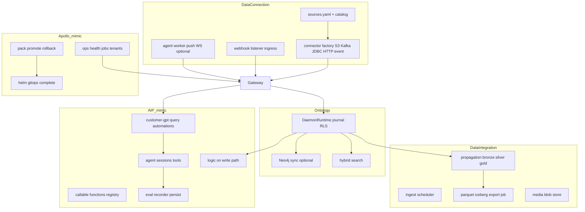

# Parity produk penuh (mimic stack, E2E, no mocks)

## Konteks dan definisi “selesai”

- **Bukan** integrasi ke cloud Palantir atau kompatibilitas OSDK/Foundry API ([`docs/13-sdk.md`](docs/13-sdk.md), [`docs/14-data-integration-map.md`](docs/14-data-integration-map.md)).
- **Ya:** arsitektur dan produk setara—data connection + data integration + ontology + AIP + deployment/ops—di atas stack yang sudah ada (Nest gateway, `DaemonRuntime`, Postgres journal/lakehouse, optional Neo4j, Go ingest `:8081`, compose/K8s).
- **Baseline terukur hari ini:** ~**15–25%** permukaan komersial Palantir (Foundry ~20–30%, AIP ~15–25%, Apollo ~0–10%); **core control plane monorepo** ~40–55% ([`docs/00-overview.md`](docs/00-overview.md), maps 14/15).
- **Target program (18–24 bulan, disiplin PR kecil):** ~**65–75%** pada **capability matrix** yang Anda definisikan (bukan klaim “100% Palantir”).

**Definisi selesai per capability (anti-slop):**

| Gate | Wajib |
|------|--------|
| Kode | Route/factory/service nyata di hot path gateway atau worker terpisah yang dipanggil CI |
| Config | Entri di [`configs/collect-sensing/sources.yaml`](configs/collect-sensing/sources.yaml) / catalog, bukan komentar “deferred” saja |
| Test | Integration/e2e di [`docs/06-testing.md`](docs/06-testing.md): `dev:up` + migrate + `daemon_app`; **no** `jest.mock` domain; **no** mock ingest server untuk jalur golden baru |
| Docs | Baris matrix **Live** + link file; hapus “document only” setelah ship |

**Pengecualian mock yang tetap diizinkan (eksplisit):** hanya test lama [`tests/integration/gateway-http.test.ts`](tests/integration/gateway-http.test.ts) sampai diganti; golden path baru tidak meniru pola itu.

---

## Arsitektur target (mimic, bukan vendor lock-in)

---

## Deliverable dokumen (fase 0, minggu 1–2)

Buat **[`docs/16-product-parity-matrix.md`](docs/16-product-parity-matrix.md)** (baru):

- Tabel ~80 baris: **Pilar** (Foundry-DC / Foundry-DI / Ontology / AIP / Apollo) × **Capability** × **Status** (Live / InProgress / Planned) × **Evidence** (path test) × **% weight**.
- Sinkronkan dengan [`docs/14-data-integration-map.md`](docs/14-data-integration-map.md) dan [`docs/15-data-connection-map.md`](docs/15-data-connection-map.md)—setiap baris Deferred v1 dapat **Planned** + owner fase.
- Referensi edukatif dari uploads (tanpa nama counterparty di README publik): syncs, exports, webhooks, listeners, agents, datasets, pipelines, CDC, Iceberg, schedules, builds.
- Link ke [`docs/06-testing.md`](docs/06-testing.md) untuk **Golden E2E** (lihat bawah).

Update [`docs/00-overview.md`](docs/00-overview.md) satu paragraf + link ke doc 16.

---

## Golden E2E (fondasi anti-mock)

**File baru:** [`tests/integration/foundry-parity-golden.integration.test.ts`](tests/integration/foundry-parity-golden.integration.test.ts)

**Skenario wajib (skip hanya jika env tidak ada, bukan mock):**

1. `pnpm run dev:up` + `DAEMON_POSTGRES_URL` (`daemon_app`) + migrate.
2. `POST /v1/ingest/sources/demo-parties/run` dengan `DAEMON_REPO_ROOT`—**tanpa** `DAEMON_INGEST_SKIP_UPSTREAM` di CI job dedicated.
3. Assert: journal row + `GET /v1/lakehouse/events?since=...` minimal 1 event.
4. `GET /v1/read/entities/...` (setelah Phase 4 list API) atau read-by-id hari ini.
5. Optional branch: Neo4j + `POST /v1/query/ask` dengan **fixture LLM disabled** atau recorded golden output (bukan mock planner)—kebijakan: gunakan OpenRouter hanya di job `nightly`, deterministic stub **hanya** di `ontology-query` test harness yang terpisah dari golden.

**CI:** tambah job `parity-golden` di workflow integration (setelah migrate), `DAEMON_INTEGRATION_REQUIRED=1`.

**Enable fixtures:** aktifkan `fixture-http-pull` / `fixture-postgres-read` di [`configs/collect-sensing/sources.yaml`](configs/collect-sensing/sources.yaml) dengan guard env (`DAEMON_PARITY_FIXTURES=1`) agar lokal/CI bisa menjalankan pull nyata.

---

## Fase implementasi (A + B + C paralel, Apollo menyusul)

### Fase 0 — Program & gates (2 minggu)

- Doc 16 matrix + golden test skeleton (ingest → lakehouse minimal).
- `pnpm run check:parity-matrix` (script validasi: setiap baris Live punya path test atau alasan CI skip).
- Perpanjang [`scripts/check-openapi-gateway-parity.mjs`](scripts/check-openapi-gateway-parity.mjs) hanya untuk **route inventory**, bukan % produk Palantir.

### Fase 1 — Foundry Data Connection (6–9 minggu)

**Tujuan:** menutup gap utama doc 15 + screenshot “source types / listeners”.

| Item | Implementasi | File utama |
|------|----------------|------------|
| S3 connector | Factory + config schema + run via `ingestRunSource` | [`collect-sensing/connectors/`](collect-sensing/connectors/), [`connector-factory.ts`](collect-sensing/connectors/connector-factory.ts), catalog YAML |
| Kafka connector | Consumer batch → normalize → ingest (compose: redpanda/kafka service) | sama + [`deployment/docker/compose.dev.yaml`](deployment/docker/compose.dev.yaml) |
| Event-subscriber wired | NATS/Kafka subscription injected di `IngestPipelineService` | [`event-subscriber-connector.ts`](collect-sensing/connectors/event-connectors/event-subscriber-connector.ts), [`ingest-pipeline.service.ts`](api/gateway/src/ingest/ingest-pipeline.service.ts) |
| Webhook ingress | `POST /v1/ingest/webhooks/:sourceId` + HMAC + idempotency | controller baru di `api/gateway/src/ingest/` |
| Listener ingress (batch) | `POST /v1/ingest/listeners/:listenerId/events` | sama |
| Agent worker v1 | Service terpisah (Go atau TS): register, heartbeat, push records ke gateway | `collect-sensing/cmd/agent-worker/` atau package baru; map uploads `agent-worker`, `agent-proxy` |
| SDK + OpenAPI | Methods + spec:check | [`packages/sdk/src/client.ts`](packages/sdk/src/client.ts), [`api/rest/src/openapi.ts`](api/rest/src/openapi.ts) |

**Acceptance:** golden test + integration per connector (MinIO/S3 di compose, Kafka topic seed).

**Bukan slop:** jangan tambah 24 nama connector di UI tanpa factory; catalog hanya tipe yang **Live** di matrix.

### Fase 2 — Foundry Data Integration (6–9 minggu, overlap Fase 1)

| Item | Implementasi | File utama |
|------|----------------|------------|
| Ingest scheduler | Cron/worker: `sources.yaml` `schedule` field → `ingestRunSource` | worker package + config schema |
| StreamPipeline on hot path | Wire [`stream-pipeline.ts`](collect-sensing/pipelines/stream-pipeline.ts) untuk incremental | ingest + propagation |
| Parquet/Iceberg export | Job: bronze/silver → object store (MinIO) | [`data-platform/lakehouse/`](data-platform/lakehouse/), export module baru |
| Media sets v1 | Blob table + `POST /v1/media` + link entity | `data-platform/` migration + gateway |
| JDBC CDC connector | Debezium-style atau polling CDC table → bronze | connector + doc 14 row CDC |
| Builds observability | `GET /v1/ingest/jobs`, propagation run status | extend ingest + analytics |

**Acceptance:** scheduled run integration; export file exists di bucket test; lakehouse events + export checksum.

### Fase 3 — Ontology product surface (4–6 minggu)

Melanjutkan [`sdk_parity_roadmap`](.cursor/plans/sdk_parity_roadmap_3958cb75.plan.md) Phase 3–4:

- `GET /v1/read/entities` + SDK `listEntities` + codegen dari [`configs/ontology/packs/foundation/`](configs/ontology/packs/foundation/).
- Wire **logic-layer** ke commit path: [`ontology/logic-layer/`](ontology/logic-layer/) dalam `CommandGateway` / validator.
- Optional: **Workshop-lite** read-only UI di `experience-layer/` (bukan clone Palantir)—hanya jika Fase 1–2 stabil.

### Fase 4 — AIP mimic (6–8 minggu)

| Item | Implementasi | File utama |
|------|----------------|------------|
| Agent session API | `POST /v1/agents/sessions`, tools dari action catalog | expose [`action-runtime/agent-runtime/`](action-runtime/agent-runtime/) |
| Evals persist | Postgres table + hook dari GPT/query/automations | [`observability/evals/eval-hooks.ts`](observability/evals/eval-hooks.ts) |
| Callable functions | `POST /v1/functions/:id/invoke` + audit | baru; catalog YAML handlers |
| Admin/internal HTTP | Routes untuk [`products/admin-console/`](products/admin-console/) | `api/gateway/src/products/` |
| Rust logic-engine | FFI atau sidecar call dari TS on write | [`engine/logic-engine/`](engine/logic-engine/) |

**Acceptance:** satu E2E: agent session → tool read entity → write dengan policy → eval row tersimpan.

**Anti-slop:** jangan duplikasi “Agent Studio” UI; API + SDK dulu.

### Fase 5 — Apollo mimic (4–6 minggu)

| Item | Implementasi | File utama |
|------|----------------|------------|
| Pack promote | `dev` → `staging` → `prod` artifact + `validate-change` gate | [`api/gateway/src/governance/`](api/gateway/src/governance/), CI script |
| Helm production | Semua services (gateway, ingest, agent-worker, workers) | [`deployment/helm/daemon-platform/`](deployment/helm/daemon-platform/) |
| Ops API | `GET /v1/ops/health`, jobs, tenants, connector status | modul `api/gateway/src/ops/` |
| Release notes | Tie to pack version + migration | docs + changelog automation |

**Acceptance:** `helm template` + smoke deploy staging; ops API returns job list from real Postgres.

---

## Urutan PR yang disarankan (8–12 PR, masing-masing reviewable)

1. `docs/16` + golden test skeleton + CI job  
2. Enable http-pull/postgres fixtures + tests  
3. S3 connector + MinIO compose  
4. Kafka connector + compose service  
5. Webhook + listener ingress  
6. Agent worker v1 + gateway auth  
7. Ingest scheduler  
8. Parquet export job  
9. `listEntities` + SDK/codegen  
10. Logic on write + agent session API  
11. Evals persist + functions invoke  
12. Helm/ops API + pack promote  

Setiap PR: update baris matrix doc 16, **no** penambahan Deferred tanpa issue link ke fase berikutnya.

---

## Non-goals (tetap)

- Palantir cloud APIs, OSDK OAuth, Workshop/Contour UI penuh, marketplace connector packaging, private link enterprise SKU.
- Klaim % di README tanpa matrix doc 16.
- Counterparty naming di artefak publik (NDA user rule).
- Mengganti YAML pack dengan export Foundry ontology.

Epic [`sempurnakan_arsitektur_bc`](.cursor/plans/sempurnakan_arsitektur_bc_ee86870a.plan.md) tetap terpisah; program ini **menggantikan** “Palantir parity” sebagai track produk eksplisit.

---

## Risiko dan mitigasi

| Risiko | Mitigasi |
|--------|----------|
| Scope meledak (24+ source types) | Matrix: hanya tipe dengan factory + test |
| Flaky CI | Dedicated `parity-golden` job; retries hanya infra |
| LLM nondeterminism | Evals/LLM di nightly; golden tanpa mock LLM |
| Go ingest tidak persist ontology | Dokumentasikan SSOT TS; uji forward Go hanya metadata job |

---

## Metrik kemajuan

- **% matrix Live** (weighted): laporan mingguan dari doc 16.  
- **Golden E2E:** hijau di CI = minimum bar produk.  
- **OpenAPI routes:** tetap `spec:check` (18+ routes); tidak disamakan dengan % Palantir.

Setelah Anda approve plan ini, eksekusi dimulai dari **Fase 0** (doc 16 + golden test + CI), lalu **Fase 1 PR #3–#6** untuk Data Connection nyata.
