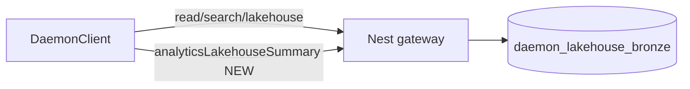
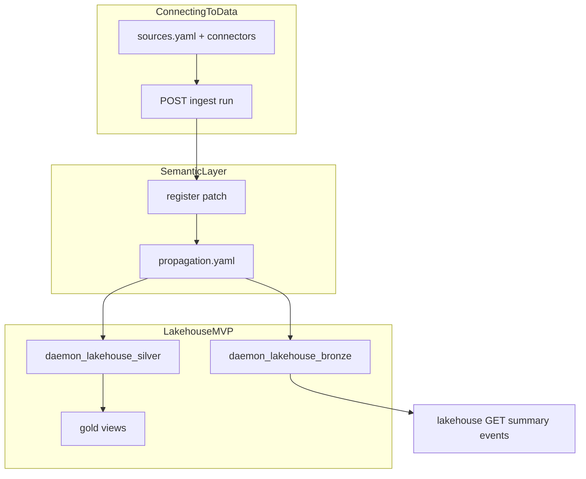
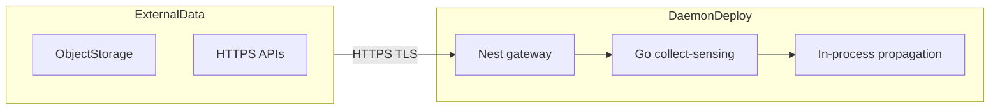
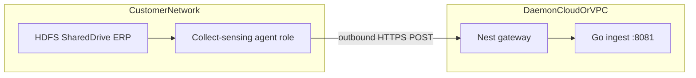

# SDK polish (post-parity residuals)

## Status quo

[Operational hardening v2](.cursor/plans/experience_layer_v2_1d0fc939.plan.md) and [SDK parity roadmap](.cursor/plans/sdk_parity_roadmap_3958cb75.plan.md) are **implemented**: search replay, GPT sessions, bronze read/summary, OpenAPI parity script, expanded [`packages/sdk/src/client.ts`](packages/sdk/src/client.ts), pack codegen, and `listEntities`.

Remaining gaps vs gateway/OpenAPI and the parity plan’s Phase 2 doc note:

| Gap | Gateway / OpenAPI | SDK today |
|-----|-------------------|-----------|
| Lakehouse summary `since` | [`lakehouse.controller.ts`](api/gateway/src/lakehouse/lakehouse.controller.ts) `@Query("since")` | [`lakehouseSummary()`](packages/sdk/src/client.ts) — no params |
| Lakehouse events filters | `entityType`, `ontologyId`, `changeType`, `since`, `limit` in OpenAPI | [`lakehouseEvents()`](packages/sdk/src/client.ts) — no params |
| Analytics lakehouse report | `GET /v1/analytics/lakehouse-summary` documented in [`openapi.ts`](api/rest/src/openapi.ts) + parity script | **No** `DaemonClient` method |
| Typed summary | [`BronzeLakehouseSummary`](data-platform/lakehouse/bronze-reader.ts) / [`LakehouseAnalyticsReport`](products/analytics-workflows/lakehouse-analytics.ts) | [`LakehouseSummary`](packages/sdk/src/types.ts) is `{ [key: string]: unknown }` |
| SDK guide | Parity plan suggested `docs/12-sdk.md` | [`docs/12-connectors-catalog.md`](docs/12-connectors-catalog.md) already uses **12** — use **`docs/13-sdk.md`** |



---

## 1. Typed lakehouse and analytics types

**File:** [`packages/sdk/src/types.ts`](packages/sdk/src/types.ts)

Add interfaces aligned with OpenAPI [`LakehouseSummary`](api/rest/src/openapi.ts) / [`LakehouseAnalyticsReport`](api/rest/src/openapi.ts) and existing product types in [`products/analytics-workflows/lakehouse-analytics.ts`](products/analytics-workflows/lakehouse-analytics.ts):

- `BronzeEntityTypeCountRow`, `BronzeChangeVolumeRow`
- `LakehouseSummary` (replace index signature): `entityTypeCounts`, `changeVolumeByDay`, `window.since?`
- `LakehouseAnalyticsReport`: `title`, `generatedAt`, `totalEvents`, `summary`
- `LakehouseEventsParams`: `since?`, `limit?`, `entityType?`, `ontologyId?`, `changeType?` (`register` | `patch`)

Export from [`packages/sdk/src/index.ts`](packages/sdk/src/index.ts) via existing `export * from "./types.js"`.

**Optional (minimal):** add `LakehouseBronzeEvent` with known fields from bronze writer if easily inferred from [`bronze-writer.ts`](data-platform/lakehouse/bronze-writer.ts) `listEvents` row shape; otherwise keep events as `Record<string, unknown>[]` for v1 polish.

---

## 2. Extend `DaemonClient` methods

**File:** [`packages/sdk/src/client.ts`](packages/sdk/src/client.ts)

| Method | Route | Change |
|--------|-------|--------|
| `lakehouseSummary` | `GET /v1/lakehouse/summary` | Accept `options?: { since?: string }`; build query string |
| `lakehouseEvents` | `GET /v1/lakehouse/events` | Accept `LakehouseEventsParams`; map all five query params |
| `analyticsLakehouseSummary` | `GET /v1/analytics/lakehouse-summary` | **New** — `options?: { since?, reportTitle? }`; return `LakehouseAnalyticsReport` |

Keep existing tenancy/session header behavior unchanged.

---

## 3. Unit tests

**File:** [`packages/sdk/src/client.test.ts`](packages/sdk/src/client.test.ts)

Add/update fetch-mock tests:

- `lakehouseSummary` appends `?since=...` when provided
- `lakehouseEvents` appends `entityType`, `ontologyId`, `changeType`, `limit`, `since`
- `analyticsLakehouseSummary` hits `/v1/analytics/lakehouse-summary` with `reportTitle` / `since`

Update existing `lakehouseSummary` test body to match typed `LakehouseSummary` shape if mock payload changes.

---

## 4. Documentation: `docs/13-sdk.md`

**New file:** [`docs/13-sdk.md`](docs/13-sdk.md)

Sections (concise, public-safe per NDA guardrails):

1. **Install and configure** — `@daemon/sdk`, `baseUrl`, `tenantId` / `domainId` → `x-daemon-tenant` / `x-daemon-domain` (see [`tenant-context.ts`](api/gateway/src/platform/tenant-context.ts))
2. **DaemonClient surface** — table: method → route → policy resource (read entity, search, lakehouse, analytics lakehouse, ingest, GPT, automations, write, policy check)
3. **Pack codegen** — `pnpm run codegen:pack` / `spec:check` stale check; import `foundation` from generated types
4. **Contract drift** — `pnpm run spec:check` runs [`scripts/check-openapi-gateway-parity.mjs`](scripts/check-openapi-gateway-parity.mjs)
5. **Ontology / OSDK ergonomics (not compatibility)** — compact table in `13-sdk.md` only (full data-layer table lives in `14`):

| Enterprise ontology concept | daemon-sdk analogue |
|----------------------------|---------------------|
| Object type / object | Pack entity YAML + `EntityRecord` |
| Action type | [`action-catalog.yaml`](configs/governance/action-catalog.yaml) + `POST /v1/write` / automations |
| OSDK-style client | `@daemon/sdk` `DaemonClient` |
| Object set / search | `GET /v1/search`, `listEntities` |
| AIP-style chat + retrieval | Customer GPT + hybrid search citations |

**Link from:** [`docs/00-overview.md`](docs/00-overview.md) (bullets to `13-sdk.md`, `14-data-integration-map.md`, `15-data-connection-map.md`).

**Cross-link:** [`docs/11-data-platform-lakehouse.md`](docs/11-data-platform-lakehouse.md), [`docs/12-connectors-catalog.md`](docs/12-connectors-catalog.md), [`docs/05-security-governance.md`](docs/05-security-governance.md), [`docs/06-deployment-topology.md`](docs/06-deployment-topology.md).

---

## 5. Documentation: `docs/14-data-integration-map.md`

**New file:** [`docs/14-data-integration-map.md`](docs/14-data-integration-map.md)

Educational map for developers familiar with **enterprise data integration** docs (user-provided external references: datasets, media sets, streams, branching, builds, schedules, health checks, Iceberg, virtual tables, CDC, views, data pipeline, connecting to data). Wording stays **NDA-safe**: “Foundry-style” / “enterprise data OS” in prose; no partner names in commit messages; optional “External reference” subsection with the public doc URLs the user supplied.

| Foundry-style topic | daemon-sdk today | SDK / HTTP surface | Notes / deferred |
|--------------------|------------------|-------------------|------------------|
| **Connecting to data** | collect-sensing connectors | `POST /v1/ingest/sources/:sourceId/run` | [`docs/12-connectors-catalog.md`](docs/12-connectors-catalog.md), `configs/collect-sensing/sources.yaml` |
| **Data pipeline** | ingest → normalize → register (no separate “pipeline builder” UI) | ingest + gateway `DaemonRuntime` | Bounded context: collect-sensing only; see [`docs/02-bounded-contexts.md`](docs/02-bounded-contexts.md) |
| **Datasets** (tabular SSOT) | Postgres entity snapshots + silver latest | read APIs, `listEntities` | Journal: `daemon_entity_snapshots`; not Parquet datasets |
| **Streams** (incremental) | registry `register`/`patch` + propagation | propagation targets on events | Real-time = event-driven propagation, not a separate stream product |
| **Media sets** (unstructured) | — | — | **Deferred** (no blob/media-set store in v1) |
| **Branching** (dev/prod dataset branches) | pack `version` + domain/tenant scope | governance policies on schema change | Not git-style dataset branches; use pack versions + env config |
| **Builds** (materialize dataset) | propagation + lakehouse writers | bronze/silver append on register/patch | “Build” ≈ propagation job side effects, not Spark build UI |
| **Schedules** | manual/CI ingest + `pnpm run test:repo` | — | **Deferred** cron scheduler for ingest; document CI as interim |
| **Health checks** | `spec:check`, `check:sources`, integration tests | — | Data health = migration + replay + lakehouse summary APIs |
| **Iceberg tables** | Postgres bronze (append JSONB) | `GET /v1/lakehouse/*` | **Deferred** Iceberg/Parquet export; doc points to bronze as MVP analogue |
| **Virtual tables** | gold SQL views (`daemon_lakehouse_gold_*`) | read via Postgres / future SQL API | See [`docs/11-data-platform-lakehouse.md`](docs/11-data-platform-lakehouse.md) gold section |
| **CDC** | bronze `change_type` + entity snapshot journal | `lakehouseEvents({ changeType })` | CDC-like **read** of changes; not JDBC CDC connectors |
| **Views** | materialized views + gold rollups | propagation `materialized-view:*` | Config-driven view names in [`propagation.yaml`](configs/governance/propagation.yaml) |



**`docs/13-sdk.md`** gets short pointers: data concepts → [14](./14-data-integration-map.md); connectivity → [15](./15-data-connection-map.md).

**Uploaded mirrors** (Cursor `uploads/*.md` for data-integration and data-connection) are **not** copied into the repo; they informed taxonomy only. **Do not** embed vendor architecture PNGs in public docs; use original mermaid below.

---

## 6. Documentation: `docs/15-data-connection-map.md`

**New file:** [`docs/15-data-connection-map.md`](docs/15-data-connection-map.md)

Maps **enterprise data connection** docs (architecture, core concepts, connection security, foundry worker vs agent worker, initial setup, permissions) to daemon-sdk connectivity. Complements §5 (datasets/pipelines); read together with [`docs/12-connectors-catalog.md`](docs/12-connectors-catalog.md).

### Topology (original mermaid, inspired by common cloud vs agent patterns)

**Pattern A — cloud-side pull (analogue: “foundry worker”)**



daemon-sdk: [`http-pull`](collect-sensing/connectors) and gateway `fetch` in [`IngestPipelineService`](api/gateway/src/ingest/ingest-pipeline.service.ts); gateway orchestrates connector run (`POST /v1/ingest/sources/:sourceId/run`).

**Pattern B — customer-network agent (analogue: “agent worker”)**



daemon-sdk: Go **ingest** service ([`docs/06-deployment-topology.md`](docs/06-deployment-topology.md)) receives batches; gateway forwards via [`IngestService.post("/ingest/records")`](api/gateway/src/ingest/ingest.service.ts). **No** long-lived outbound WebSocket agent product in v1 — document as **deferred**; HTTP job/record APIs are the interim.

### Concept table

| Data-connection topic | daemon-sdk analogue | Where in repo |
|----------------------|---------------------|---------------|
| **Architecture** (gateway → isolated compute → datasets) | Gateway → `DaemonRuntime` / propagation → Postgres + lakehouse | [`06-deployment-topology.md`](docs/06-deployment-topology.md) |
| **Core concepts** (sources, syncs, agents) | `sources.yaml`, connector catalog, ingest jobs | [`12-connectors-catalog.md`](docs/12-connectors-catalog.md), [`ingest.controller.ts`](api/gateway/src/ingest/ingest.controller.ts) |
| **Connection security** (TLS 1.2+, HTTPS) | `configs/environments/prod.yaml` TLS expectations; HTTPS to ingest URL | Document ops requirement; no custom TLS stack in app code |
| **Foundry worker vs agent worker** | **Cloud pull:** gateway/connector `http-pull`. **Agent-style:** dedicated Go ingest + optional on-prem deploy of ingest only | Compose: gateway `:3000`, ingest `:8081` |
| **Initial setup** | `pnpm run db:migrate`, `pnpm run dev up`, `pnpm run check:sources`, tenant/domain headers on first API call | [`06-testing.md`](docs/06-testing.md) |
| **Permissions** | `PolicyEngine` + `@PolicyCheck` on ingest (`ingest-job`, `ingest-source`, `ingest-record`); RBAC YAML | [`05-security-governance.md`](docs/05-security-governance.md), [`configs/policies/`](configs/policies/) |

SDK surface for connectivity (in `13-sdk.md` table): `runIngestSource` / ingest-related methods if exposed on `DaemonClient`; policy-gated same as gateway.

### External reference URLs (optional subsection)

User-supplied public doc links for data-connection (educational only):

- Architecture, core concepts, connection security, foundry worker vs agent worker, initial setup overview, permissions (Foundry data-connection paths under `data-connection/`).

### Deferred (document only)

- Data Connection **agent** installer, agent proxy, WebSocket sync channel, private link / VPC endpoints, marketplace sync packaging, OIDC for external connectors, webhook/listener ingress products.

---

## 7. Validation

```bash
pnpm run build
pnpm run spec:check
```

No migration or Postgres test changes required for this polish-only slice.

---

## Out of scope

- `GET /v1/lakehouse/entities/latest` (optional in v2 plan; defer)
- OpenAPI codegen via `openapi-typescript` (Phase 5 of parity roadmap)
- `@daemon/react` hooks
- Re-exporting types from `@daemon/data-platform` into SDK (avoid new package coupling; duplicate small interfaces in SDK)
- Implementing Foundry-parity products: dataset branching UI, media sets, Iceberg export, JDBC sync agents, pipeline designer, scheduled ingest cron (document only in `14`)
- Data Connection agent runtime, WebSocket agent channel, private links, listener/webhook products (document only in `15`)
