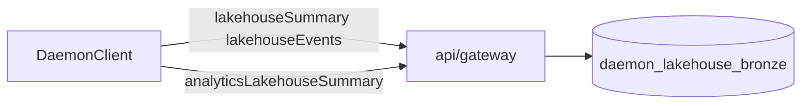

# SDK polish verification plan

## Verdict (static audit)

All six plan todos in [`.cursor/plans/sdk_polish_residuals_a90e2059.plan.md`](.cursor/plans/sdk_polish_residuals_a90e2059.plan.md) are **already implemented** in the working tree. No code changes are required for plan closure unless validation commands fail.

| Plan item | Expected | Repo state |
|-----------|----------|------------|
| Typed lakehouse types | `BronzeEntityTypeCountRow`, `LakehouseSummary`, `LakehouseAnalyticsReport`, `LakehouseEventsParams` | Present in [`packages/sdk/src/types.ts`](packages/sdk/src/types.ts) (lines 36–68) |
| `lakehouseSummary({ since? })` | Query param on `GET /v1/lakehouse/summary` | [`packages/sdk/src/client.ts`](packages/sdk/src/client.ts) L79–86 |
| `lakehouseEvents(params?)` | Five query params | L88–99 |
| `analyticsLakehouseSummary()` | `GET /v1/analytics/lakehouse-summary` | L101–110 |
| Unit tests | `since`, full events QS, analytics route | [`packages/sdk/src/client.test.ts`](packages/sdk/src/client.test.ts) L95–163 |
| OpenAPI parity | Analytics route listed | [`scripts/check-openapi-gateway-parity.mjs`](scripts/check-openapi-gateway-parity.mjs) includes `GET /v1/analytics/lakehouse-summary` |
| `docs/13-sdk.md` | DaemonClient table + lakehouse params + links to 14/15 | Exists; linked from [`docs/00-overview.md`](docs/00-overview.md) L41–43 |
| `docs/14-data-integration-map.md` | Topic table + mermaid + SDK pointers | Exists; mentions `analyticsLakehouseSummary` |
| `docs/15-data-connection-map.md` | Topologies + concept table + deferred agents | Exists; links to 13-sdk for ingest methods |



## Execution steps (when you approve implementation)

Run from repo root:

```bash
pnpm run build
pnpm run spec:check
cd packages/sdk && pnpm test
```

**Pass criteria:** exit code 0 on all three; no drift between OpenAPI and gateway for lakehouse/analytics routes.

**Optional smoke (if Postgres/gateway up):** integration test already hits analytics route in [`tests/integration/lakehouse-bronze.integration.test.ts`](tests/integration/lakehouse-bronze.integration.test.ts).

Do **not** edit [`.cursor/plans/sdk_polish_residuals_a90e2059.plan.md`](.cursor/plans/sdk_polish_residuals_a90e2059.plan.md) unless you explicitly want plan file updates.

## Minor gaps (optional, not blocking)

These were called out in the plan but are **nice-to-have** only:

1. **Reverse cross-links** — Plan §4 asked cross-links **from** [`docs/11-data-platform-lakehouse.md`](docs/11-data-platform-lakehouse.md), [`docs/12-connectors-catalog.md`](docs/12-connectors-catalog.md), [`docs/05-security-governance.md`](docs/05-security-governance.md), and [`docs/06-deployment-topology.md`](docs/06-deployment-topology.md) **to** 13/14/15. Today [`docs/13-sdk.md`](docs/13-sdk.md) links **to** those files (Related docs), but 11/12/05/06 do not link back. One sentence each is enough if you want symmetry.

2. **Doc 11 SDK mention** — [`docs/11-data-platform-lakehouse.md`](docs/11-data-platform-lakehouse.md) documents HTTP routes but could add a single line pointing to `DaemonClient` lakehouse methods in 13-sdk (gateway docs already describe `GET /v1/analytics/lakehouse-summary`).

3. **Events typing** — Plan allowed keeping events as `Record<string, unknown>[]`; implemented as such. Adding `LakehouseBronzeEvent` remains **out of scope** per plan.

## Explicitly out of scope (per plan and your choice)

- Palantir **data-connection agent** docs (set-up-agent, agent-proxy, agent-worker, troubleshooting) and **set-up-source / source-exploration** — not part of this verification; you chose verify-polish only.
- LangChain JS / OpenRouter product work — already documented elsewhere (`queryAsk`, `customerGptChat` in 13-sdk; LangGraph in [`products/ontology-query/`](products/ontology-query/)).
- `entities/latest`, openapi-typescript codegen, `@daemon/react`, re-exporting `@daemon/data-platform` types.

## If validation fails

| Failure | Likely fix |
|---------|------------|
| `spec:check` parity | Align [`api/rest/src/openapi.ts`](api/rest/src/openapi.ts) with gateway controller or update parity script list |
| SDK tests | Fix query-string encoding or mock shapes in [`client.test.ts`](packages/sdk/src/client.test.ts) |
| `build` | Type export or import path in `packages/sdk` |

Report failures with command output; no speculative refactors beyond the failing surface.
