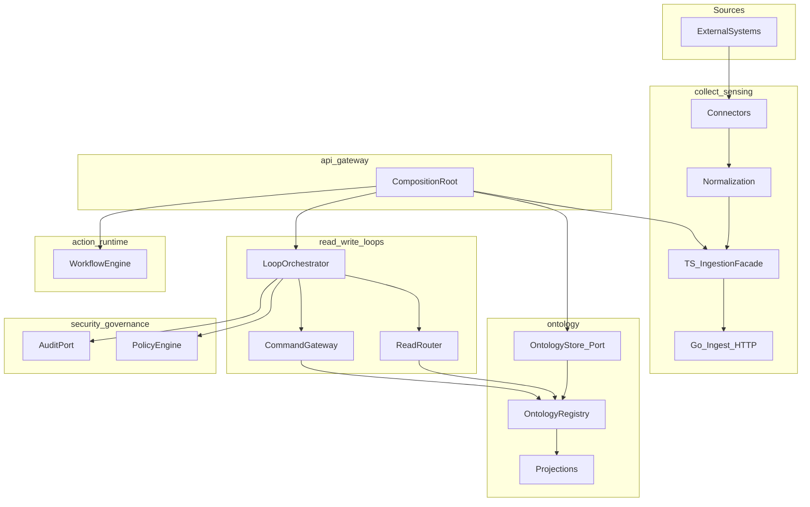
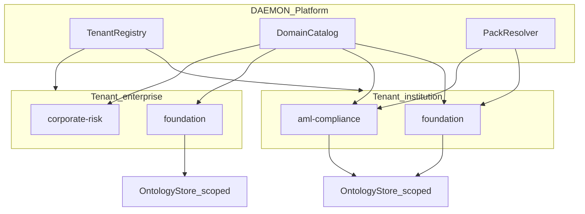

# Sempurnakan fase Arsitektur & bounded context

## Tujuan dan batas scope

**Tujuan:** Fase arsitektur dianggap “selesai” ketika struktur monorepo, batas tanggung jawab, diagram, dan **jalur runtime** selaras dengan [docs/00-overview.md](docs/00-overview.md) dan diagram di [docs/reference/perplexity-architecture-spec.md](docs/reference/perplexity-architecture-spec.md) (baris ~1075+), bukan hanya “folder ada + test hijau”.

**In scope (fase ini):**
- Dokumentasi arsitektur yang **jujur** terhadap kode
- **Port + composition root** (gateway = satu tempat wiring)
- **Write path** melalui `LoopOrchestrator` (bukan bypass langsung ke `CommandGateway`)
- **Satu pintu masuk** mutasi ontology dari ingest (`OntologyStore` / facade)
- **Enforcement** arah import antar bounded context + test arsitektur
- E2E HTTP yang membuktikan alur konteks (compose)
- **Semantic SSOT (Ontology Master):** pack ontology **sector-agnostik** (bukan terikat logistik/ANTERO); loader + validasi register/patch; versi pack — PDF Master dipakai sebagai **pola governance**, entitas W1 disesuaikan multi-institusi (mis. lembaga pengawas / FIU / compliance)
- **Governance (Technology OS):** pemetaan tier dokumen → modul repo, propagation **template** per tipe entitas, action catalog ↔ `action-runtime`, approval gates ↔ `governance-policies.yaml` + `prompt-guard`
- **Multi-institusi, enterprise, multi-domain:** satu platform DAEMON menampung banyak **tenant** (lembaga/regulator atau grup enterprise), masing-masing mengaktifkan satu atau lebih **domain** ontology (foundation + extension); isolasi data & policy per tenant; bukan satu ontology global untuk semua klien

**Out of scope (fase berikutnya):**
- Postgres sebagai system of record / replikasi multi-instance (pack tetap in-memory registry)
- Semua 8 entitas komersial + seluruh junction dalam satu PR (gunakan gelombang; lihat §9)
- OIDC production, K8s/Helm penuh, Palantir parity
- Menyalin teks penuh PDF bisnis ke repo publik (NDA: nama counterparty / merek hanya di dokumen internal atau dengan persetujuan tertulis)



---

## Diagnosis: celah arsitektur hari ini

| Area | Kondisi | Dampak |
|------|---------|--------|
| Diagram | [docs/01-end-to-end-architecture.md](docs/01-end-to-end-architecture.md) hanya 4 subgraph; tanpa `action-runtime`, `security-governance`, `data-platform`, `language`/`engine` | Stakeholder salah baca “apa yang sudah ada” |
| Write path | [docs/07-sequence-flows.md](docs/07-sequence-flows.md) → `CommandGateway`; [api/gateway/src/write/write.service.ts](api/gateway/src/write/write.service.ts) bypass `LoopOrchestrator` | Policy di Nest (`@PolicyCheck`) ≠ policy di loop; tidak ada trace state machine |
| Composition | [products/shared/product-runtime.ts](products/shared/product-runtime.ts) sudah benar (`ReadRouter` + `PolicyEngine` + `LoopOrchestrator`); gateway **tidak** memakai pola yang sama | Dua “platform” paralel (produk vs API) |
| Ingest → ontology | [api/gateway/src/ingest/ingest.service.ts](api/gateway/src/ingest/ingest.service.ts) memanggil `globalRegistry` langsung; Go hanya menghitung record ([collect-sensing/orchestrator/ingestion_orchestrator.go](collect-sensing/orchestrator/ingestion_orchestrator.go)) | Alur collect→ontology terpecah; diagram “canonical upsert” belum satu kontrak |
| Ontology SSOT | [ontology/registry/ontology-registry.ts](ontology/registry/ontology-registry.ts) `Map` in-process | Bukan masalah fase arsitektur jika ada **port**; masalah jika tidak ada abstraksi |
| Dependensi | `products/*`, `api/graphql` import `@daemon/ontology` langsung | Melanggar batas “ontology hanya lewat loops/API” untuk runtime produksi |
| CI | `spec:check` = tree file; tidak ada **boundary check** import | Struktur folder OK, arsitektur runtime bisa drift |
| Governance + semantic SSOT | PDF Ontology Master / Technology OS di `docs/`; runtime pakai `ontologyId: "default"` / `my-entity` di smoke; [configs/policies/governance-policies.yaml](configs/policies/governance-policies.yaml) tidak terhubung ke registry | **~15–25%** — tidak ada pack, tidak ada validasi domain, tidak ada propagation config |
| Multi-institusi / enterprise / multi-domain | [configs/tenancy.yaml](configs/tenancy.yaml) hanya `default`; registry key `ontologyId:entityId` tanpa `tenantId`; ABAC/RLS ada di test tapi **tidak** di `EntityRecord` / gateway ingest | **~10%** — konsep tenant di header REST, belum model produk multi-klien |

---

## Rencana implementasi

### 1. Kontrak port antar konteks

Tambahkan modul tipis (pilih salah satu, disarankan **opsi A**):

- **Opsi A (disarankan):** [packages/context-ports/](packages/context-ports/) — `@daemon/context-ports`
  - `OntologyStore`: `get`, `register`, `patch`, `list` (tipe dari [ontology/registry/ontology-registry.ts](ontology/registry/ontology-registry.ts))
  - `AuditPort`: `record(event)` (wrap [security-governance/audit/postgres-audit-log.ts](security-governance/audit/postgres-audit-log.ts) + in-memory untuk dev)
  - Re-export port loop yang sudah ada di [read-write-loops/loop-controller/loop-orchestrator.ts](read-write-loops/loop-controller/loop-orchestrator.ts) (`ReadPort`, `WritePort`, `PolicyPort`) agar gateway tidak import path dalam

- **Opsi B:** Port hanya di `ontology/ports/` + export dari package ontology — lebih sedikit file, kurang terpusat untuk lint.

Refactor minimal di ontology:
- `InMemoryOntologyStore` implements `OntologyStore`
- `OntologyRegistry` menerima `OntologyStore` di constructor (default in-memory); `globalRegistry` tetap untuk test backward-compat
- Semua mutasi ingest/write tetap melalui registry/store yang sama

### 2. Composition root gateway (mirror ProductRuntime)

Buat [api/gateway/src/platform/daemon-runtime.ts](api/gateway/src/platform/daemon-runtime.ts) (atau ekstrak `ProductRuntime` ke [packages/platform-runtime/](packages/platform-runtime/) dipakai gateway + products):

```typescript
// Pola yang sudah ada di product-runtime.ts — dijadikan SSOT wiring platform
readonly reads = new ReadRouter(store);
readonly writes = new CommandGateway(store);
readonly policy = PolicyEngine.fromRules(...) // atau PolicyService Rust client
createLoop(): LoopOrchestrator { ... }
upsertFromIngest(records): void { store/register }
```

Ubah:
- [api/gateway/src/read/read.service.ts](api/gateway/src/read/read.service.ts) — inject `ReadRouter` dari runtime
- [api/gateway/src/write/write.service.ts](api/gateway/src/write/write.service.ts) — `submit()` → `runtime.createLoop().run(...)` (sesuai signature [LoopOrchestrator](read-write-loops/loop-controller/loop-orchestrator.ts))
- [api/gateway/src/ingest/ingest.service.ts](api/gateway/src/ingest/ingest.service.ts) — hapus import langsung `globalRegistry`; panggil `runtime.upsertFromIngest`
- Nest: [api/gateway/src/app.module.ts](api/gateway/src/app.module.ts) + `PlatformModule` provider `DAEMON_RUNTIME` singleton

**Catatan:** `@PolicyCheck` di controller bisa tetap sebagai **lapisan edge**; loop tetap memanggil `PolicyPort` agar diagram 07 dan runtime selaras.

### 3. Audit hook di jalur loop (arsitektur, bukan compliance penuh)

- Adapter `AuditPort` di composition root: pada `WritePort.submit` / setelah `LoopOrchestrator.run` sukses, tulis event ke `InMemoryAuditLog` atau `PostgresAuditLog` jika `DAEMON_POSTGRES_URL` set (reuse test integration yang sudah ada).
- Tidak wajib mengaktifkan lineage penuh; cukup bukti **security-governance** terhubung ke write path.

### 4. Proyeksi / event (opsional ringan)

- Saat bootstrap gateway: `globalRegistry.subscribe` → [ontology/projections/materialized-views/materialized-view.ts](ontology/projections/materialized-views/materialized-view.ts) (sudah ada `attach`) — dokumentasikan di [docs/02-ontology-system.md](docs/02-ontology-system.md).
- Opsional: publish ke [data-platform/event-bus/nats-publisher.ts](data-platform/event-bus/nats-publisher.ts) hanya jika env NATS ada (no-op default).

### 5. Dokumentasi arsitektur (wajib untuk “fase selesai”)

Perbarui agar match kode pasca-refactor:

| File | Perubahan |
|------|-----------|
| [docs/01-end-to-end-architecture.md](docs/01-end-to-end-architecture.md) | Diagram penuh: Sources → Collect → Language/Engine (ringkas) → Ontology → Loops → Action → API; subgraph Security + DataPlatform |
| [docs/02-bounded-contexts.md](docs/02-bounded-contexts.md) | Tabel + **public API** per package (`exports` di package.json), **larangan import**, daftar composition root |
| [docs/07-sequence-flows.md](docs/07-sequence-flows.md) | Write: `Gateway → LoopOrchestrator → Policy → CommandGateway → OntologyStore`; Ingest: `Gateway → OntologyStore → (optional) Go job` |
| [docs/00-overview.md](docs/00-overview.md) | Tambah bullet “Architecture phase complete” criteria |

Tidak mengubah [docs/reference/perplexity-architecture-spec.md](docs/reference/perplexity-architecture-spec.md) (referensi historis); spec tree tetap via `spec:check`.

### 6. Enforcement dependensi (CI)

Tambah [scripts/check-context-boundaries.mjs](scripts/check-context-boundaries.mjs) + target `pnpm run check:architecture`:

Aturan minimal (contoh):

| From | May import |
|------|------------|
| `collect-sensing` | `platform-types`, `context-ports` |
| `ontology` | `platform-types`, `data-platform` (opsional terbatas) |
| `read-write-loops` | `ontology`, `platform-types`, `context-ports` |
| `security-governance` | `platform-types` |
| `action-runtime` | `platform-types`, `read-write-loops` (hanya port/types, bukan gateway) |
| `products` | `action-runtime`, `read-write-loops`, `security-governance`, `platform-types` — **bukan** `@daemon/ontology` registry (kecuali test `*.test.ts`) |
| `api/gateway` | semua (composition root) |

Implementasi: scan `import` dengan glob + deny-list (tanpa dependency-cruiser baru jika ingin minimal); atau tambah `dependency-cruiser` devDependency jika tim mau graf visual.

Wire ke [.github/workflows/ci.yml](.github/workflows/ci.yml) setelah `spec:check`.

### 7. Test bukti arsitektur

| Test | Lokasi | Tujuan |
|------|--------|--------|
| Boundary | `tests/architecture/context-boundaries.test.ts` | Jalankan script / assert rules |
| Loop wiring | `api/gateway/src/write/write.service.test.ts` | WriteService memakai loop, deny policy → 403 trace |
| E2E HTTP | Perluas [tests/integration/gateway-http.test.ts](tests/integration/gateway-http.test.ts) atau [tests/e2e/](tests/e2e/) | `POST ingest` → `GET read` → `POST write` → baca versi naik; tanpa mock registry di gateway test |
| Contract | [tests/contract/api-contract.test.ts](tests/contract/api-contract.test.ts) | Sesuaikan jika response write menyertakan `trace` dari loop |

Tetap hormati kebijakan repo: integrasi/e2e tanpa `jest.mock`; gunakan compose + env flags dev yang sudah ada.

### 8. Package exports (batas publik konteks)

Perjelas `exports` di:
- [ontology/package.json](ontology/package.json) — tambah `./ports` atau root re-export store + registry
- [collect-sensing/package.json](collect-sensing/package.json) — export facade + connectors entry
- [read-write-loops/package.json](read-write-loops/package.json) — export `loop-orchestrator` sebagai entry utama write path

Dokumentasikan di `docs/02-bounded-contexts.md`.

### 9. Technology OS / Ontology Master (governance + SSOT semantik)

**Tujuan dimensi:** naik dari **~15–25%** → **~55–65%** pada “standar Technology OS / Ontology Master” — bukan parity dokumen PDF penuh, tetapi **satu sumber kebenaran semantik di repo** yang dapat divalidasi CI dan dipakai runtime.

**Sumber kebenaran bisnis (referensi manusia, tidak di-commit sebagai teks penuh):**
- `docs/Ontology Master v2.0.3.pdf` (Tier 0A — entitas, relasi, junction, action catalog)
- `docs/Technology OS.pdf` (Tier 2 — propagasi, peran DAEMON vs sistem operasional)
- `docs/Charter.pdf`, `docs/Manifesto.pdf` (precedence: Charter > Ontology Master > Technology OS)

**Prinsip produk (dari Anda):** ontology **general case** — pengguna lintas sektor institusi; contoh klien termasuk lembaga intelijen keuangan / FIU (mis. INTRAC/PPATK) **hanya di dokumentasi internal**, bukan hardcode di pack publik.

**Artefak machine-readable (nama netral di repo publik):**

```
configs/ontology/packs/foundation/
  pack.yaml              # ontologyId: foundation, tier 0A pattern, semver, sector: institutional
  entities/              # Party, Organization, Case, Event, Asset, Document (YAML)
  relations/             # generic Link / Association + junction rules
  action-catalog.yaml    # sector-agnostic workflows (screen, triage, escalate, report-draft)
configs/governance/
  propagation.yaml       # entityType → read surfaces (template, bukan jalur logistik)
```

PDF logistik/Ontology Master v2.0.3 tetap referensi **metodologi** (tier, junction, action catalog), bukan literal copy `Shipment`/`ShipmentLeg` kecuali klien mengaktifkan **pack extension** terpisah (W2+ / opsional).

**Komponen kode:**

| Komponen | Lokasi | Perilaku |
|----------|--------|----------|
| `OntologyPackLoader` | `ontology/packs/load-pack.ts` (baru) | Parse pack YAML; bangun `EntityModel` per entity type; fail-fast jika pack invalid |
| `OntologyGovernanceService` | `ontology/governance/ontology-governance.ts` (baru) | `assertRegisterable(type, payload)`; `assertSchemaChange` → gate dari `governance-policies.yaml` (approval required untuk breaking) |
| Bootstrap | `DaemonRuntime` / `PlatformModule` | Env `DAEMON_ONTOLOGY_PACK` default `configs/ontology/packs/foundation`; registry hanya tipe di pack; **pack extensions** (opsional W2+) load tambahan |
| Ingest / write | Setelah §2–3 | Tolak record dengan `entityType` tidak dikenal atau field invalid (`EntityModel.validate`) |
| Action alignment | [action-runtime/](action-runtime/) | Entri di `action-catalog.yaml` map ke workflow id yang sudah ada; dokumentasikan di `docs/08` |

**Gelombang isi pack (agar scope terkendali):**

| Gelombang | Isi | Bukti |
|-----------|-----|--------|
| **W1 (fase ini)** | **Foundation:** `Party`, `Organization`, `Case`, `Event`, `Link` (+ optional `Document`); action catalog: screen / triage / escalate; junction `Case`↔`Event` | E2E + `pack-compliance`; cocok FIU/AML **tanpa** nama institusi di kode |
| **W2** | **Sector extensions** (opsional): mis. `packs/logistics`, `packs/trade-finance` — hanya jika klien butuh | PR terpisah; tidak memblokir W1 |
| **W3** | Propagasi penuh + custom read models per extension pack | Butuh projection/event matang |

**Dokumentasi governance:**

| File | Isi |
|------|-----|
| [docs/08-semantic-governance-alignment.md](docs/08-semantic-governance-alignment.md) (baru) | Tabel: Tier dokumen → folder repo; peran DAEMON (semantic/agent) vs ANTERO/ops (dokumen saja); diagram propagasi top-down; daftar file config |
| [docs/02-ontology-system.md](docs/02-ontology-system.md) | Tambah § pack, validasi, versi, forbidden `default` di production path |
| [docs/05-security-governance.md](docs/05-security-governance.md) | Link `governance-policies.yaml` ↔ schema change + audit event types |

**CI / test:**

- `scripts/validate-ontology-pack.mjs` — parse semua YAML pack; semver; unique entity types; junction konsisten
- `pnpm run check:ontology-pack` di [.github/workflows/ci.yml](.github/workflows/ci.yml)
- `tests/ontology/pack-compliance.test.ts` — load pack; sample payload valid/invalid
- Perbarui smoke/E2E: `ontologyId: foundation`, entity `Party` / `Case` / `Event` — bukan `default` / `my-entity`

**NDA / publik:** README/commit: “foundation ontology pack”, “institutional blockint”; **jangan** menamai counterparty atau klien spesifik (contoh FIU) di artefak publik — hanya di `docs/08` atau runbook internal.

### 10. Multi-institusi, enterprise, dan multi-domain

**Tujuan produk (dari Anda):** DAEMON harus sampai ke tahap dapat **menampung berbagai institusi, enterprise, dan multi-domain** — satu codebase/platform, banyak konteks klien, tanpa mencampur data atau skema.

**Model konseptual (tiga sumbu):**



| Sumbu | Arti | Contoh (generik) |
|-------|------|------------------|
| **Tenant** | Institusi atau enterprise — pemilik data & kebijakan | Regulator/FIU, bank, holding, operator logistik |
| **Kind** | Metadata di [configs/tenancy.yaml](configs/tenancy.yaml): `institution` \| `enterprise` | Membedakan profil kuota/audit, bukan isolasi terpisah |
| **Domain** | Vertikal ontology di dalam tenant | `foundation`, `aml-compliance`, `corporate-risk`, `logistics` (extension) |
| **Pack** | Artefak YAML | `foundation` + `extensions/<domain>` — **dikompilasi** per tenant lewat `enabledDomains` |

**Perubahan data model (minimal untuk fase arsitektur):**

- Perluas `EntityRecord` (+ port `OntologyStore`): `tenantId`, `domainId` (wajadi pada register/patch/list)
- Kunci penyimpanan in-memory: `{tenantId}:{domainId}:{entityType}:{entityId}` (ganti key tunggal `ontologyId:entityId`)
- `OntologyId` tetap bisa memakai string stabil per domain, mis. `foundation` atau `{domainId}/foundation` — dokumentasikan kontrak di `docs/02`
- Gateway / REST: header **`X-Daemon-Tenant`** (sudah ada pola di [api/rest/src/session.ts](api/rest/src/session.ts)) + **`X-Daemon-Domain`** (baru); Nest guard `TenantContext` inject ke services
- Policy: perluas [security-governance/policy/row-level-policy.ts](security-governance/policy/row-level-policy.ts) / ABAC agar `resource.tenantId` dan `resource.domainId` match subject (sudah ada pola `tenantId` di test)

**Konfigurasi:**

```yaml
# configs/tenancy.yaml (perluas)
tenants:
  - id: inst-alpha
    kind: institution
    enabledDomains: [foundation, aml-compliance]
  - id: ent-beta
    kind: enterprise
    enabledDomains: [foundation, corporate-risk]

# configs/ontology/domains/catalog.yaml (baru)
domains:
  - id: foundation
    packPath: configs/ontology/packs/foundation
  - id: aml-compliance
    extends: foundation
    packPath: configs/ontology/packs/extensions/aml-compliance
  - id: corporate-risk
    extends: foundation
    packPath: configs/ontology/packs/extensions/corporate-risk
```

**Komponen:**

| Komponen | Lokasi | Perilaku |
|----------|--------|----------|
| `TenantRegistry` | `ontology/tenancy/tenant-registry.ts` | Load `tenancy.yaml`; validasi tenant + domain diizinkan |
| `DomainCatalog` | `ontology/tenancy/domain-catalog.ts` | Daftar domain + dependency `extends` |
| `PackResolver` | `ontology/packs/pack-resolver.ts` | Merge foundation + extensions → satu `CompiledPack` per (tenant, domain) |
| `ScopedOntologyStore` | implements `OntologyStore` | Delegasi ke registry dengan filter tenant/domain |
| `DaemonRuntime` | per-request atau per-tenant factory | `runtime.forContext(tenantId, domainId)` |

**Gelombang (selaras §9):**

| Gelombang | Multi-tenant / multi-domain |
|-----------|----------------------------|
| **W1** | Dua tenant dummy di `tenancy.yaml`; satu domain `foundation` per tenant; E2E ingest tenant A tidak terbaca tenant B |
| **W2** | Domain catalog + extension pack contoh (`aml-compliance`); tenant institusi aktifkan 2 domain; validasi entity hanya dari union pack |
| **W3** | Propagation per domain; opsional schema-per-tenant di Postgres (selaras `platform.yaml` `schema_per_tenant`) — **implementasi DB fase data**, tapi **kontrak** dan test isolasi sudah hijau |

**Dokumentasi:** perluas `docs/08` + `docs/02` dengan diagram tenant×domain; `docs/00` tambah “Platform multi-tenant readiness criteria”.

**Bukti CI:**

- `tests/tenancy/cross-tenant-isolation.test.ts`
- E2E: `inst-alpha` + `aml-compliance` vs `ent-beta` + `foundation` — read/write terisolasi
- `check:tenancy-config` — validasi `enabledDomains` ⊆ `catalog.yaml`

**NDA:** tenant contoh memakai id generik (`inst-alpha`, `ent-beta`); tidak menamai lembaga nyata di repo publik.

---

## Urutan eksekusi disarankan

```mermaid
flowchart LR
  A[context_ports] --> B[scoped_store]
  B --> T[tenant_domain_catalog]
  T --> P[pack_resolver_W1]
  P --> C[daemon_runtime]
  C --> D[gateway_TenantContext]
  D --> E[audit_adapter]
  E --> G[governance_ssot]
  G --> M[multi_tenant_e2e]
  M --> F[docs_diagrams]
  F --> H[boundary_and_pack_CI]
```



1. Port + `OntologyStore` dengan **tenantId + domainId** di record & key  
2. `TenantRegistry` + `DomainCatalog` + Pack W1 foundation  
3. `PackResolver` + governance validate  
4. `DaemonRuntime` + `TenantContext` (headers) + gateway DI  
5. Write → loop; ingest → scoped store + validate  
6. Audit adapter (event menyertakan tenant/domain)  
7. **E2E isolasi 2 tenant** (+ 2 domain saat W2)  
8. `propagation.yaml` + `docs/08` + 02/05  
9. Dokumentasi 01/02/07/00  
10. `check:architecture` + `check:ontology-pack` + `check:tenancy-config` + CI  

---

## Kriteria selesai (Definition of Done)

- [ ] Satu diagram end-to-end di `docs/01` mencakup 5 bounded context + cross-cutting
- [ ] `POST /v1/write` di gateway memakai `LoopOrchestrator` (test membuktikan `trace` / state)
- [ ] Ingest tidak import `globalRegistry` langsung dari gateway module
- [ ] `pnpm run check:architecture` hijau di CI
- [ ] Integrasi HTTP: ingest → read → write berhasil dengan entity yang sama
- [ ] Tabel “public API / forbidden imports” di `docs/02` terisi
- [ ] `configs/ontology/packs/foundation` ter-load di gateway; ingest dengan tipe tidak ada di pack → 400
- [ ] `pnpm run check:ontology-pack` hijau; tidak ada path produksi yang hardcode `ontologyId: "default"`
- [ ] `docs/08` memetakan Ontology Master + Technology OS → modul + config (tanpa melanggar NDA di README)
- [ ] Minimal **2 tenant** (`institution` + `enterprise`) dan **1+ domain** per tenant di config; data tenant A tidak muncul di read tenant B
- [ ] `X-Daemon-Tenant` + `X-Daemon-Domain` terdokumentasi di contract/SDK; ingest/write menolak domain tidak di `enabledDomains`
- [ ] `pnpm run check:tenancy-config` hijau

**Target keselarasan fase:**

| Dimensi | Sebelum | Target setelah fase |
|---------|---------|---------------------|
| Arsitektur & bounded context | ~60–65% | ~**85–90%** |
| Technology OS / Ontology Master (governance + SSOT semantik) | ~**15–25%** | ~**55–65%** |
| **Multi-institusi / enterprise / multi-domain** | ~**10%** | ~**60–70%** (isolasi + katalog + pack per domain; DB schema-per-tenant = fase data) |
| Palantir / Foundry production parity | ~20–30% | ~25–40% (multi-tenant ontology layer mendekati pola Foundry spaces, bukan parity penuh) |

---

## Risiko dan mitigasi

- **Breaking API write response** jika menambah field `trace` — dokumentasikan di SDK atau tetap backward-compatible (tambah field opsional).
- **Duplikasi policy** (guard Nest + loop) — terima sebagai defense-in-depth; dokumentasikan di `docs/05-security-governance.md`.
- **Go ingest tetap metadata-only** — OK untuk fase arsitektur; kontrak: **canonical upsert = TS OntologyStore**; Go = job audit trail (jelaskan di `docs/07`).
- **Explosion kombinasi tenant×domain** — batasi via `enabledDomains` di tenancy.yaml; `PackResolver` cache compiled pack per pasangan (tenant, domain).
- **Satu tenant multi-domain** — entity type bisa bentrok jika extension menambah tipe sama; aturan: extension hanya **menambah** tipe baru atau **memperluas** field dengan semver minor, tidak override foundation tanpa approval gate.
