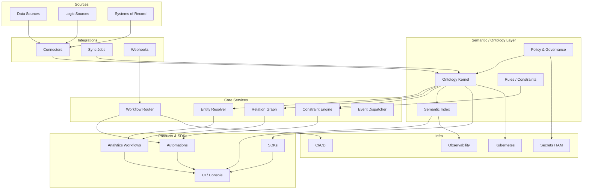
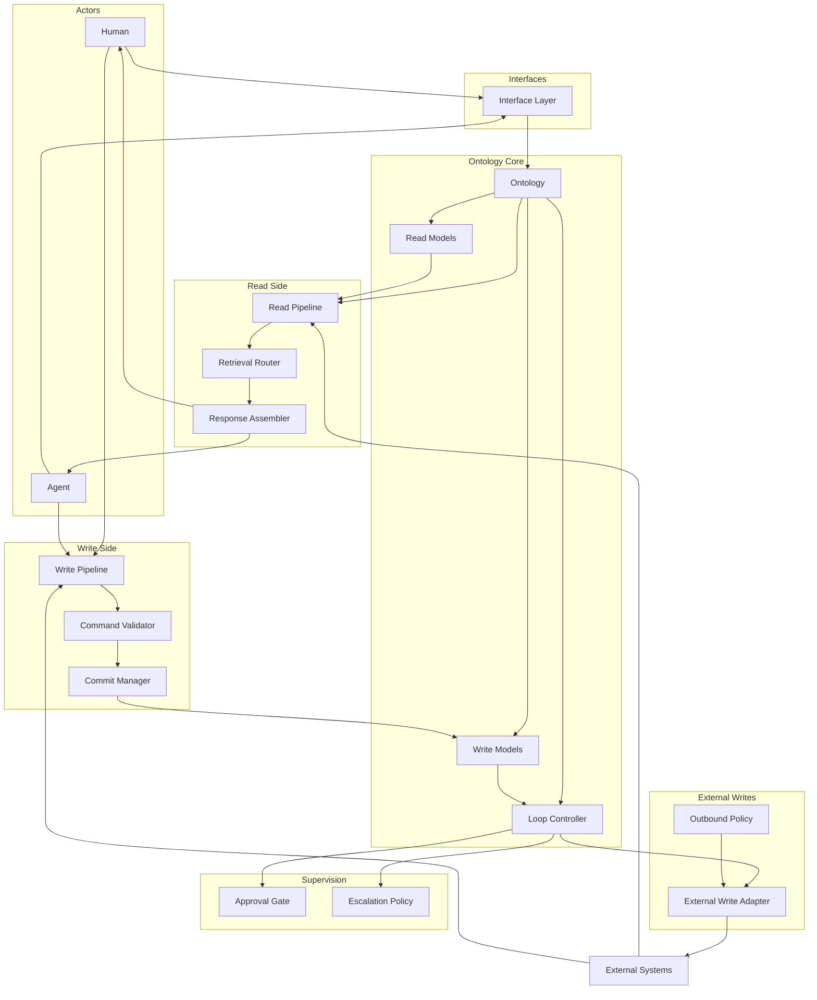
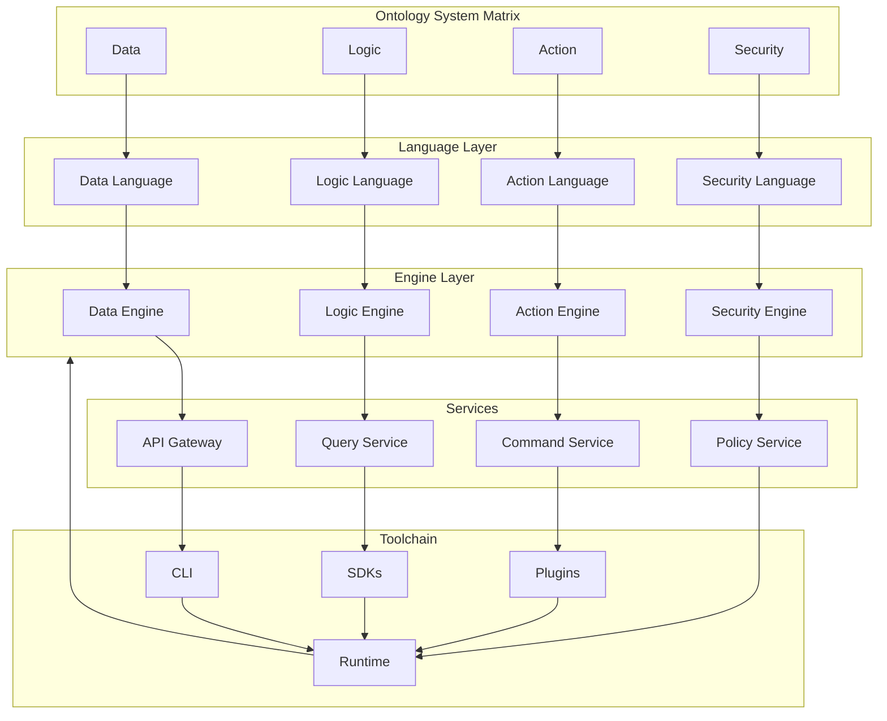
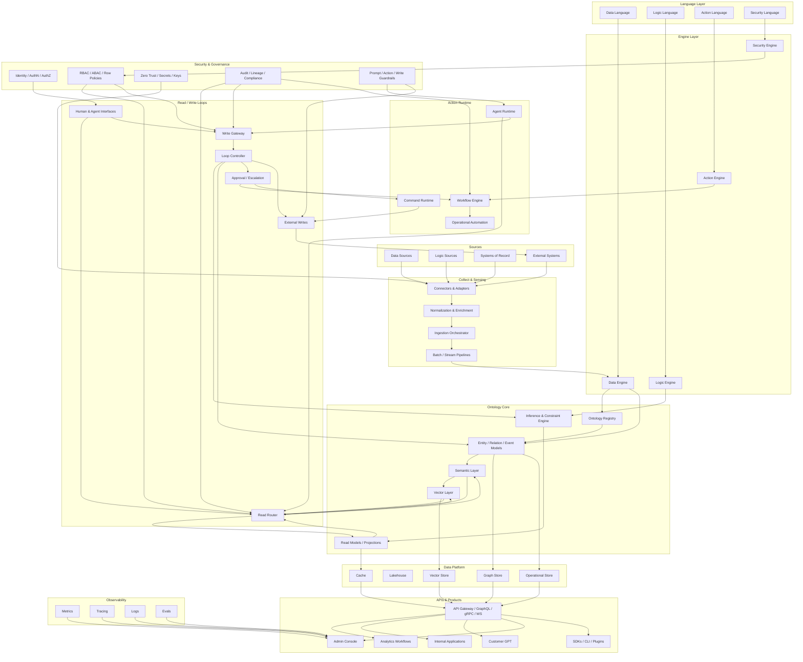

# Buat Susunan folder \& file dari input gambar tersebut, serta graph TB arsitek nya

Berikut contoh susunan folder/file dan graph TB yang menurunkan blok-blok besar di diagram “Palantir AIP Architecture Overview” ke bentuk monorepo arsitektur layanan. [^1_1]

## Struktur folder tingkat atas

```text
aip-platform/
├── README.md
├── docs/
│   ├── architecture-overview.md
│   ├── ontology-design.md
│   ├── security-governance.md
│   └── runbook-operations.md
├── configs/
│   ├── aip-config.yaml
│   └── policies/
│       ├── row-level-policies.yaml
│       └── data-access-policies.yaml
├── collect-sensing/                 # COLLECT & SENSING [file:1]
│   ├── orchestrator/
│   │   ├── service.go
│   │   └── orchestrator.yaml
│   ├── connectors/
│   │   ├── llm-tools-adapter/
│   │   │   ├── handler.ts
│   │   │   └── llm-tools-config.yaml
│   │   ├── enterprise-systems-adapter/
│   │   │   ├── handler.ts
│   │   │   └── mapping.yaml
│   │   └── external-apis-adapter/
│   │       ├── handler.ts
│   │       └── auth.yaml
│   └── pipelines/
│       ├── event-ingestion.pipeline.yaml
│       └── sensor-streams.pipeline.yaml
├── ontology/                        # ONTOLOGY (Control, Data, Vectors) [file:1]
│   ├── control-plane/
│   │   ├── ontology-registry.service.ts
│   │   └── ontology-schema.json
│   ├── data-models/
│   │   ├── entities/
│   │   │   ├── Customer.entity.json
│   │   │   └── Shipment.entity.json
│   │   └── relationships/
│   │       ├── CustomerShipment.rel.json
│   │       └── AssetOwnership.rel.json
│   ├── vectorization/
│   │   ├── embedding-jobs/
│   │   │   ├── text-embedding.job.yaml
│   │   │   └── multimodal-embedding.job.yaml
│   │   └── vector-store/
│   │       ├── schema.sql
│   │       └── index-config.yaml
│   └── services/
│       ├── semantic-search.service.go
│       └── retrieval-api.http.ts
├── security-governance/             # SECURITY & GOVERNANCE [file:1]
│   ├── authn-authz/
│   │   ├── oidc-provider-config.yaml
│   │   └── rbac-policies.yaml
│   ├── audit-compliance/
│   │   ├── audit-log-consumer.go
│   │   └── compliance-reports.md
│   ├── data-governance/
│   │   ├── classification-policy.yaml
│   │   └── pii-handling-guidelines.md
│   └── key-management/
│       ├── kms-config.yaml
│       └── key-rotation-job.yaml
├── aip-infra-cloud/                 # AIP INFRA & CLOUD / RUNTIME [file:1]
│   ├── cluster/
│   │   ├── k8s/
│   │   │   ├── namespace-aip.yaml
│   │   │   └── base-deployments.yaml
│   │   └── autoscaling-policies.yaml
│   ├── llm-runtime/
│   │   ├── model-gateway.service.ts
│   │   ├── prompts-templates/
│   │   │   ├── retrieval-augmented.prompt.md
│   │   │   └── tool-calling.prompt.md
│   │   └── tools-registry.json
│   └── monitoring/
│       ├── grafana-dashboards/
│       └── alerts.yaml
├── operational-automation/          # OPERATIONAL / DIGITAL AUTOMATION [file:1]
│   ├── workflows/
│   │   ├── incident-response.workflow.yaml
│   │   └── approval-loop.workflow.yaml
│   ├── agents/
│   │   ├── security-analyst.agent.yaml
│   │   └── operations-copilot.agent.yaml
│   └── schedulers/
│       └── workflow-scheduler.service.go
├── external-systems-security/       # SECURITY & MGMT OF EXTERNAL SYSTEMS [file:1]
│   ├── connectors/
│   │   ├── sap/
│   │   │   └── sap-connector.config.yaml
│   │   ├── snowflake/
│   │   │   └── snowflake-connector.config.yaml
│   │   └── messaging-brokers/
│   │       └── kafka-connector.config.yaml
│   ├── zero-trust-proxy/
│   │   ├── proxy.service.go
│   │   └── access-policies.yaml
│   └── sync-jobs/
│       └── full-sync.job.yaml
├── experience-layer/                # CUSTOMER GPT EXPERIENCES, INTERNAL APPS, AUTOMATION [file:1]
│   ├── customer-gpt-experiences/
│   │   ├── chat-ui/
│   │   │   ├── package.json
│   │   │   └── ChatApp.tsx
│   │   └── backend/
│   │       ├── gpt-orchestrator.service.ts
│   │       └── session-store.schema.sql
│   ├── internal-applications/
│   │   ├── dashboards/
│   │   │   ├── risk-dashboard/
│   │   │   └── ops-dashboard/
│   │   └── admin-console/
│   │       └── AdminConsoleApp.tsx
│   └── enterprise-automation/
│       ├── bpm-integration.service.ts
│       └── automation-apis.http.yaml
└── data-sources/                    # DATA SOURCES / INPUT SIDE [file:1]
    ├── operational-db/
    │   ├── postgres/
    │   │   └── schema.sql
    ├── data-lake/
    │   └── layout.md
    ├── logs-telemetry/
    │   └── schema.json
    └── third-party-apis/
        └── catalog.md
```

Struktur ini memetakan setiap “box” besar di diagram (Collect \& Sensing, Ontology, Security \& Governance, Infra, Experience, dan External Systems) menjadi domain service yang bisa di-deploy dan diskalakan secara independen. [^1_1]

## Mermaid graph TB arsitektur

Berikut graph TB yang merangkum aliran utama: data \& sistem eksternal → collect/sensing → ontology \& security → runtime/infra → experience \& automation. [^1_1]

```mermaid
graph TB

%% LAYER: DATA & EXTERNAL SYSTEMS
subgraph DataAndSystems["Data Sources & External Systems"]
    DS[Data Sources\n(DB, Data Lake, Logs)]
    ES[Enterprise Systems\n(ERP, CRM, WMS)]
    TP[Third-Party APIs]
end

%% LAYER: COLLECT & SENSING
subgraph CollectSensing["Collect & Sensing"]
    CS_ORCH[Ingestion Orchestrator]
    CS_CONN[Connectors & Adapters]
    CS_PIPE[Ingestion Pipelines]
end

%% LAYER: ONTOLOGY
subgraph Ontology["Ontology"]
    ONT_CTRL[Ontology Control Plane]
    ONT_MODEL[Data Models & Relationships]
    ONT_VEC[Vectorization & Vector Store]
    ONT_SERV[Semantic Services\n(Search & Retrieval)]
end

%% LAYER: SECURITY & GOVERNANCE
subgraph SecGov["Security & Governance"]
    SG_AUTH[AuthN/AuthZ\n(RBAC, OIDC)]
    SG_POL[Row-Level & Data Policies]
    SG_AUDIT[Audit & Compliance]
end

%% LAYER: AIP INFRA & CLOUD
subgraph Infra["AIP Infra & Cloud / Runtime"]
    INF_CLUSTER[Cluster & Orchestration\n(K8s, Autoscaling)]
    INF_LLM[LLM Runtime & Tools Gateway]
    INF_MON[Monitoring & Alerts]
end

%% LAYER: OPERATIONAL AUTOMATION
subgraph OpsAuto["Operational Automation"]
    OA_WF[Workflows\n(Incident, Approvals)]
    OA_AGENTS[Operational / Security Agents]
    OA_SCHED[Schedulers]
end

%% LAYER: SECURITY & MGMT OF EXTERNAL SYSTEMS
subgraph ExtSec["Security & Mgmt of External Systems"]
    EX_CONN[Secure Connectors]
    EX_ZT[Zero-Trust Proxy]
    EX_SYNC[Sync & ETL Jobs]
end

%% LAYER: EXPERIENCE
subgraph Experience["Experience Layer"]
    EXP_CGPT[Customer GPT Experiences]
    EXP_INT[Internal Applications\n(Dashboards, Admin)]
    EXP_AUTO[Enterprise Automation Interfaces]
end

%% FLOWS

%% Data & systems into collect
DS --> CS_CONN
ES --> CS_CONN
TP --> CS_CONN

CS_CONN --> CS_PIPE
CS_PIPE --> CS_ORCH

%% Collect into ontology
CS_ORCH --> ONT_MODEL
CS_ORCH --> ONT_VEC

%% Ontology core links
ONT_MODEL --> ONT_SERV
ONT_VEC --> ONT_SERV

%% Security overlays ontology & access
ONT_MODEL --> SG_POL
ONT_SERV --> SG_POL
SG_AUTH --> Experience
SG_POL --> Experience
SG_AUDIT --> Infra

%% Infra supports collect, ontology, automation, experience
INF_CLUSTER --> CS_ORCH
INF_CLUSTER --> ONT_SERV
INF_CLUSTER --> OA_WF
INF_CLUSTER --> Experience
INF_LLM --> ONT_SERV
INF_LLM --> Experience
INF_MON --> INF_CLUSTER

%% Operational automation uses ontology + infra
ONT_SERV --> OA_WF
OA_WF --> OA_AGENTS
OA_AGENTS --> OA_SCHED

%% External systems security path
ES --> EX_CONN
EX_CONN --> EX_ZT
EX_ZT --> CS_CONN
EX_SYNC --> ONT_MODEL

%% Experience consumes ontology + automation
ONT_SERV --> EXP_CGPT
ONT_SERV --> EXP_INT
OA_WF --> EXP_AUTO
OA_AGENTS --> EXP_INT
```

Kamu bisa langsung copy–paste graph Mermaid tersebut ke dokumentasi (mis. `docs/architecture-overview.md`) dan menyesuaikan nama node agar align dengan istilah internal atau domain logistik/AI yang kamu pakai sendiri. [^1_1]

<div align="center">⁂</div>

[^1_1]: 221832.jpeg


---

# now this

Berikut versi **Ontology System** dari gambar kedua, saya turunkan menjadi struktur folder/file dan `graph TB` yang lebih rapi untuk implementasi arsitektur. [^2_1]

## Struktur folder

```text
ontology-system/
├── README.md
├── docs/
│   ├── ontology-overview.md
│   ├── data-models.md
│   ├── workflows.md
│   └── sdks-and-products.md
├── core/
│   ├── ontology-engine/
│   │   ├── ontology-registry.ts
│   │   ├── entity-resolver.ts
│   │   ├── relation-graph.ts
│   │   └── constraint-engine.ts
│   ├── semantic-layer/
│   │   ├── semantic-index.ts
│   │   ├── retrieval-service.ts
│   │   └── embedding-pipeline.ts
│   ├── policy-layer/
│   │   ├── access-policy.ts
│   │   ├── classification-policy.ts
│   │   └── governance-rules.ts
│   └── orchestration/
│       ├── workflow-router.ts
│       ├── automation-runner.ts
│       └── event-dispatcher.ts
├── sources/
│   ├── data-sources/
│   │   ├── structured/
│   │   │   ├── postgres/
│   │   │   ├── mysql/
│   │   │   └── warehouse/
│   │   ├── unstructured/
│   │   │   ├── documents/
│   │   │   ├── emails/
│   │   │   └── logs/
│   │   └── streaming/
│   │       ├── kafka/
│   │       └── eventbus/
│   ├── logic-sources/
│   │   ├── rules/
│   │   ├── procedures/
│   │   └── business-processes/
│   └── systems-of-record/
│       ├── erp/
│       ├── crm/
│       ├── wms/
│       └── hris/
├── products/
│   ├── analytics-workflows/
│   │   ├── dashboard-builder/
│   │   ├── query-wizard/
│   │   └── report-generator/
│   ├── automations/
│   │   ├── approval-flows/
│   │   ├── incident-response/
│   │   └── task-orchestrator/
│   ├── sdk/
│   │   ├── ts/
│   │   ├── python/
│   │   └── go/
│   └── ui/
│       ├── console/
│       ├── admin-panel/
│       └── product-shell/
├── integrations/
│   ├── connectors/
│   │   ├── api-connectors/
│   │   ├── db-connectors/
│   │   └── file-connectors/
│   ├── sync-jobs/
│   └── webhooks/
├── api/
│   ├── graphql/
│   ├── rest/
│   └── grpc/
└── infra/
    ├── kubernetes/
    ├── observability/
    ├── secrets/
    └── ci-cd/
```


## Graph TB arsitektur




## Pemetaan blok gambar

- **Top layer** saya interpretasikan sebagai `Semantic / Ontology Layer`, tempat domain concepts, relations, policies, dan constraints hidup. [^2_1]
- **Bawah kiri** cocok dimodelkan sebagai `Data Sources`, karena berisi sumber data operasional dan event stream. [^2_1]
- **Bawah tengah** cocok sebagai `Logic Sources`, yaitu aturan bisnis, prosedur, dan proses yang menjadi input semantik. [^2_1]
- **Bawah kanan** adalah `Systems of Record`, seperti ERP/CRM/WMS/HRIS sebagai sumber kebenaran utama. [^2_1]
- **Bagian atas** yang menunjukkan analytics workflows, automations, dan products/SDKs saya turunkan menjadi layer konsumsi dari ontology core. [^2_1]

Kalau kamu mau, saya bisa lanjut bikin versi **lebih production-ready** dalam format:

1. `monorepo Go/TS/Rust`,
2. `NestJS + Temporal + Postgres + Neo4j`,
3. atau `Mermaid yang lebih detail per subdomain`.

<div align="center">⁂</div>

[^2_1]: 221835.jpeg


---

# now this

Berikut versi **Read–Write Loops** dari gambar ketiga, saya turunkan ke struktur folder/file dan `graph TB` yang cocok untuk implementasi sistem ontology yang punya loop baca-tulis antara human, agent, dan ontology. [^3_1]

## Struktur folder

```text
ontology-read-write-loops/
├── README.md
├── docs/
│   ├── loop-model.md
│   ├── interface-contracts.md
│   ├── read-path.md
│   ├── write-path.md
│   └── external-write-policies.md
├── interfaces/
│   ├── human-interface/
│   │   ├── ui-schema.json
│   │   └── interaction-contract.ts
│   ├── agent-interface/
│   │   ├── agent-runtime.ts
│   │   └── tool-contracts.ts
│   └── shared/
│       ├── session-context.ts
│       ├── message-envelope.ts
│       └── auth-context.ts
├── ontology/
│   ├── ontology-core/
│   │   ├── entities/
│   │   ├── relations/
│   │   ├── rules/
│   │   └── constraints/
│   ├── read-models/
│   │   ├── materialized-views/
│   │   ├── semantic-index/
│   │   └── query-plans/
│   ├── write-models/
│   │   ├── command-schemas/
│   │   ├── mutation-policies/
│   │   └── conflict-resolution/
│   └── loop-controller/
│       ├── loop-orchestrator.ts
│       ├── state-machine.ts
│       └── evaluation-engine.ts
├── flows/
│   ├── read-loops/
│   │   ├── read-pipeline.ts
│   │   ├── retrieval-router.ts
│   │   └── response-assembler.ts
│   ├── write-loops/
│   │   ├── write-pipeline.ts
│   │   ├── command-validator.ts
│   │   └── commit-manager.ts
│   └── external-writes/
│       ├── external-write-adapter.ts
│       └── outbound-policy.ts
├── agents/
│   ├── human-proxy/
│   │   └── human-session-manager.ts
│   ├── ontology-agent/
│   │   ├── planner.ts
│   │   ├── reader.ts
│   │   └── writer.ts
│   └── supervision/
│       ├── approval-gate.ts
│       └── escalation-policy.ts
├── api/
│   ├── read/
│   │   ├── graphql/
│   │   └── rest/
│   ├── write/
│   │   ├── commands/
│   │   └── mutations/
│   └── websocket/
│       └── realtime-loop.ts
└── infra/
    ├── event-bus/
    ├── queues/
    ├── audit-log/
    └── observability/
```


## Graph TB arsitektur




## Makna diagram

- **Bagian atas** menunjukkan dua aktor utama, `Human` dan `Agent`, yang sama-sama masuk melalui interface layer ke ontology. [^3_1]
- **Bagian tengah** adalah inti ontology yang memisahkan `read models` dan `write models`, lalu dikontrol oleh `loop controller`. [^3_1]
- **Sisi kiri** menggambarkan jalur **write**, yaitu input dari human/agent diproses lewat validation, commit, lalu menulis ke model ontology. [^3_1]
- **Sisi kanan** menggambarkan jalur **read**, yaitu ontology dibaca untuk retrieval dan response assembly. [^3_1]
- **Bagian bawah** menunjukkan `external writes`, yaitu write yang keluar ke sistem eksternal dengan policy dan adapter khusus. [^3_1]

Kalau kamu mau, saya bisa lanjut bikin **versi super detail** yang memecah ini menjadi:

1. folder per service,
2. event schema,
3. command/query contract,
4. dan sequence diagram read-write loop.

<div align="center">⁂</div>

[^3_1]: 221836.jpeg


---

# now this

Berikut versi **Data · Logic · Action · Security × Language · Engine · Toolchain** dari gambar keempat, saya turunkan menjadi struktur folder/file dan `graph TB` yang bisa dipakai sebagai blueprint implementasi. [^4_1]

## Struktur folder

```text
ontology-platform/
├── README.md
├── docs/
│   ├── platform-overview.md
│   ├── language-layer.md
│   ├── engine-layer.md
│   ├── toolchain-layer.md
│   └── security-governance.md
├── language/
│   ├── data/
│   │   ├── schema-language/
│   │   ├── query-language/
│   │   └── serialization/
│   ├── logic/
│   │   ├── rule-language/
│   │   ├── policy-language/
│   │   └── constraint-language/
│   ├── action/
│   │   ├── command-language/
│   │   ├── workflow-language/
│   │   └── agent-language/
│   └── security/
│       ├── auth-language/
│       ├── audit-language/
│       └── governance-language/
├── engine/
│   ├── data-engine/
│   │   ├── parser.ts
│   │   ├── validator.ts
│   │   └── materializer.ts
│   ├── logic-engine/
│   │   ├── inference.ts
│   │   ├── rule-runner.ts
│   │   └── planner.ts
│   ├── action-engine/
│   │   ├── executor.ts
│   │   ├── workflow-orchestrator.ts
│   │   └── agent-runner.ts
│   └── security-engine/
│       ├── policy-enforcer.ts
│       ├── authz.ts
│       └── audit-trail.ts
├── toolchain/
│   ├── cli/
│   │   ├── ont-cli.ts
│   │   └── commands/
│   ├── sdk/
│   │   ├── ts/
│   │   ├── go/
│   │   └── python/
│   ├── plugins/
│   │   ├── connectors/
│   │   ├── exporters/
│   │   └── validators/
│   └── runtime/
│       ├── bundle-manager.ts
│       └── environment.ts
├── services/
│   ├── api-gateway/
│   ├── query-service/
│   ├── command-service/
│   └── policy-service/
├── infra/
│   ├── kubernetes/
│   ├── observability/
│   ├── secrets/
│   └── ci-cd/
└── examples/
    ├── data-example/
    ├── logic-example/
    ├── action-example/
    └── security-example/
```


## Graph TB arsitektur




## Pemetaan makna

- **Kolom Data, Logic, Action, Security** saya jadikan dimensi domain utama sistem ontology. [^4_1]
- **Baris Language, Engine, Toolchain** saya jadikan tiga lapis abstraksi: definisi, eksekusi, dan developer experience/tooling. [^4_1]
- **Engine layer** berfungsi sebagai runtime untuk memproses bahasa masing-masing domain. [^4_1]
- **Toolchain** menjadi jembatan untuk CLI, SDK, plugin, dan runtime packaging. [^4_1]
- **Services** mengekspose kemampuan platform ke aplikasi eksternal melalui API, query, command, dan policy service. [^4_1]

Kalau kamu mau, saya bisa lanjut gabungkan **keempat gambar** tadi menjadi **satu arsitektur end-to-end** lengkap dengan:

1. folder monorepo final,
2. graph TB besar,
3. dan pembagian service Go/TS/Rust.

<div align="center">⁂</div>

[^4_1]: 221837.jpeg


---

# Lanjut gabungkan ke empat gambar tadi menjadi satu arsitektur end to end lengkap

Berikut saya gabungkan **empat gambar** tadi menjadi satu **arsitektur end-to-end** yang utuh: dari ingestion, ontology, read/write loop, sampai language-engine-toolchain dan product surface. Arsitektur ini menyatukan lapisan **Data, Logic, Action, Security** dengan alur **Collect → Model → Govern → Retrieve → Act → Externalize**. [^5_1][^5_2][^5_3][^5_4]

## Struktur monorepo final

```text
daemon-ontology-platform/
├── README.md
├── docs/
│   ├── 00-overview.md
│   ├── 01-end-to-end-architecture.md
│   ├── 02-ontology-system.md
│   ├── 03-read-write-loops.md
│   ├── 04-language-engine-toolchain.md
│   ├── 05-security-governance.md
│   ├── 06-deployment-topology.md
│   └── 07-sequence-flows.md
│
├── configs/
│   ├── platform.yaml
│   ├── tenancy.yaml
│   ├── environments/
│   │   ├── dev.yaml
│   │   ├── staging.yaml
│   │   └── prod.yaml
│   └── policies/
│       ├── access-policies.yaml
│       ├── data-policies.yaml
│       ├── action-policies.yaml
│       └── governance-policies.yaml
│
├── language/
│   ├── data/
│   │   ├── schema-language/
│   │   ├── mapping-language/
│   │   ├── query-language/
│   │   └── serialization/
│   ├── logic/
│   │   ├── rule-language/
│   │   ├── inference-language/
│   │   ├── policy-language/
│   │   └── constraint-language/
│   ├── action/
│   │   ├── command-language/
│   │   ├── workflow-language/
│   │   ├── agent-language/
│   │   └── tool-language/
│   └── security/
│       ├── auth-language/
│       ├── trust-language/
│       ├── audit-language/
│       └── governance-language/
│
├── sources/
│   ├── data-sources/
│   │   ├── structured/
│   │   │   ├── postgres/
│   │   │   ├── mysql/
│   │   │   └── warehouse/
│   │   ├── unstructured/
│   │   │   ├── documents/
│   │   │   ├── emails/
│   │   │   ├── tickets/
│   │   │   └── logs/
│   │   └── streaming/
│   │       ├── kafka/
│   │       ├── nats/
│   │       └── webhooks/
│   ├── logic-sources/
│   │   ├── business-rules/
│   │   ├── playbooks/
│   │   ├── workflows/
│   │   └── decision-tables/
│   └── systems-of-record/
│       ├── erp/
│       ├── crm/
│       ├── wms/
│       ├── hris/
│       └── cmdb/
│
├── collect-sensing/
│   ├── orchestrator/
│   │   ├── ingestion-orchestrator.ts
│   │   └── source-registry.ts
│   ├── connectors/
│   │   ├── db-connectors/
│   │   ├── api-connectors/
│   │   ├── file-connectors/
│   │   └── event-connectors/
│   ├── normalization/
│   │   ├── canonical-mapper.ts
│   │   ├── schema-resolver.ts
│   │   └── metadata-enricher.ts
│   └── pipelines/
│       ├── batch-pipeline.ts
│       ├── stream-pipeline.ts
│       └── replay-pipeline.ts
│
├── ontology/
│   ├── registry/
│   │   ├── ontology-registry.ts
│   │   ├── version-manager.ts
│   │   └── namespace-manager.ts
│   ├── models/
│   │   ├── entities/
│   │   ├── relations/
│   │   ├── events/
│   │   ├── states/
│   │   └── traits/
│   ├── semantic-layer/
│   │   ├── semantic-index.ts
│   │   ├── retrieval-service.ts
│   │   ├── entity-resolver.ts
│   │   └── relation-graph.ts
│   ├── vector-layer/
│   │   ├── embedding-pipeline.ts
│   │   ├── vector-store.ts
│   │   └── hybrid-search.ts
│   ├── logic-layer/
│   │   ├── rule-engine.ts
│   │   ├── inference-engine.ts
│   │   ├── constraint-engine.ts
│   │   └── planner.ts
│   └── projections/
│       ├── read-models/
│       ├── materialized-views/
│       └── query-optimizers/
│
├── read-write-loops/
│   ├── interfaces/
│   │   ├── human-interface/
│   │   ├── agent-interface/
│   │   └── session-context/
│   ├── reads/
│   │   ├── read-router.ts
│   │   ├── context-builder.ts
│   │   ├── retrieval-planner.ts
│   │   └── response-assembler.ts
│   ├── writes/
│   │   ├── command-gateway.ts
│   │   ├── mutation-validator.ts
│   │   ├── commit-manager.ts
│   │   └── conflict-resolver.ts
│   ├── loop-controller/
│   │   ├── loop-orchestrator.ts
│   │   ├── state-machine.ts
│   │   ├── approval-gates.ts
│   │   └── escalation-engine.ts
│   └── external-writes/
│       ├── outbound-adapter.ts
│       ├── external-command-bus.ts
│       └── outbound-policy.ts
│
├── action-runtime/
│   ├── workflow-engine/
│   │   ├── workflow-orchestrator.ts
│   │   ├── saga-manager.ts
│   │   └── compensation-handler.ts
│   ├── agent-runtime/
│   │   ├── planner.ts
│   │   ├── tool-runner.ts
│   │   ├── memory-bridge.ts
│   │   └── evaluator.ts
│   ├── command-runtime/
│   │   ├── command-executor.ts
│   │   ├── task-scheduler.ts
│   │   └── job-dispatcher.ts
│   └── automation/
│       ├── incident-response/
│       ├── approval-flows/
│       └── enterprise-ops/
│
├── security-governance/
│   ├── identity/
│   │   ├── authn.ts
│   │   ├── authz.ts
│   │   └── federation.ts
│   ├── policy/
│   │   ├── rbac.ts
│   │   ├── abac.ts
│   │   ├── row-level-policy.ts
│   │   └── field-level-policy.ts
│   ├── trust/
│   │   ├── zero-trust-gateway.ts
│   │   ├── secret-broker.ts
│   │   └── key-management.ts
│   ├── audit/
│   │   ├── audit-log.ts
│   │   ├── lineage-tracker.ts
│   │   └── compliance-export.ts
│   └── guardrails/
│       ├── prompt-guard.ts
│       ├── action-guard.ts
│       └── external-write-guard.ts
│
├── engine/
│   ├── data-engine/
│   ├── logic-engine/
│   ├── action-engine/
│   └── security-engine/
│
├── toolchain/
│   ├── cli/
│   ├── sdk/
│   │   ├── ts/
│   │   ├── go/
│   │   ├── rust/
│   │   └── python/
│   ├── plugins/
│   │   ├── connectors/
│   │   ├── validators/
│   │   ├── exporters/
│   │   └── agent-tools/
│   ├── scaffolds/
│   └── runtime/
│
├── api/
│   ├── gateway/
│   ├── graphql/
│   ├── rest/
│   ├── grpc/
│   └── websocket/
│
├── products/
│   ├── analytics-workflows/
│   ├── automations/
│   ├── customer-gpt/
│   ├── internal-applications/
│   ├── admin-console/
│   └── product-shell/
│
├── external-systems/
│   ├── adapters/
│   ├── sync-jobs/
│   ├── outbound-actions/
│   └── system-proxies/
│
├── data-platform/
│   ├── lakehouse/
│   ├── operational-store/
│   ├── graph-store/
│   ├── vector-store/
│   └── cache/
│
├── observability/
│   ├── metrics/
│   ├── tracing/
│   ├── logging/
│   ├── evals/
│   └── dashboards/
│
├── deployment/
│   ├── docker/
│   ├── kubernetes/
│   ├── helm/
│   └── terraform/
│
└── tests/
    ├── contract/
    ├── integration/
    ├── policy/
    ├── ontology/
    └── e2e/
```

Struktur ini menyatukan layer dari empat diagram: **AIP architecture overview**, **ontology system**, **read-write loops**, dan **language/engine/toolchain matrix** ke dalam satu monorepo yang terpisah per bounded context namun tetap konsisten secara runtime. [^5_1][^5_2][^5_3][^5_4]

## Graph TB end-to-end



Graph ini menunjukkan bahwa seluruh sistem berputar di sekitar **ontology core** sebagai semantic control plane, sementara **read/write loops** menjadi jalur interaksi utama bagi human dan agent, lalu **action runtime** mengeksekusi keputusan ke workflow internal maupun external systems. [^5_1][^5_2][^5_3][^5_4]

## Alur end-to-end

1. **Ingestion**: data, logic source, dan systems of record masuk melalui connector, lalu dinormalisasi ke canonical model sebelum diproses pipeline. [^5_1][^5_2]
2. **Language-to-engine**: definisi domain pada layer language diterjemahkan ke engine data, logic, action, dan security agar bisa dieksekusi secara runtime. [^5_4]
3. **Ontology build**: hasil engine membentuk entity, relation, event, projection, semantic index, dan vector index di ontology core. [^5_2][^5_4]
4. **Read loop**: human atau agent membaca state sistem via semantic retrieval, hybrid search, dan materialized view. [^5_3]
5. **Write loop**: command dari human/agent divalidasi, dievaluasi terhadap rules dan guardrails, lalu di-commit ke ontology atau dikirim sebagai action ke sistem eksternal. [^5_3][^5_4]
6. **Execution**: workflow engine, command runtime, dan automation menindaklanjuti perubahan menjadi aksi operasional. [^5_1][^5_3]
7. **Governance**: semua read, write, dan outbound action dibungkus identity, policy, audit, lineage, dan zero-trust controls. [^5_1][^5_4]

## Pembagian service yang disarankan

Untuk implementasi production-grade, pembagian service yang masuk akal adalah seperti berikut. [^5_1][^5_2][^5_3][^5_4]


| Domain | Service utama | Bahasa yang cocok |
| :-- | :-- | :-- |
| Ingestion | connector-service, normalization-service, ingestion-orchestrator | Go / TypeScript [^5_1][^5_2] |
| Ontology core | ontology-registry, entity-graph, semantic-retrieval, vector-indexer | Rust / Go [^5_2][^5_4] |
| Read/write loop | read-router, write-gateway, loop-controller | TypeScript / Go [^5_3] |
| Action runtime | workflow-engine, agent-runtime, command-runtime | TypeScript / Go [^5_1][^5_3] |
| Security | authz-service, policy-engine, audit-service, secrets-broker | Go / Rust [^5_1][^5_4] |
| Product/API | api-gateway, graphql, websocket, admin-console backend | TypeScript [^5_1][^5_2] |
| Toolchain | CLI, SDK, codegen, plugin runtime | TypeScript / Rust / Python [^5_4] |

Kalau disesuaikan dengan stack kamu, pola yang paling natural adalah **Go untuk infra/runtime**, **TypeScript untuk orchestration/API/agent**, dan **Rust untuk graph, policy, atau performance-critical semantic components**. [^5_1][^5_2][^5_3][^5_4]

## Boundary implementasi

Supaya arsitektur ini tidak berubah jadi monolit kabur, batas tanggung jawabnya sebaiknya seperti ini. [^5_1][^5_2][^5_3][^5_4]

- **Collect \& Sensing** hanya bertugas ingest, normalize, dan enrich; tidak memegang business decision. [^5_1][^5_2]
- **Ontology Core** adalah source of semantic truth; ia memodelkan entity, relation, event, state, dan projection. [^5_2][^5_3]
- **Read/Write Loops** adalah interaction fabric; semua human/agent mutation lewat sini agar approval, validation, dan lineage terjaga. [^5_3]
- **Action Runtime** mengeksekusi workflow dan automation, tetapi tidak menjadi tempat definisi ontology. [^5_1][^5_3]
- **Security \& Governance** adalah cross-cutting layer yang mengontrol tiap read, write, dan external action. [^5_1][^5_4]
- **Toolchain** melayani developer/operator agar ontology, workflow, dan policy bisa dibangun secara repeatable. [^5_4]

