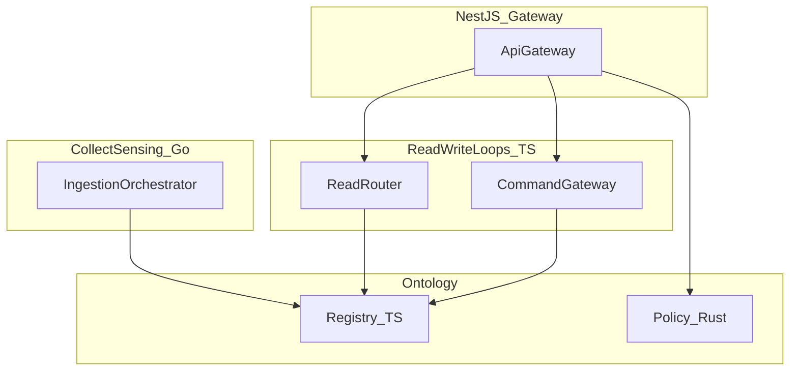

# End-to-end architecture

```mermaid
graph TB
  subgraph ingest [CollectSensing_Go]
    ING[IngestionOrchestrator]
  end
  subgraph ont [Ontology]
    REG[Registry_TS]
    POL[Policy_Rust]
  end
  subgraph loops [ReadWriteLoops_TS]
    READ[ReadRouter]
    WRITE[CommandGateway]
  end
  subgraph api [NestJS_Gateway]
    GW[ApiGateway]
  end
  ING --> REG
  GW --> READ
  GW --> WRITE
  READ --> REG
  WRITE --> REG
  GW --> POL
```

Data flows: external sources → collect-sensing → ontology registry → read/write loops → products and agents via API gateway.
