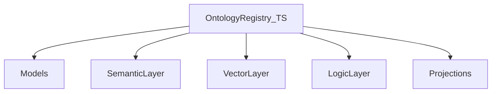

# Ontology system

The ontology is the system of record for entities, relations, events, states, and traits. It is composed of layered concerns coordinated by the registry.

## Layers

- **Registry** (`ontology/registry/`): namespacing, versioning, and entity lifecycle. Acts as the write path for all ontology mutations.
- **Models** (`ontology/models/`): typed definitions for entities, relations, events, states, and traits.
- **Semantic layer** (`ontology/semantic-layer/`): meaning resolution and term normalization.
- **Vector layer** (`ontology/vector-layer/`): embedding and similarity lookups, optionally backed by the Rust vector shim.
- **Logic layer** (`ontology/logic-layer/`): rule evaluation and inference over registered entities.
- **Projections** (`ontology/projections/`): read-model builders fed from registry events. `EntityReadModelProjection` is attached in `DaemonRuntime` and updated by `PropagationExecutor` on register/patch (see `configs/governance/propagation.yaml`).
- **Pack SSOT** (`configs/ontology/packs/foundation/`): entities under `entities/`, relations under `relations/` (e.g. `Link`), junctions under `junctions/` (e.g. `CaseEvent`). Loaded by `loadFoundationPack()` and validated by `pnpm run check:ontology-pack`.
- **Governance** (`ontology/governance/`): `OntologyGovernance` validates entities, links, and junctions; `GovernancePolicyLoader` enforces breaking schema changes from `configs/policies/governance-policies.yaml` (CLI: `daemon-cli ontology validate-schema-change`).

## Cross-language registry

A Go HTTP registry mirrors the TypeScript registry semantics for use by the collect-sensing ingest path. Both share the same namespace/version contract so ingested records resolve to identical entity identities.
