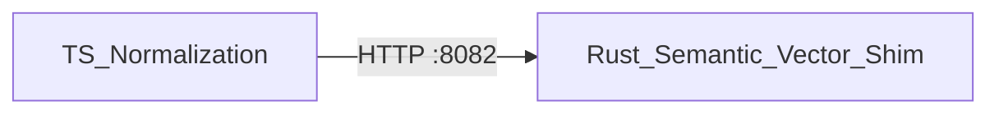

# Language engine and toolchain

The language tree defines validators and parsers across four domains, plus the toolchain that hosts plugins and SDKs.

## Language domains

- **data/** — schema language: validators for entity/relation schemas (`language/data/schema-language/validator.ts`).
- **logic/** — rule and inference grammars.
- **action/** — workflow and command DSL parsing.
- **security/** — policy expression parsing.

Each sub-area ships fixtures (YAML/JSON) and behavioral tests asserting accept/reject on inputs.

## Rust integration

Semantic and vector capabilities are exposed from Rust via a **sidecar HTTP shim** (`:8082`) rather than FFI. This avoids cgo complexity in CI while keeping the Rust crates as the implementation of record. The TypeScript ingest normalization path calls the shim over HTTP.

## Toolchain

- **plugins/** (`toolchain/plugins/`): a plugin host interface plus a reference plugin that registers one ontology entity type.
- **sdk/go**, **sdk/rust** (`toolchain/sdk/`): parity SDKs exposing health, read, and write against the gateway.
