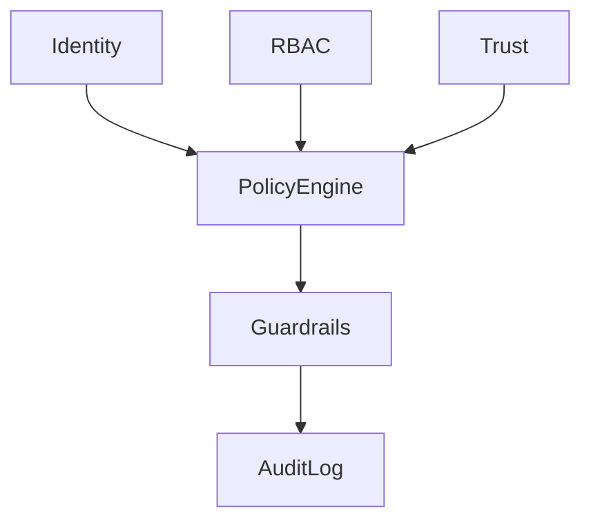

# Security and governance

Security and governance enforce identity, policy, guardrails, trust, and audit across the platform.

## Policy engine

`security-governance/policy-engine.ts` is the central decision point. It evaluates `action`/`resource` against the policies in [`configs/policies/`](../configs/policies). A decision is `allow` or `deny` with an optional `reason`. Denials surface as `ErrorCodes.POLICY_DENIED`.

## Policy sources

- `access-policies.yaml` — entity read/write access.
- `action-policies.yaml` — workflow and command execution.
- `data-policies.yaml` — store access and data classification.
- `governance-policies.yaml` — audit, retention, escalation, approval gates.

## Audit

Audit uses an in-memory backend for fast unit tests, and `PostgresAuditLog` when `DAEMON_POSTGRES_URL` is set (used in integration and e2e). Audit records are retained per `governance-policies.yaml`.

## Approval and escalation

External writes and schema changes route through approval gates. Policy denials and external writes trigger escalation channels defined in governance policy.

Loop failures map to escalation levels in `read-write-loops/loop-controller/escalation-engine.ts` (`notify` → log/review, `page` → on-call, `halt` → stop processing). Gateway policy denials and repeated write-loop failures should be treated as security-relevant signals, not only product errors.

## Incident response

**Governance maturity (category 2 — incident response):** Moderate → **Satisfactory** when the workflows below are followed in production. This repo wires audit and escalation primitives; paging, SIEM, and runbooks live in your operations toolchain.

### Detection and triage

| Signal | Source | Initial action |
|--------|--------|----------------|
| Policy denial (`POLICY_DENIED`) | `PolicyEngine` + gateway `@PolicyCheck` | Review `daemon_audit` for `action`, `resource`, `tenant_id`, `domain_id`; confirm expected vs misconfiguration |
| Ontology governance events | `ontology.register`, `ontology.patch`, `ontology.schema.change` | Triage schema-change approvals; check propagation lag if read models drift |
| Write-loop escalation | `EscalationEngine` (`page` / `halt`) | Page on-call for the owning service; halt requires incident commander |
| Static analysis regressions | CodeQL on PR (`/.github/workflows/codeql.yml`) | Block merge on new high/critical findings; open security ticket for accepted risk |

### Audit → SIEM → on-call

1. **Emit:** Production paths append to `PostgresAuditLog` (`daemon_audit`) when `DAEMON_POSTGRES_URL` is set; unit tests use in-memory `AuditLog`.
2. **Forward:** Export or replicate `daemon_audit` (and application logs) into your SIEM with tenant/domain dimensions preserved. Minimum fields: `action`, `outcome`, `subject_id`, `resource`, `tenant_id`, `domain_id`, `metadata`, timestamp.
3. **Alert:** SIEM rules should correlate:
   - Spike in `policy_denied` or `outcome = deny` for a tenant
   - `ontology.schema.change` without matching approval record
   - Neo4j / ontology-query errors after Cypher validation changes (possible abuse)
4. **Page:** Route `page` and `halt` escalations from write loops to the same on-call rotation as API availability. Include audit record IDs in the incident ticket.

### Response playbook (summary)

1. **Contain:** Disable affected tenant API keys or set maintenance mode; for schema incidents, freeze `ontology validate-schema-change` / pack deploys.
2. **Investigate:** Query audit by `tenant_id` + time window; replay gateway request IDs from `metadata`; check CodeQL/SARIF if the change introduced a regression.
3. **Recover:** Roll back deployment or revert pack YAML; re-run propagation / Neo4j backfill if graph projection diverged.
4. **Close:** Document root cause, audit gap, and whether `governance-policies.yaml` escalation channels need updates.

### Related config

- `configs/policies/governance-policies.yaml` — escalation triggers (`policy_denied`, `external_write`), retention, approval gates
- `configs/governance/action-catalog.yaml` — gateway actions bound to `PolicyEngine`
- Cypher guardrails: `products/ontology-query/validate-cypher.ts` (max length, read-only, no multi-statement); Neo4j timeout via `DAEMON_NEO4J_QUERY_TIMEOUT_MS` (see [10-neo4j-graph-model.md](./10-neo4j-graph-model.md))

## Wired vs config-only (commercial SSOT)

| Config / capability | CI check | Runtime |
|---------------------|----------|---------|
| `governance-policies.yaml` approval gates | `pnpm run check:governance-policies` | `OntologyGovernance.assertSchemaChange` / `enforceSchemaChange`; CLI `ontology validate-schema-change` |
| `propagation.yaml` | `check:governance-policies` (targets) | `PropagationExecutor` on registry register/patch via `DaemonRuntime` |
| `action-catalog.yaml` | `check:governance-policies` (gateway `@PolicyCheck` pairs) | `PolicyEngine` at gateway startup via `loadActionCatalogPolicyRules()`; optional `onCommitted` workflow steps after loop commit |
| Pack relations/junctions | `check:ontology-pack` | Link validation on ingest/register; junction validation when junction ingest exists |
| Postgres RLS (`app.tenant_id`) | integration test when Postgres up | `withTenantSession` on journal upserts |
| CodeQL (JS/TS, Go, Rust) | `.github/workflows/codeql.yml` on PR/push to `main` | SARIF uploaded to GitHub Security tab |
| Incident response runbook | This doc (category 2) | Audit → SIEM → on-call; escalation levels in loop controller |

Audit actions for ontology paths include `ontology.register`, `ontology.patch`, and `ontology.schema.change` (when schema gates run).

Policy-gated HTTP and `DaemonClient` methods (`checkPolicy`, ingest, write, automations): [13-sdk.md](./13-sdk.md).
