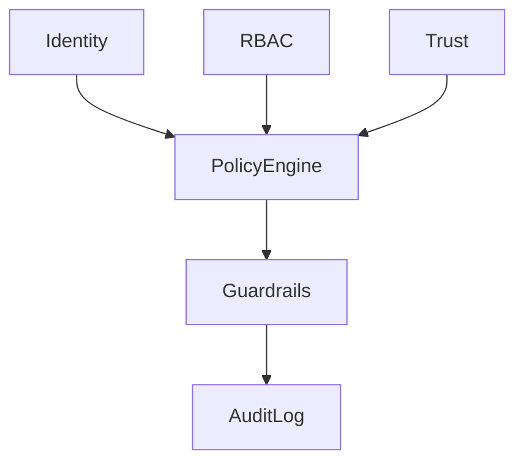

# Security and governance

Security and governance enforce identity, policy, guardrails, trust, and audit across the platform.

## Policy engine

`security-governance/policy-engine.ts` is the central decision point. It evaluates `action`/`resource` against the policies in [`configs/policies/`](../configs/policies). A decision is `allow` or `deny` with an optional `reason`. Denials surface as `ErrorCodes.POLICY_DENIED`.

## Policy sources

- `access-policies.yaml` — entity read/write access.
- `action-policies.yaml` — workflow and command execution.
- `data-policies.yaml` — store access and data classification.
- `governance-policies.yaml` — audit, retention, escalation, approval gates.

## Audit

Audit uses an in-memory backend for fast unit tests, and `PostgresAuditLog` when `DAEMON_POSTGRES_URL` is set (used in integration and e2e). Audit records are retained per `governance-policies.yaml`.

## Approval and escalation

External writes and schema changes route through approval gates. Policy denials and external writes trigger escalation channels defined in governance policy.
