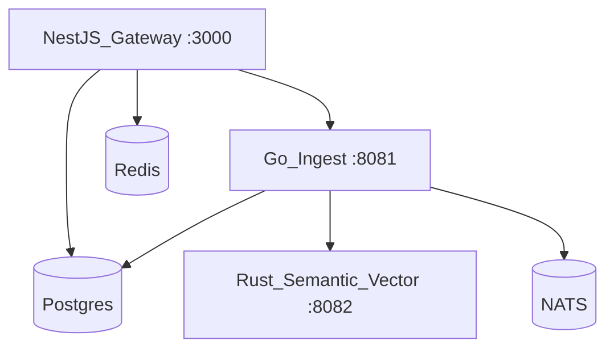

# Deployment topology

The platform runs as a set of cooperating services across TypeScript, Go, and Rust.

## Local

`deployment/docker/compose.dev.yaml` brings up Postgres, Redis, NATS, collect-sensing (Go ingest), the Rust shim, and the gateway. The CLI `dev up` wraps this and waits for health.

## Environments

Per-environment settings live in [`configs/environments/`](../configs/environments): `dev.yaml`, `staging.yaml`, `prod.yaml`. Production enforces auth and TLS and uses larger connection pools.

## Kubernetes

Manifests under `deployment/kubernetes/` deploy each service with health probes. Service URLs are injected via environment variables (`DAEMON_GATEWAY_URL`, `DAEMON_INGEST_URL`, `DAEMON_POLICY_URL`).

## CI

CI runs fast `build` and unit `test` jobs plus an `integration` job that starts the compose stack, waits for health, and runs `pnpm run test:repo` against real services.
