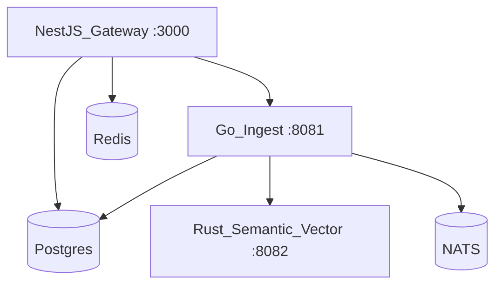

# Deployment topology

The platform runs as a set of cooperating services across TypeScript, Go, and Rust.

## Postgres durability (gateway)

When `DAEMON_POSTGRES_URL` is set, the gateway treats Postgres as the durable layer:

- **`daemon_entity_snapshots`** — write-through journal on every register/patch; in-process `OntologyRegistry` is the hot read path.
- **`daemon_audit`** — audit mirror with `tenant_id`, `domain_id`, `metadata`.
- **`daemon_graph_edges`** — scoped edges (`tenant_id`, `domain_id`, `from_id`, `to_id`, `relation`); populated when registering `Link` entities.
- **`daemon_ontology_changes`** — append-only change log (register/patch) with `pack_version`.

Row-level security on snapshots, audit, changes, and graph edges uses session variable `app.tenant_id` (set by `withTenantSession` in the operational store).

On process start, `initDaemonRuntime()` applies migrations and replays snapshots into memory. Without Postgres, the gateway uses an in-memory registry only (dev default). In production, set `DAEMON_POSTGRES_URL` (optional `DAEMON_SSOT_MODE=memory` only for explicit dev overrides; production rejects memory-only SSOT).

Run `pnpm run db:migrate` after schema changes or on a fresh database.

## Local

`deployment/docker/compose.dev.yaml` brings up Postgres, Redis, NATS, collect-sensing (Go ingest), the Rust shim, and the gateway. The CLI `dev up` wraps this and waits for health.

## Environments

Per-environment settings live in [`configs/environments/`](../configs/environments): `dev.yaml`, `staging.yaml`, `prod.yaml`. Production enforces auth and TLS and uses larger connection pools.

### Staging read loop

[`configs/environments/staging.yaml`](../configs/environments/staging.yaml) documents the projection read rollout:

| Env | Purpose |
|-----|---------|
| `DAEMON_READ_FROM_PROJECTION=1` | Serve reads from the in-process projection when a row exists |
| `DAEMON_READ_PARITY_CHECK=1` | Compare projection vs registry on every read; expose mismatch counters on `/metrics` |

Local parity harness (no gateway): `node scripts/measure-read-projection-parity.mjs` — expects 100% match after register + projection apply.

Watch staging: `daemon_read_parity_checks_total`, `daemon_read_parity_matches_total`, and `daemon_read_parity_mismatch_total{reason=...}`; investigate `read_parity_mismatch` log lines before promoting to prod.

## Kubernetes

Manifests under `deployment/kubernetes/` deploy each service with health probes. Service URLs are injected via environment variables (`DAEMON_GATEWAY_URL`, `DAEMON_INGEST_URL`, `DAEMON_POLICY_URL`).

## CI

CI runs fast `build` and unit `test` jobs plus an `integration` job that starts the compose stack, waits for health, and runs `pnpm run test:repo` against real services.

Connectivity patterns (cloud pull vs agent-style ingest) and SDK configuration: [15-data-connection-map.md](./15-data-connection-map.md), [13-sdk.md](./13-sdk.md).

For production cutover (profiles, migrations, smoke, per-domain checklist): [20-deployment-go-live-guide.md](./20-deployment-go-live-guide.md).
