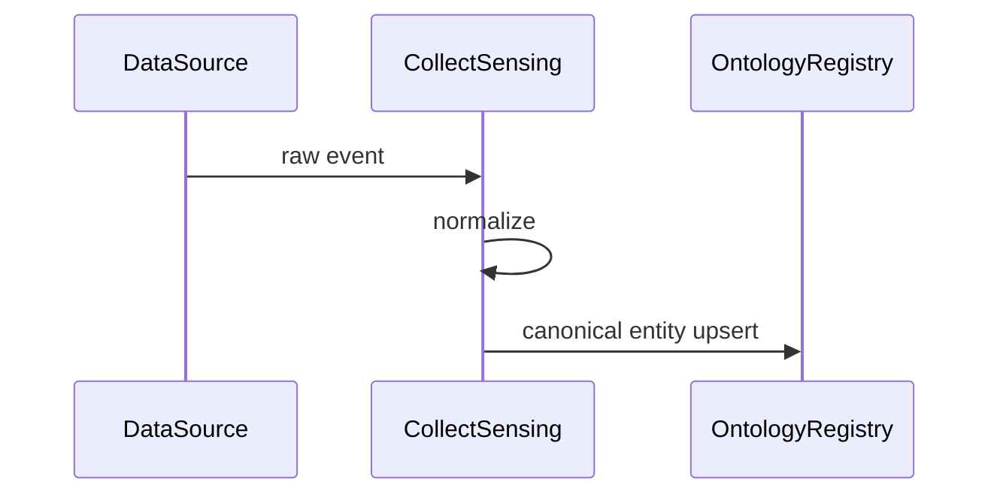
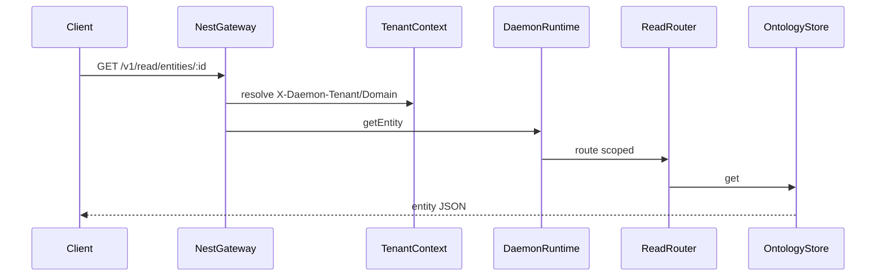
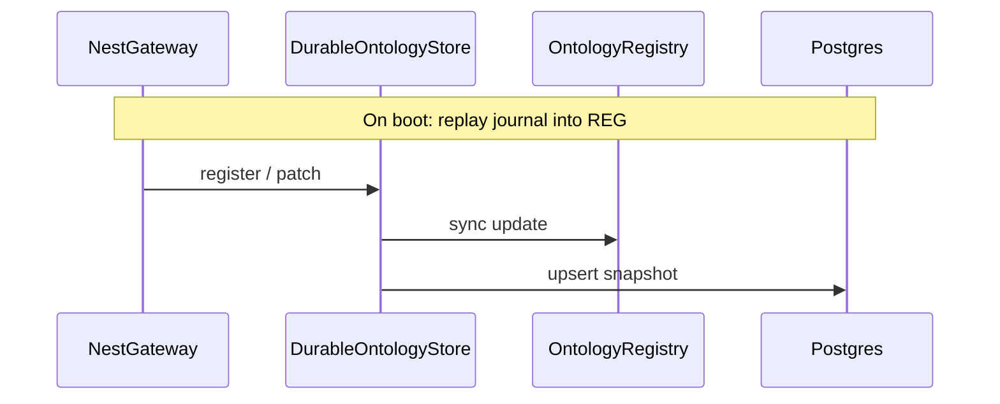
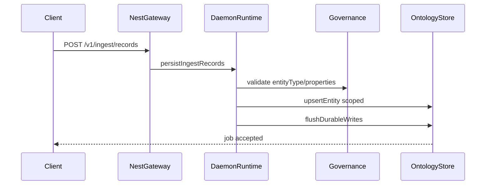
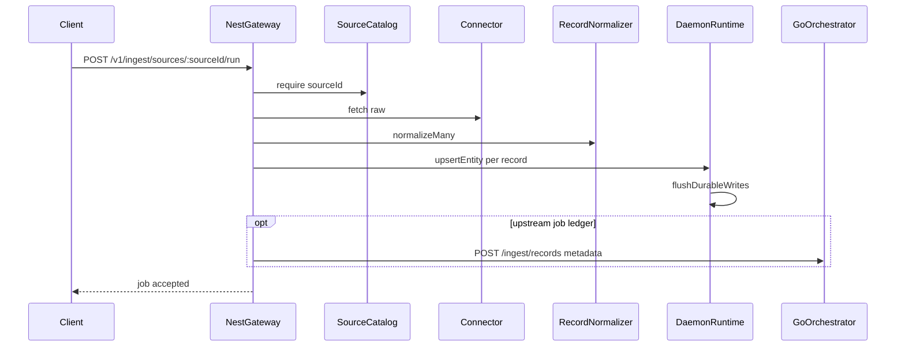
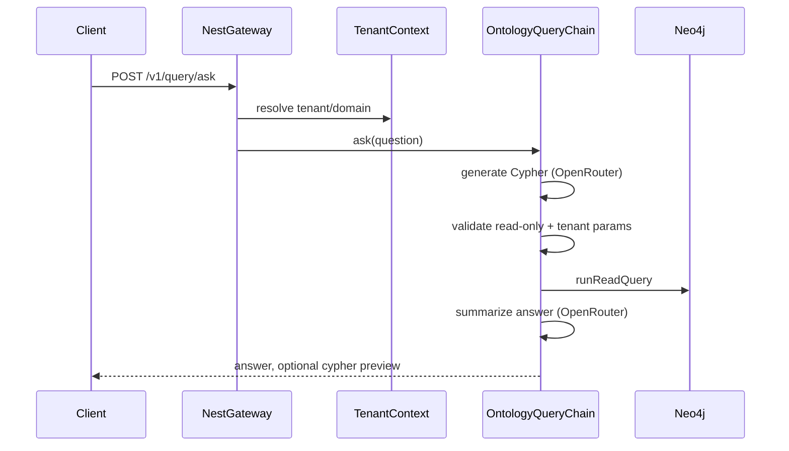

# Sequence flows

## Ingest → ontology



## Read path



## Write path

```mermaid
sequenceDiagram
  participant Client
  participant GW as NestGateway
  participant RT as DaemonRuntime
  participant LOOP as LoopOrchestrator
  participant Ont as OntologyStore
  participant AUD as AuditPort
  Client->>GW: POST /v1/write
  GW->>RT: runWriteLoop
  RT->>LOOP: execute
  LOOP->>Ont: patch
  alt committed and onCommitted in action-catalog
    RT->>RT: WorkflowOrchestrator (catalog steps)
    RT->>AUD: workflow.execute
  end
  RT->>AUD: record loop.write
  Ont-->>Client: writeId, version, workflowResults
```

## Durable write (Postgres journal)

When `DAEMON_POSTGRES_URL` is configured, `DurableOntologyStore` mirrors each mutation to `daemon_entity_snapshots` after updating the in-memory registry.



## Ingest via gateway (pre-shaped records)



## Ingest source-run (collect-sensing → ontology)

Canonical ontology build is the gateway `DaemonRuntime` path. The Go `IngestionOrchestrator` (`POST /ingest/records` on `:8081`) is optional job metadata when `DAEMON_INGEST_SKIP_UPSTREAM` is unset.



## Natural-language ontology query (Neo4j)

When `DAEMON_NEO4J_URI` and `DAEMON_ONTOLOGY_QUERY_ENABLED=1` are set, the gateway exposes `POST /v1/query/ask`. Writes still flow through propagation into Neo4j (`neo4j-graph-sync`).



## Natural-language ontology query (Neo4j)

When `DAEMON_NEO4J_URI` and `DAEMON_ONTOLOGY_QUERY_ENABLED=1` are set, the gateway exposes `POST /v1/query/ask`. Writes still flow through propagation into Neo4j (`neo4j-graph-sync`).


