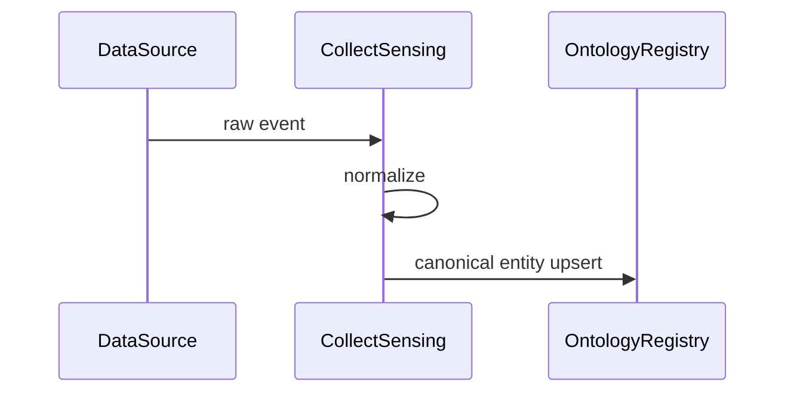
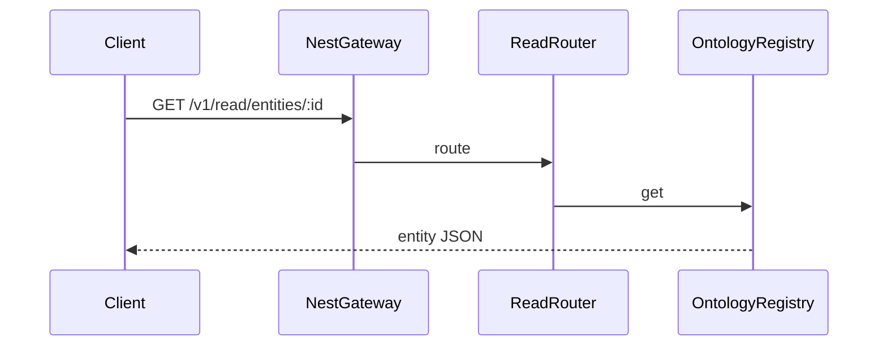
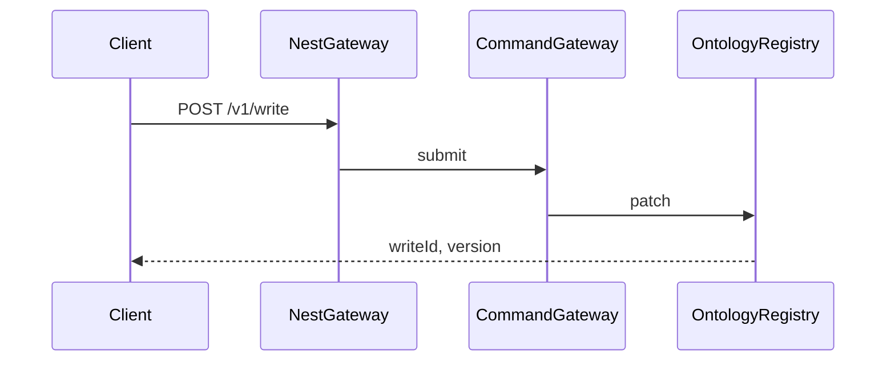

# Sequence flows

## Ingest → ontology

```mermaid
sequenceDiagram
  participant Src as DataSource
  participant CS as CollectSensing
  participant Ont as OntologyRegistry
  Src->>CS: raw event
  CS->>CS: normalize
  CS->>Ont: canonical entity upsert
```

## Read path

```mermaid
sequenceDiagram
  participant Client
  participant GW as NestGateway
  participant RR as ReadRouter
  participant Ont as OntologyRegistry
  Client->>GW: GET /v1/read/entities/:id
  GW->>RR: route
  RR->>Ont: get
  Ont-->>Client: entity JSON
```

## Write path

```mermaid
sequenceDiagram
  participant Client
  participant GW as NestGateway
  participant CG as CommandGateway
  participant Ont as OntologyRegistry
  Client->>GW: POST /v1/write
  GW->>CG: submit
  CG->>Ont: patch
  Ont-->>Client: writeId, version
```
