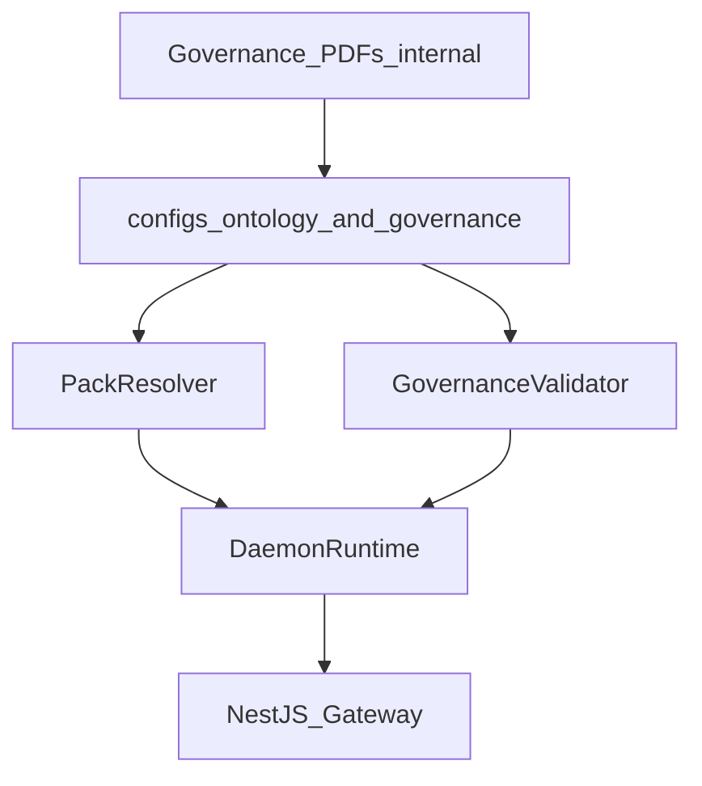

# Semantic governance and alignment

## Purpose

Ontology packs, domain catalogs, and governance configs form the semantic single source of truth (SSOT) for what entities may exist, which fields are required, and how changes propagate across tenants and domains.

## Document tier precedence (human reference)

Internal PDFs (Charter, Ontology Master, Technology OS) are not committed to the repo. They guide product policy; machine-readable configs below are the SSOT for CI and runtime.

| Tier / source (internal) | Precedence | Role in repo (machine-readable) |
|--------------------------|------------|--------------------------------|
| Charter / Manifesto (PDF) | Highest | Product policy; not versioned in git |
| Ontology Master v2.x (PDF) | Above Technology OS | Tier 0A methodology: entities, relations, junctions, action catalog |
| Technology OS (PDF) | Operational / propagation | `configs/governance/propagation.yaml` |

Public packs stay sector-agnostic (foundation). Do not copy logistics-specific entity names (e.g. shipment types) into public packs unless approved as a separate extension pack.

## Ontology Master concepts → modules and paths

| Concept (Tier 0A pattern) | Implementation | Validation |
|---------------------------|----------------|------------|
| Entity types / field models | `configs/ontology/packs/foundation/entities/*.yaml` | `pnpm run check:ontology-pack` |
| Pack manifest / semver | `configs/ontology/packs/foundation/pack.yaml` | `tests/ontology/pack-compliance.test.ts` |
| Relations / junction rules | `configs/ontology/packs/foundation/relations/`, `junctions/` | `pnpm run check:ontology-pack` |
| Action catalog (governed actions) | `configs/governance/action-catalog.yaml` | policy fixtures; gateway `@PolicyCheck` |
| Domain catalog | `configs/ontology/domains/catalog.yaml` | `pnpm run check:tenancy-config` |
| Runtime registration / patch | `ontology/governance/`, `DaemonRuntime`, gateway ingest/write | HTTP 400 for unknown `entityType` |

## Technology OS concepts → modules and paths

| Concept | Implementation | Runtime hook |
|---------|----------------|--------------|
| Propagation (register/patch → surfaces) | `configs/governance/propagation.yaml` | `PropagationExecutor` (entity-scoped rules) → `read-model-projection`, `audit-loop`, `materialized-view:case-by-status`, `materialized-view:party-by-kind`, `graph-edge-sync` (Link) |
| DAEMON vs operational systems | [02-bounded-contexts.md](./02-bounded-contexts.md) | Gateway = semantic control plane; collect-sensing = ingest only |
| Multi-tenant / multi-domain rollout | `configs/tenancy.yaml` + `X-Daemon-Tenant` / `X-Daemon-Domain` | `TenantContextService`, scoped store keys |
| Workflows / agents | `action-runtime/` via `products/automations/` | Gateway `/v1/automations/*` |

## Propagation flow (config to runtime)



## Layout

| Path | Role |
|------|------|
| `configs/ontology/packs/<packId>/` | Pack manifest (`pack.yaml`) and per-entity field models |
| `configs/ontology/domains/catalog.yaml` | Domain definitions and default ontology pack per domain |
| `configs/governance/propagation.yaml` | Propagation rules (pack version bumps, tenant rollout) |
| `configs/governance/action-catalog.yaml` | Governed write actions mapped to loop outcomes |
| `configs/tenancy.yaml` | Tenant registry (`default`, `inst-alpha`, `ent-beta`) and enabled domains |

## Foundation pack

The `foundation` pack is sector-agnostic: `Party`, `Organization`, `Case`, `Event`, `Link`, `Document`. Ingest and write paths validate `entityType` and properties against pack models before registering in the scoped ontology store.

## Multi-tenant and multi-domain

- **Tenant** — resolved from `X-Daemon-Tenant` (default: `default`).
- **Domain** — resolved from `X-Daemon-Domain` (default: `foundation`).
- Storage keys are `{tenantId}:{domainId}:{ontologyId}:{entityId}` so the same entity id in different tenants does not collide.

`PackResolver` selects the ontology pack from the tenant’s pack binding and the domain catalog.

## Gateway composition

`DaemonRuntime` (see `api/gateway/src/platform/daemon-runtime.ts`) wires:

- `OntologyStore` (global registry implementing scoped storage)
- `AuditPort` (in-memory with optional Postgres mirror)
- `LoopOrchestrator` for governed writes
- Tenant registry, domain catalog, pack loader, and governance validator

Gateway controllers must not import `globalRegistry` or `CommandGateway` directly; they use the runtime facade.

## Commercial SSOT (semantic vs operational)

| Authority | What is SSOT | Runtime |
|-----------|--------------|---------|
| **Semantic** | Pack YAML (entities, relations, junctions), `propagation.yaml`, `governance-policies.yaml`, `action-catalog.yaml` | Validation on register/ingest; propagation on registry events; schema-change gates via governance loader |
| **Operational** | Postgres when `DAEMON_POSTGRES_URL` is set: `daemon_entity_snapshots`, `daemon_ontology_changes`, `daemon_graph_edges`, `daemon_audit` | Write-through journal with awaited `pendingWrites()`; RLS via `app.tenant_id`; replay on startup |

PDFs (Charter, Ontology Master, Technology OS) remain human reference only — not committed. Extension packs (e.g. sector catalogs) are out of scope for this epic.

**Definition of done (commercial SSOT epic):** foundation relations/junctions in CI; propagation + projection wired; breaking schema changes require approvals per `governance-policies.yaml`; Postgres path includes change log, scoped graph edges, and RLS tests.

## Compliance checks

```bash
pnpm run check:ontology-pack
pnpm run check:governance-policies
pnpm run check:tenancy-config
pnpm run check:architecture
```

Pack compliance and tenant isolation are also covered in `tests/ontology/pack-compliance.test.ts` and `tests/tenancy/isolation.test.ts`.

## Internal compliance example (FIU-style)

For financial intelligence or case-management workflows, map internal entity types to foundation types (e.g. `Party` for subjects, `Case` for investigations, `Event` for timeline entries). Keep institution-specific labels in properties; do not fork the pack unless a new entity type is approved through governance.
