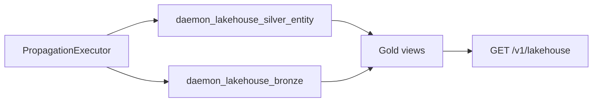

# Data platform — lakehouse (bronze, silver, gold)

## Scope

Lakehouse layers persist ontology entity state and change history in Postgres (no Parquet in this phase). Bronze is append-only; silver is curated latest state per entity; gold exposes SQL views for analytics rollups. In the Data Ops lifecycle ([16-data-ops-lifecycle-map.md](./16-data-ops-lifecycle-map.md)), bronze is written in **Transform**, silver/gold in **Model**, and lakehouse read APIs in **Analyze**.



## Bronze (append-only)

Table `daemon_lakehouse_bronze` (migration `004_lakehouse_bronze.sql`):

| Column | Purpose |
|--------|---------|
| `tenant_id`, `domain_id` | Scope |
| `ontology_id`, `entity_id`, `entity_type` | Entity identity |
| `change_type` | `register` or `patch` |
| `payload` | JSONB snapshot (properties, version, updatedAt) |
| `source` | Propagation source label (default `propagation`) |
| `indexed_at` | Event timestamp |

`BronzeWriter.append` runs from propagation target `lakehouse-bronze` on `default-register` / `default-patch` rules.

Read API: `GET /v1/lakehouse/events` — query params `since` (ISO timestamp), `limit` (max 500), optional `entityType`, `ontologyId`, `changeType` (`register` | `patch`).

Bronze aggregations (`BronzeReader`): `GET /v1/lakehouse/summary` — optional `since`; returns `entityTypeCounts`, `changeVolumeByDay` (per day and change type), and `window`. Reflects the **change stream in bronze**, not full SSOT history (entities registered before bronze was enabled may be absent).

## Silver (curated latest)

Table `daemon_lakehouse_silver_entity` (migration `006_lakehouse_silver_gold.sql`):

| Column | Purpose |
|--------|---------|
| `(tenant_id, domain_id, ontology_id, entity_id)` | Primary key |
| `entity_type`, `properties` | Latest entity snapshot |
| `version`, `source_updated_at` | From entity record |
| `materialized_at` | Upsert timestamp |

`SilverWriter.upsert` runs from propagation target `lakehouse-silver` (same default rules as bronze).

**Backfill** from existing SSOT (one-time, per tenant):

```sql
INSERT INTO daemon_lakehouse_silver_entity (
  tenant_id, domain_id, ontology_id, entity_id,
  entity_type, properties, version, source_updated_at, materialized_at
)
SELECT
  tenant_id, domain_id, ontology_id, entity_id,
  entity_type, properties, version, updated_at, NOW()
FROM daemon_entity_snapshots
ON CONFLICT (tenant_id, domain_id, ontology_id, entity_id) DO UPDATE SET
  entity_type = EXCLUDED.entity_type,
  properties = EXCLUDED.properties,
  version = EXCLUDED.version,
  source_updated_at = EXCLUDED.source_updated_at,
  materialized_at = NOW();
```

Run under each tenant session (`app.tenant_id`) or as a controlled migration job.

## Gold (views)

Defined in `006_lakehouse_silver_gold.sql`:

- `daemon_lakehouse_gold_entity_counts` — entity counts by `entity_type` per tenant/domain (from silver)
- `daemon_lakehouse_gold_change_volume` — bronze events per day

`GET /v1/lakehouse/summary` (gateway) uses bronze aggregations by default. Gold views (`daemon_lakehouse_gold_*`) remain available via `LakehouseReader` for silver-backed entity counts and bronze daily volume. Policy: `read` on resource `lakehouse`.

## Analytics (bronze history)

`GET /v1/analytics/lakehouse-summary` — policy `query:analytics`; optional `since`, `reportTitle`. Returns a report built from bronze rollups (complementary to hybrid search in `GET /v1/analytics/search`).

## GPT sessions

Table `daemon_gpt_sessions` (migration `005_gpt_sessions.sql`) stores citation lists per `x-session-id` for Customer GPT (`GptSessionStore`). Requires `DAEMON_POSTGRES_URL`.

## Operations

Run migrations before enabling lakehouse in production:

```bash
pnpm run db:migrate
```

Without `DAEMON_POSTGRES_URL`, bronze/silver writers and session store are no-ops.

Integration tests:

- `tests/integration/lakehouse-bronze.integration.test.ts` (events filters, summary, analytics report)
- `tests/integration/lakehouse-silver-gold.integration.test.ts`
- `tests/integration/customer-gpt.integration.test.ts` (session persistence)
- `tests/integration/search-replay.integration.test.ts`

## Related docs

TypeScript client: `lakehouseSummary`, `lakehouseEvents`, and `analyticsLakehouseSummary` in [13-sdk.md](./13-sdk.md). CDC and data-layer analogues: [14-data-integration-map.md](./14-data-integration-map.md). Data Ops lifecycle: [16-data-ops-lifecycle-map.md](./16-data-ops-lifecycle-map.md). Platform maps: [17-platform-decision-map.md](./17-platform-decision-map.md), [18-enterprise-platform-map.md](./18-enterprise-platform-map.md).
