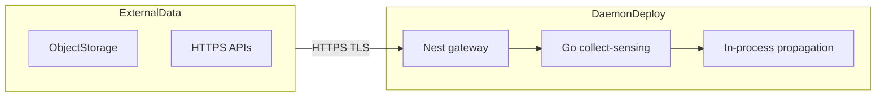
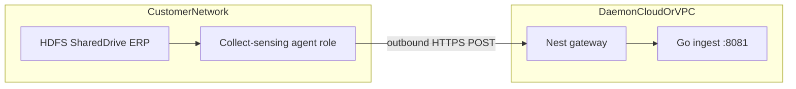

# Data connection map (connectivity architecture)

Maps **enterprise data connection** documentation (architecture, core concepts, connection security, cloud worker vs agent worker, initial setup, permissions) to how daemon-sdk connects external systems. Complements the data-integration topic map in [14-data-integration-map.md](./14-data-integration-map.md); read together with [12-connectors-catalog.md](./12-connectors-catalog.md). The **Connect** phase of the Data Ops lifecycle is detailed in [16-data-ops-lifecycle-map.md](./16-data-ops-lifecycle-map.md).

## Pattern A — cloud-side pull (analogue: “foundry worker”)

Gateway or connector code pulls from external HTTPS/object APIs inside the deployment boundary.

**In repo:**

- `http-pull` and related connectors under `collect-sensing/connectors`
- Gateway orchestration: `POST /v1/ingest/sources/:sourceId/run` via `IngestPipelineService` (`api/gateway/src/ingest/ingest-pipeline.service.ts`)
- SDK: `DaemonClient.ingestRunSource(sourceId)`

## Pattern B — customer-network agent (analogue: “agent worker”)

Data originates in a customer network; batches are pushed outbound to daemon ingest over HTTPS.

**In repo:**

- Go **ingest** service (see [06-deployment-topology.md](./06-deployment-topology.md))
- Gateway forwards records: `IngestService` → `POST` on ingest URL (`api/gateway/src/ingest/ingest.service.ts`)
- SDK: `ingestRecords`, `ingestStartJob` / `ingestGetJob`

**Implemented (DSDK MVP):** `toolchain/collect-agent` CLI pushes local files to gateway ingest (`daemon-agent push`). **Deferred:** long-lived outbound WebSocket agent product, agent installer/proxy, private link endpoints.

## Concept table

| Data-connection topic | daemon-sdk analogue | Where in repo |
|----------------------|---------------------|---------------|
| **Architecture** (gateway → compute → datasets) | Gateway → `DaemonRuntime` / propagation → Postgres + lakehouse | [06-deployment-topology.md](./06-deployment-topology.md) |
| **Core concepts** (sources, syncs, agents) | `sources.yaml`, connector catalog, ingest jobs | [12-connectors-catalog.md](./12-connectors-catalog.md), `api/gateway/src/ingest/ingest.controller.ts` |
| **Connection security** (TLS 1.2+, HTTPS) | `configs/environments/prod.yaml` TLS expectations; HTTPS to ingest URL | Ops requirement; terminate TLS at ingress/load balancer |
| **Foundry worker vs agent worker** | **Cloud pull:** gateway/connector `http-pull`. **Agent-style:** dedicated Go ingest + optional on-prem ingest deploy | Compose: gateway `:3000`, ingest `:8081` |
| **Initial setup** | `pnpm run db:migrate`, `pnpm run dev up`, `pnpm run check:sources`, tenant/domain headers on first API call | [06-testing.md](./06-testing.md) |
| **Permissions** | `PolicyEngine` + `@PolicyCheck` on ingest (`ingest-job`, `ingest-source`, `ingest-record`); RBAC YAML | [05-security-governance.md](./05-security-governance.md), `configs/policies/` |

## SDK surface (connectivity)

| Concern | `DaemonClient` method | Policy resource |
|---------|----------------------|-----------------|
| Run connector for a source | `ingestRunSource` | `ingest-source` |
| Push record batch | `ingestRecords` | `ingest-record` |
| Job lifecycle | `ingestStartJob`, `ingestGetJob` | `ingest-job` |
| Pre-flight authz | `checkPolicy` | — |

Full method list: [13-sdk.md](./13-sdk.md).

## External reference (optional)

Public documentation paths under enterprise **data-connection** (educational only):

- Architecture, core concepts, connection security, foundry worker vs agent worker, initial setup overview, permissions.

## Implemented (DSDK MVP)

| Topic | Where |
|-------|--------|
| Webhook ingress | `POST /v1/ingest/webhooks/:sourceId` (HMAC), gateway ingest module |
| Scheduled sync | `daemon_ingest_schedules` + `GET/POST/PATCH /v1/ingest/schedules` |
| S3 / Kafka connectors | `collect-sensing/connectors/`, catalog types `s3`, `kafka` |
| Collect agent (Pattern B) | `toolchain/collect-agent/` |

## Deferred (document only)

Agent installer/proxy, WebSocket sync channel, private link / VPC endpoints, marketplace sync packaging, OIDC for external connectors remain out of scope for v1; use HTTP ingest, webhooks, schedules, and the collect-agent CLI until a dedicated long-lived agent runtime ships.
