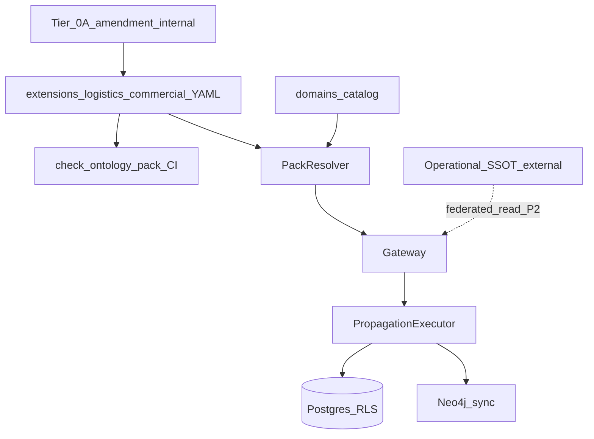

# PRD (public stub) — Logistics-commercial ontology extension

**Document ID:** PRD-DAEMON-LOG-PUB-001  
**Status:** Public stub — full requirements live in private governance materials when applicable  
**Audience:** Contributors, integrators, and reviewers of daemon-sdk  
**Related:** [08-semantic-governance-alignment.md](./08-semantic-governance-alignment.md), [02-bounded-contexts.md](./02-bounded-contexts.md)

This document is a **sanitized product requirements stub**. It describes a planned **extension pack** pattern without institution-specific names, committed governance PDFs, or counterparty trademarks. Implementation details follow approved internal ontology amendments (Tier 0A) maintained outside this repository.

---

## 1. Summary

Extend the DAEMON semantic control plane with an **approved ontology extension pack** (`logistics-commercial`, working title) that models a **dual-domain logistics vocabulary**:

- **Commercial** — customer-facing entities (accounts, opportunities, conversations, and related types).
- **Operational** — execution-layer objects (orders, shipments, transport documents, trips, manifests, dispatch, routing decisions).
- **Junction** — at minimum a **shipment-leg** style link between commercial shipment context and operational manifest structure.

The pack remains **outside** the public `foundation` pack, is validated in CI, and integrates with existing propagation, policy, gateway ingest/write, and graph projection paths. Operational transaction processing, pricing engines, and real-time execution logic stay in **downstream operational systems**; DAEMON owns semantic registration, validation, propagation, and audit—not replacement of those systems.

---

## 2. Contacts

| Role | Responsibility |
|------|----------------|
| Product owner | Scope, amendment approval, release sign-off |
| Platform engineering | Pack layout, gateway, CI, Postgres/Neo4j hooks |
| Ontology steward | Entity and junction definitions vs Tier 0A |
| Security / governance | Policy, tenancy, RLS, audit acceptance |
| Operational platform lead | SSOT boundary for live execution data; federated read (later phase) |

Assign names in your organization’s stakeholder register; this public stub does not store PII or vendor contacts.

---

## 3. Background

### Current state (daemon-sdk)

| Capability | Location |
|------------|----------|
| Sector-agnostic foundation entities | `configs/ontology/packs/foundation/` |
| Extension pack pattern (reference) | `ontology/packs/extension-pack-id.ts`, example `aml-compliance` |
| Domain catalog | `configs/ontology/domains/catalog.yaml` |
| Propagation | `configs/governance/propagation.yaml`, `PropagationExecutor` |
| Governance policies | `configs/policies/governance-policies.yaml` |
| NL / graph (foundation scope) | `docs/09`, `docs/10`, `products/ontology-query` |

The **commercial ontology SSOT epic** (foundation relations, junctions, propagation, Postgres journal, RLS, graph edges) is complete. Logistics-specific entity types are **explicitly out of foundation** until an extension pack is approved.

### Why an extension pack

1. **Foundation-first policy** — Public packs stay sector-agnostic; logistics literals must not leak into `foundation` without a breaking governance decision.
2. **Top-down ontology discipline** — Internal Ontology Master methodology (version pin **v2.0.3** in [08](./08-semantic-governance-alignment.md)) expects vocabulary to precede ad-hoc database columns.
3. **Technical readiness** — Pack merge, domain binding, entity-type-aware propagation, and competency/graph docs can be extended once YAML models exist.

### Out of scope for this PRD stub

- Committing internal Charter, Manifesto, or Ontology Master PDFs to git.
- Building or replacing downstream operational applications.
- End-customer shipment tracking UI in daemon-sdk.

---

## 4. Objective

### Goals

- Reduce **semantic drift** between approved ontology definitions and runtime configs.
- Enable **governed** registration and query of logistics-commercial types through the same gateway and policy surface as foundation.
- Improve **graph and NL query** coverage for shipment/commercial paths (post graph phase) without forking the platform.

### Key results (v1)

| ID | Key result | Target |
|----|------------|--------|
| KR1 | Extension pack declares commercial + operational + junction types | ≥12 types CI-valid |
| KR2 | Propagation rules exist for each v1 type or documented exception | 100% of v1 types |
| KR3 | Production ingest of pack `entityType` only via gateway + validator | No unvalidated types |
| KR4 | Public docs and competency updated for foundation + extension boundary | Implemented (v0.2.0 P0+P1) |

---

## 5. Market segment(s) (internal JTBD)

1. **Ontology stewards** — Maintain Tier 0A alignment and prevent duplicate concepts (e.g. conflating generic `Party` with commercial account records).
2. **Platform engineers** — Integrate operational and commercial feeds with stable `entityType` contracts.
3. **Governance / audit** — Evidence that schema changes followed approval and traceability.
4. **Analysts / agents** — NL and graph queries that include logistics-commercial paths when domain is enabled.

---

## 6. Value proposition

| Approach | Ontology conformance | Drift risk | Graph/NL readiness |
|----------|---------------------|------------|-------------------|
| Ad-hoc DB columns only | Low | High | Fragmented |
| DAEMON extension pack | High (YAML + CI) | Low | Unified projection path |

**Underinvest in v1:** Full finance/people/performance layers, pricing shadow, transport-planning engines, and bidirectional operational write-back—defer to domain OS or operational SSOT.

---

## 7. Solution

### Proposed pack and domain

| Item | Proposed value | Notes |
|------|----------------|-------|
| Extension pack id | `logistics-commercial` | Final id via governance approval |
| Domain id | `logistics` (or alias) | Bound in `catalog.yaml`; tenant enablement |
| Foundation dependency | `foundation` semver range in `pack.yaml` | No logistics types in foundation |

### Feature list (v1)

| Priority | Feature |
|----------|---------|
| P0 | Pack directory, `pack.yaml`, entity YAML for commercial core + operational core + shipment-leg junction |
| P0 | Domain catalog entry + tenancy tests |
| P0 | Pack allowlist / resolver merge tests (mirror `aml-compliance` pattern) |
| P0 | Propagation rules per v1 entity type |
| P1 | Neo4j label sync + graph model doc updates — **shipped** (v0.2.0) |
| P1 | Competency questions for logistics-commercial (public subset after review) — **shipped** LQ-10–LQ-17 |
| P2 | Federated read from operational SSOT |
| P2 | Additional governed actions beyond existing ingest/write/query |

### Architecture (logical)

### Assumptions

- Property sets may start **minimal** (required fields only) and expand via governed semver bumps.
- Operational systems remain authoritative for live execution state until federated read is designed.
- CEO or delegated ontology approval is an **organizational** gate; technically approximated via `schema-change` policy.

---

## 8. Release

### Phases

| Phase | Scope |
|-------|--------|
| **R1** | Pack + domain + CI + gateway validation |
| **R2** | Propagation + Neo4j + integration tests + competency |
| **R3** | Federated operational read (separate design note) |

### v1 success criteria

- [x] `pnpm run check:ontology-pack` passes with extension pack present.
- [x] `pnpm run check:tenancy-config` passes with new domain.
- [x] Integration test: sample commercial + operational ingest under logistics domain (Account, Shipment, Manifest).
- [x] No logistics-specific types added to `configs/ontology/packs/foundation/`.
- [x] [08-semantic-governance-alignment.md](./08-semantic-governance-alignment.md) updated with pack id and mapping rows when implemented.
- [x] Extension pack v0.2.0 includes P1 entities (Lead, Pipeline, Activity, AccountPlan, Signal, Trip, Dispatch, RoutingDecision).
- [x] `logistics-commercial` validated in `pnpm run check:ontology-pack` alongside `aml-compliance`.

### Public entity checklist (generic names)

| Generic type | Category | v1 priority |
|--------------|----------|-------------|
| CommercialAccount | Commercial | P0 |
| CommercialContact | Commercial | P0 |
| CommercialLead | Commercial | P1 |
| CommercialOpportunity | Commercial | P1 |
| CommercialPipeline | Commercial | P1 |
| CommercialConversation | Commercial | P1 |
| CommercialActivity | Commercial | P1 |
| CommercialAccountPlan | Commercial | P1 |
| CommercialSignal | Commercial | P1 |
| OperationalOrder | Operational | P0 |
| OperationalShipment | Operational | P0 |
| OperationalTransportDocument | Operational | P0 |
| OperationalTrip | Operational | P1 |
| OperationalManifest | Operational | P1 |
| **ShipmentLeg** (junction) | Junction | **P0** |
| OperationalDispatch | Operational | P1 |
| OperationalRoutingDecision | Operational | P1 |

Final YAML `entityType` strings and property schemas are defined in the approved pack, not in this stub.

---

## Appendix — Mapping to repository paths

| PRD concern | Repo path |
|-----------|-----------|
| Foundation SSOT | `configs/ontology/packs/foundation/` |
| Extension template | `ontology/packs/extension-pack-id.ts` |
| New pack (planned) | `configs/ontology/packs/extensions/logistics-commercial/` |
| Domains | `configs/ontology/domains/catalog.yaml` |
| Propagation | `configs/governance/propagation.yaml` |
| Policies | `configs/policies/governance-policies.yaml` |
| Architecture | [01-end-to-end-architecture.md](./01-end-to-end-architecture.md) |
| Security | [05-security-governance.md](./05-security-governance.md) |
| Graph | [10-neo4j-graph-model.md](./10-neo4j-graph-model.md) |

---

## Document lineage

| Version | Visibility | Notes |
|---------|------------|-------|
| PRD-DAEMON-LOG-001 | Private (when used) | Institution-specific detail, traceability to internal PDFs |
| PRD-DAEMON-LOG-PUB-001 | **This file** | Public stub for contributors; no counterparty names |

When private and public PRDs diverge, **approved private requirements** take precedence for delivery; update this stub on each public release milestone.
