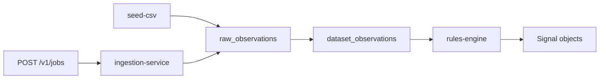

# Automation overview

## Data flow

## Rules engine

`rules-engine` loads SQL from `ontology/v2/rules`, validates SELECT-only, scopes by tenant, writes `rule_runs` per rule and creates Signal objects in Postgres.

## Operations

- SLA: `docs/operations/data-platform-sla-v1.md`
- Runbooks: `docs/operations/runbooks/`
- Health: `scripts/data-health-check.sh`, `make check-data`
