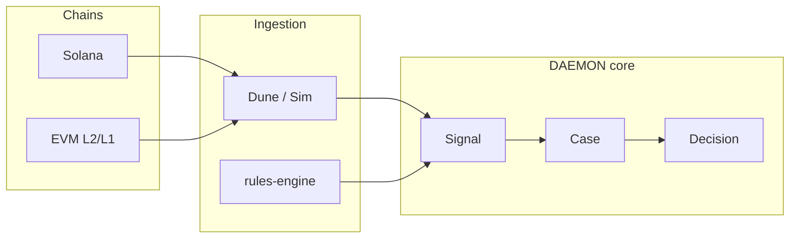

# Multi-chain dApp guide v1 (DAEMON)

For builders who need **one operational plane** across Solana and EVM — not a single L1 winner.

## Architecture

## Developer checklist

1. Normalize addresses per chain in connector params (no mixed-chain ids in one signal pk without prefix).
2. Emit **Observation** → **Signal** with `chainId` / `network` in properties.
3. Open cases with explicit `signalIds` so `case_signals` preserves provenance.
4. Use read-only agent tools (`investigate_case`) before human **OpenCase**.

## v1 limits

- No custodial wallet in platform-api.
- Sanctions/risk screening via configured external APIs — not legal advice.
- Pack `web3-operations` is a **stub** until sector rules ship.
