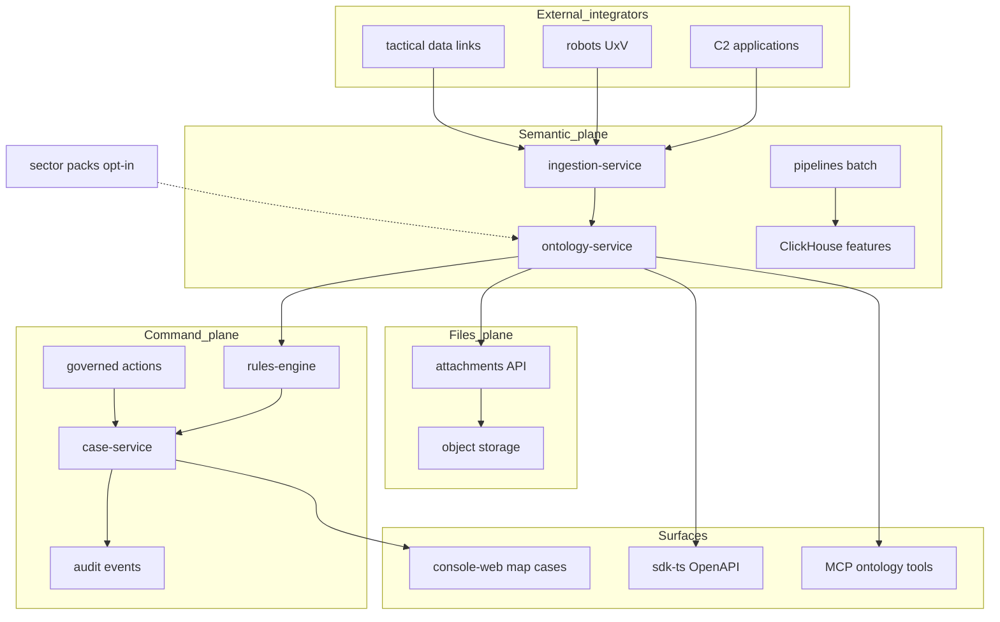

# PRD — DAEMON Platform (Master)

**Version:** 1.0 (draft)  
**Status:** Product requirements — canonical stakeholder spec  
**Last updated:** 2026-05-25  

## Related documents

| Doc | Role |
|-----|------|
| [README.md](../../README.md) | Stack, quick start, what works today |
| [operational-platform-parity-v1.md](../traceability/operational-platform-parity-v1.md) | v1 capability → proof matrix |
| [operational-pattern-parity-v1.md](../traceability/operational-pattern-parity-v1.md) | Three planes, C2-style pattern parity |
| [operational-cockpit-flow-v1.md](../ux/operational-cockpit-flow-v1.md) | Operator UX contract |
| [pack-framework-v1.md](../lifecycle/pack-framework-v1.md) | Multi-industry sector packs |
| [p2-ga-checklist-v1.md](../operations/p2-ga-checklist-v1.md) | Customer GA acceptance |
| [production-readiness-v1.md](../operations/production-readiness-v1.md) | Phase gates (ops tracker; not replaced by this PRD) |

**Distinction:** This PRD describes **product intent and shipped capabilities in the repo**. Production exit gates (staging on K8s, `v0.1.0`, SOC 2, etc.) live in the operations tracker and may lag repo truth.

---

## 1. Summary

DAEMON is an industry-agnostic **operational intelligence and integration platform** built on **open ontology data models**. Any developer can **create, enrich, and reference entity data**; **craft and interpret C2-style tasking semantics** through governed actions; and **integrate command-and-control applications, robots, and tactical data link feeds** via REST APIs, TypeScript SDK, ingestion connectors, and MCP tools—without maintaining a separate shadow database per application.

Operators use the same semantic layer in a web cockpit: **signal → case → decision → audit**, with optional geo map and attachments. Industry-specific behavior comes from **sector packs** (logistics, healthcare, mission tasking, energy, and 20+ sandbox sectors), not from rebuilding the platform per vertical.

**Who it is for:** integrator developers, C2/mission systems engineers, operations investigators and supervisors (any industry), compliance viewers, sector pack owners, and platform engineers deploying the stack.

**Why now:** v1 operational parity and CAP-* integration patterns are proven in the repository; GitHub production gates are active; Phase 0 staging proof scripts exist; the program is executing toward **P2 Customer GA** on a locked managed stack (self-managed Kubernetes, Supabase Cloud, ClickHouse Cloud, Neo4j Aura).

---

## 2. Contacts

| Name | Role | Responsibility |
|------|------|----------------|
| TBD | Product Manager | Scope, priorities, stakeholder alignment |
| TBD | Engineering Lead | Technical feasibility, service boundaries |
| TBD | Design Lead | Cockpit UX, operator golden path |
| TBD | Security / Compliance | OIDC, RLS, GA compliance gates |
| TBD | Platform Operations | Staging, proof ladder, release tagging |

---

## 3. Background

### Context

Today DAEMON is a multi-service platform:

| Service | Port | Role |
|---------|------|------|
| platform-api | 8080 | Identity context, audit events, geo map, attachments |
| ontology-service | 8081 | Manifest, objects, governed actions, functions |
| ingestion-service | 8082 | Connector-driven ingest |
| rules-engine | 8083 | Rule evaluation → signals |
| case-service | 8084 | Case read model |
| console-web | 3000 | Operator cockpit |

Data stores: Postgres (Supabase Auth + RLS), ClickHouse (analytics/features), Neo4j (optional graph links), object storage for attachments. Batch pipelines live under `pipelines/`. Agent tooling includes MCP ontology server and golden eval harness (`make aip-eval`).

The product thesis maps to **three planes** documented in [operational-pattern-parity-v1.md](../traceability/operational-pattern-parity-v1.md):

```text
Semantic plane  — ontology types, ingestion upserts, links, packs
Files plane     — attachments linked to entities and cases
Command plane   — actions, rules → signals/cases, audit trail
```

**Open model vocabulary (plain language):**

- **Entity** — an operational object instance (e.g. site, asset, shipment, track) with flexible properties in the ontology manifest.
- **Tasking** — requests to act, expressed as **governed action types** and rule-driven signals/work orders, executed only after human-in-the-loop approval in early waves—not autonomous weapon release.
- **Files** — evidence and sensor products stored in the attachment plane, not as opaque blobs inside ontology properties.

Default demonstration domain is **enterprise operations** (manufacturing, logistics, healthcare ops, energy). Optional packs under `ontology/v2/examples/packs/` extend types and rules per sector.

### Why now

- **v1 parity** is documented and provable locally (`e2e-smoke`, `prove-operational-loop`, integration tests).
- **Pattern parity** for entity map, position ingest, and proximity tasking is catalogued (CAP-ENTITY-MAP, CAP-POSITION-INGEST, CAP-PROXIMITY-TASKING).
- **Production discipline** is landing: GitHub ruleset `main-production-gates`, Phase 0 staging proof (provisional HTTPS tunnels), ops hardening via in-flight PR work.
- **Market pull** for one extensible operational graph that serves both integrators (APIs/SDKs) and operators (cockpit), across industries, without vendor-locked C2 SDKs in the runtime.

### What recently became possible

- Pack framework with 23 sandbox sectors and synthetic connectors (`make seed-sandbox`).
- Express / predictive rules workstream (opt-in pack, not GA default).
- AIP eval suite (8/8 cases in staging proof), plugin remap proof, propensity simulation proofs.
- Infra scaffolds for Helm, GitOps, and Terraform toward Phase 1+ operator execution.

---

## 4. Objective

### Business benefit

- Ship a **deployable platform** that enterprises can pilot on managed cloud with SOC 2 / GDPR / HIPAA / ISO 27001 trajectory.
- Grow an **integrator ecosystem** via OpenAPI and `@daemon/sdk-ts` without custom forks per tenant.
- Reduce time-to-value for new sectors through **packs** instead of greenfield applications.

### Customer benefit

- One **map + cockpit** view of operational entities and linked signals.
- **Signal to decision in three clicks or fewer** on the golden path (inbox → case → record decision).
- **Tasking-shaped workflows** with explicit human approval before mutating actions execute.
- **Reconstructable audit** for compliance and after-action review.

### Key results (draft)

| ID | Objective | Key result | Current → Target | By |
|----|-----------|------------|------------------|-----|
| KR-1 | Platform deployable | Staging smoke chain green on K8s + managed Postgres/CH/Neo4j | 🟡 tunnel proof → durable staging URLs | Phase 1 |
| KR-2 | Trustworthy access | `OIDC_REQUIRED=true` on all Go APIs in production; no prod `X-Tenant-Id` bypass | 🟡 staging rows → prod enforcement | P2 GA |
| KR-3 | Integrator-ready | OpenAPI + sdk-ts consumed by at least one external integration test or pilot | ✅ contracts in repo → pilot attestation | P2 GA |
| KR-4 | Agent safety at GA | AIP eval baseline 30-day window; flake &lt; 5%; D4–D7 gates per checklist | 🟡 8/8 local/staging → sustained prod | P2 GA |
| KR-5 | Developer extensibility | Documented path: new pack type + rule without forking core services; one non-default pack E2E in sandbox | 🟡 framework exists → measured TBD | Post-v0.1.0 |
| KR-6 | Customer graduation | One pilot tenant graduated to production with A1–A14 checklist complete | 🔴 → first production tenant | Phase 6–7 |

Numeric targets for KR-5 (connector time-to-integrate, pack authoring hours) remain **TBD** until measured in a guided pilot.

---

## 5. Market segment(s)

Segments are defined by **jobs to be done**, not demographics.

**Integrator / solution developers**  
People who need open schemas and HTTP/MCP surfaces to create, enrich, and reference entities, attach files, and publish or consume tasking-shaped actions—without maintaining parallel entity stores per app.

**C2 / mission systems engineers**  
People who must connect operational applications, unmanned assets, and tactical data feeds into a single semantic read model (map, rules, cases). They need REST-first integration and pattern parity with common reference C2 flows, not a mandatory third-party C2 SDK in the production runtime.

**Operations investigators (any industry)**  
People who triage signals, open investigation cases, and record decisions with rationale. Labels are sector-neutral in v1 UX (signal, case, decision—not AML-only wording).

**Supervisors**  
People who oversee investigators with read-only access to cases, audit trails, and geo common operating picture where enabled.

**Compliance and audit viewers**  
People who need exportable audit history and retention tiers aligned to governance docs.

**Sector pack owners**  
People who extend ontology types, rules, seeds, and connector profiles for a vertical (logistics, healthcare, mission tasking, energy utilities, etc.) within the pack framework.

**Platform engineers**  
People who deploy, prove, and operate the stack under SLO, DR, and on-call programs.

---

## 6. Value proposition(s)

### Core differentiator

One **open entity model** plus a **command plane** replaces many siloed COP and tasking databases. Industry flavor is added through **packs**, not by rebuilding the platform for each sector.

### Value by plane

| Plane | Jobs addressed | Gains | Pains relieved |
|-------|----------------|-------|----------------|
| Semantic | Model sites, assets, tracks, shipments; link entities; bind signals to cases | Single source of truth; integrators write once, many apps read | Duplicate master data in spreadsheets, siloed COP DBs |
| Files | Attach evidence, thumbnails, exports to entities/cases | Files stay linked to semantic IDs with tenant RLS | Blobs in email or orphan S3 prefixes |
| Command | Propose and interpret tasking via rules and actions; HITL execute | Auditable decisions; rules explain why a signal fired | Ad-hoc chat orders with no audit trail |

### Competitive framing (conceptual)

| Alternative | Limitation | DAEMON approach |
|-------------|------------|-----------------|
| Rules-only analytics | Alerts without governed case loop | Rules → signals → cases → decisions → audit |
| Generic case management | No ontology actions or entity graph | Manifest-driven types and `OpenCase` / `RecordDecision` |
| Closed C2 stacks | Non-extensible entity stores, vendor SDK lock-in | Open manifest + REST/MCP; pattern parity without runtime SDK |

### Segment snapshots

**Integrators:** “I can upsert assets from our feed and expose the same entities to the map and the rules engine.”  
**Operators:** “I see why I have a signal, open a case in three clicks, and my decision is on the record.”  
**Pack owners:** “I ship a sector pack without forking platform-api.”

---

## 7. Solution

### Architecture (three planes + surfaces)



External systems integrate through **ingestion connectors** and **API clients**, not through embedded vendor SDKs in Go services ([operational-pattern-parity-v1.md](../traceability/operational-pattern-parity-v1.md) §Not in scope).

### UX and operator flows

Contract: [operational-cockpit-flow-v1.md](../ux/operational-cockpit-flow-v1.md).

| Route | Purpose |
|-------|---------|
| `/` | Signal inbox + case list |
| `/cases/{caseId}` | Case detail, decision form, audit strip, context summary |
| `/dev` | Ingestion/rules demos (non-operator) |

**Golden path:** inbox → open case → record decision (≤ 3 clicks).

### Key features

| Priority | Capability | Proof / reference |
|----------|------------|-------------------|
| P0 | **Open entity model** — manifest, object types, ingest/upsert | `validate-ontology`, ontology manifest GET |
| P0 | **Reference and enrich** — links, case–signal binding, geo read model | [operational-platform-parity-v1.md](../traceability/operational-platform-parity-v1.md); `GET /v1/geo/map` |
| P0 | **Operational loop** — signal → OpenCase → RecordDecision → audit | `scripts/prove-operational-loop.sh` |
| P0 | Multi-tenant auth + RLS; no production tenant header bypass | [oidc-rls-verification-v1.md](../operations/oidc-rls-verification-v1.md) |
| P0 | OpenAPI + TypeScript SDK for integrators | [api/openapi-v1.yaml](../../api/openapi-v1.yaml), `packages/sdk-ts` |
| P1 | **C2-style tasking (interpret)** — rules → signals; proximity work orders | CAP-PROXIMITY-TASKING; `mission-tasking` pack; `TestMissionTaskingProximityAssets` |
| P1 | **C2-style tasking (craft)** — governed actions + HITL execute | Ontology action types; no autonomous strike in Wave 1–2 |
| P1 | **Integrate assets/feeds** — position → Asset upsert | CAP-POSITION-INGEST; ingestion + sandbox seeds |
| P1 | **Entity map (COP view)** | CAP-ENTITY-MAP; console `/live`, `TestGeoMapHTTP` |
| P1 | Attachments and thumbnails on entities and cases | CAP-OBJECT-STORE, CAP-OBJECT-CLI |
| P1 | **Any industry** — pack framework + 23 sandbox sectors | [pack-framework-v1.md](../lifecycle/pack-framework-v1.md), `make seed-sandbox` |
| P1 | Rules evaluate with confidence (express/predictive opt-in) | `prove-express-cargo-sim.sh` |
| P1 | AIP read tools + eval; mutating MCP per risk tier | [p2-ga-checklist-v1.md](../operations/p2-ga-checklist-v1.md) D1–D8 |
| P2 | gRPC entity-manager connectors in runtime | Deferred — REST-first |
| P2 | Vendor C2 SDK in production paths | Deferred — pattern study only |
| P2 | Classified tactical link production deployment | Out of scope for v1 assume-cases |
| P2 | Default vertical pack at GA | Platform-only GA; packs opt-in |
| P2 | Self-service signup, multi-region, Kafka/Flink streaming | Post-GA per checklist |

### CAP-* pattern index (integrator-facing)

| CAP ID | Pattern | DAEMON path |
|--------|---------|-------------|
| CAP-ENTITY-MAP | Map COP over ontology entities | `GET /v1/geo/map`; console `/live` |
| CAP-POSITION-INGEST | Periodic position → Asset upsert | ingestion-service, synthetic/sim connectors |
| CAP-PROXIMITY-TASKING | Proximity-triggered work order | `mission-tasking` pack, work orders |
| CAP-OBJECT-STORE / CAP-OBJECT-CLI | Blob plane + link to entities | `/v1/attachments*` |

Full index: [operational-sample-patterns-v1.md](../research/operational-sample-patterns-v1.md).

### Technology (locked for production program)

| Topic | Decision |
|-------|----------|
| Orchestration | Self-managed Kubernetes |
| Metadata + Auth | Supabase Cloud (Postgres + RLS) |
| Analytics | ClickHouse Cloud |
| Graph | Neo4j Aura (optional links) |
| GA product scope | Platform-only; no default vertical pack |
| Compliance target | SOC 2 Type II, GDPR, HIPAA, ISO 27001 |
| Agents at GA | Included with maturation criteria (eval, risk tier, HITL) |

Implementation scaffolds: `infra/helm/`, `infra/gitops/`, `infra/terraform/` (operator execution, not product features).

### Assumptions

- Enterprise **sales-led** tenant provisioning at GA (no self-service signup UX).
- Single **GA region**; EU region enabled post-GA on demand.
- Sector packs activated via **`ONTOLOGY_PACK=`** (or equivalent), not baked into default tenant manifest.
- Integrators study reference C2 patterns locally; DAEMON implements **equivalent flows** via ontology and attachments.
- Phase 0 **HTTPS tunnel** staging is provisional; durable staging hostnames are required before claiming production pilot complete.

### Explicit non-goals (v1 / first GA)

Aligned with [p2-ga-checklist-v1.md](../operations/p2-ga-checklist-v1.md) §Explicitly not at first GA:

- Vertical pack as **default** for all tenants (first pack promotion is post-GA Phase 8).
- Multi-region active/active at launch.
- Self-service tenant signup product UX.
- BYO-cloud / on-prem **productized** deployments (architecture may allow; not GA SKU).
- FedRAMP / IL4–IL5 authorizations.
- Streaming ingestion (Kafka / Flink) as default path.
- Autonomous agent execution of mutating actions without human gate.
- Third-party C2 vendor SDKs linked from production Go binaries.

---

## 8. Release

### Relative timeline

| Horizon | Scope |
|---------|--------|
| **Now** | v1 operational parity in local/demo; CAP-* proofs in CI/integration; 23-sector developer sandbox |
| **Next** | Close Phase 0 ops (`v0.1.0` tag, durable staging, eval D4–D7, optional agent-bridge smoke); Phase 1 production foundations |
| **Later** | Phases 2–7: managed data, security pen test, compliance attestations, SLO/on-call, **P2 Customer GA** tag `v1.0.0` |
| **Post-GA** | Default vertical pack promotion, multi-region, streaming ingest, advanced connector catalog |

### v1 scope (product)

**In v1 / repo today:**

- Full operational loop with audit.
- Open ontology manifest + actions + functions.
- Geo map, attachments, summarizeCaseContext.
- Pack framework and sandbox sectors (synthetic data).
- Mission-tasking proximity pattern (demonstration pack).
- AIP MCP tools + golden eval harness.
- OpenAPI + sdk-ts.

**Not required for “repo v1” but required for Customer GA:**

- K8s staging with managed clouds and pinned image digests.
- Production OIDC-only mode without dev tenant bypass.
- Compliance artifacts (SOC 2, ISO, HIPAA attestation, GDPR package).
- Sustained SLO program and on-call.
- Customer pilot graduation.

### Future versions (deferred)

- gRPC high-throughput entity sync connectors.
- Live tactical data link connectors in classified environments.
- ML-served rules with formal model cards in production.
- Pack marketplace / self-service pack publishing UX.

### Success criteria

**v1 success (engineering):** `E2E_FULL=1 ./scripts/e2e-smoke.sh` green; `prove-operational-loop` green; integration tests pass; `make aip-eval` 8/8.

**GA success (business):** All applicable rows in [p2-ga-checklist-v1.md](../operations/p2-ga-checklist-v1.md) marked complete—Platform A1–A14, Compliance C1–C6, AI surface D1–D8—and semantic release `v1.0.0` per [release-tagging-v1.md](../operations/release-tagging-v1.md).

Ops gate status remains authoritative in [production-readiness-v1.md](../operations/production-readiness-v1.md); this PRD does not duplicate live gate flip dates.

---

## Appendix A — Repo vs production status (snapshot 2026-05-25)

| Area | In repo | Production exit |
|------|---------|-------------------|
| Operational loop | ✅ proven locally/staging | 🟡 durable staging |
| GitHub ruleset | ✅ Active | ✅ |
| OIDC staging evidence | ✅ tunnel proof | 🟡 prod enforcement |
| `v0.1.0` tag | 🔴 | 🔴 |
| K8s + managed CH/PG/Neo4j | Scaffolds | 🔴 |
| SOC 2 / ISO certs | Docs | 🔴 |

---

## Appendix B — Glossary

| Term | Definition |
|------|------------|
| Entity | Ontology object instance representing an operational thing (asset, site, track, shipment, …) |
| Tasking | Semantics of requesting action via governed action types, rules, and work orders—not ungoverned autonomous execution |
| Pack | Sector extension under `ontology/v2/examples/packs/{packId}/` merged into manifest |
| Signal | Rule output or ingested event that may open a case |
| Case | Investigation container with linked signals and decisions |
| HITL | Human-in-the-loop approval before executeAction for mutating paths |

---

## Document history

| Date | Change |
|------|--------|
| 2026-05-25 | Initial master PRD from platform plan; incorporates open data model + C2 tasking + multi-industry thesis |
