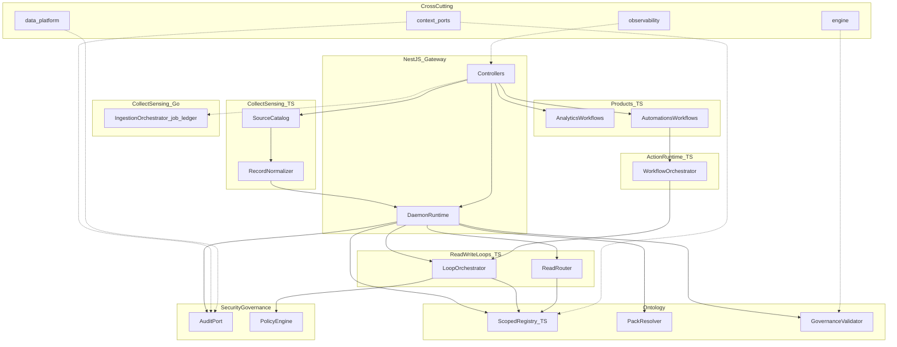

## Canonical HTTP surface

**Canonical HTTP** is the NestJS gateway (`api/gateway`) composed through `DaemonRuntime`: ingest, read, write, analytics, and automations controllers resolve tenant/domain headers, validate packs, and route writes through `LoopOrchestrator` with policy and audit.

The standalone REST app (`api/rest`) mirrors read/write/analytics/automations semantics and publishes OpenAPI for contract tests. It does not expose the full ingest surface. Use the gateway for production ingest and full tenant/domain enforcement.

## Data flow

External sources → collect-sensing connectors and normalization in TypeScript → gateway `DaemonRuntime` upsert into ontology (scoped by tenant/domain) → read/write loops and products → action-runtime workflows where automations commit governed writes.

The Go ingestion orchestrator records optional job metadata only; it does not register entities in the ontology store.

Governance and pack metadata live under `configs/ontology/` and `configs/governance/`. Mapping to semantic governance tiers is documented in [Semantic governance alignment](/semantics/governance-alignment).

See [Bounded contexts](/architecture/bounded-contexts) for context boundaries and gateway rules.
