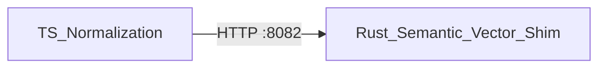

The `language/` tree defines validators and parsers across four domains, plus the toolchain that hosts plugins and SDKs.

## Language domains

| Domain | Path | Purpose |
|--------|------|---------|
| data | `language/data/schema-language/` | Entity/relation schema validation |
| logic | `language/logic/` | Rule and inference grammars |
| action | `language/action/` | Workflow and command DSL |
| security | `language/security/` | Policy expression parsing |

## Engine matrix

| Engine | Module | Role |
|--------|--------|------|
| data-engine | `engine/data-engine` | Canonical records, validation |
| logic-engine | `engine/logic-engine` | Rules and inference |
| action-engine | `engine/action-engine` | Command dispatch |
| security-engine | `engine/security-engine` | Policy evaluation hooks |

## Rust integration

Semantic and vector capabilities use a **sidecar HTTP shim** on `:8082` (not FFI). TypeScript ingest normalization calls the shim over HTTP.

## Toolchain

- `toolchain/plugins/` — plugin host + reference entity type
- `toolchain/sdk/go`, `toolchain/sdk/rust` — health, read, write against gateway

Sources: `docs/03-language-engine.md`, `docs/04-language-engine-toolchain.md`.
