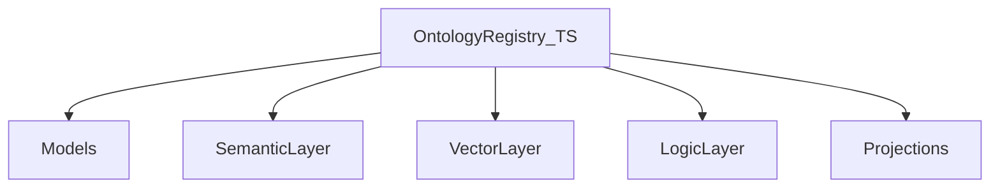

The ontology is the system of record for entities, relations, events, states, and traits. It is composed of layered concerns coordinated by the registry.



## Layers

| Layer | Path | Role |
|-------|------|------|
| Registry | `ontology/registry/` | Namespacing, versioning, entity lifecycle — write path for mutations |
| Models | `ontology/models/` | Typed definitions for entities, relations, events, states, traits |
| Semantic | `ontology/semantic-layer/` | Meaning resolution and term normalization |
| Vector | `ontology/vector-layer/` | Embeddings and similarity; Rust shim optional |
| Logic | `ontology/logic-layer/` | Rule evaluation and inference |
| Projections | `ontology/projections/` | Read-model builders; `EntityReadModelProjection` via `PropagationExecutor` |
| Pack SSOT | `configs/ontology/packs/foundation/` | Entities, relations (`Link`), junctions (`CaseEvent`) |
| Governance | `ontology/governance/` | Validation + breaking-change policy from YAML |

## Search (gateway)

`ScopedOntologySearch` indexes entities on `register`/`patch` via propagation target `semantic-vector-index` and serves `GET /v1/search` (hybrid or keyword). Rebuild after restart is not automatic in v1 — replay from snapshots is a follow-up.

## Cross-language registry

A Go HTTP registry mirrors TypeScript registry semantics for the collect-sensing ingest path. Both share the same namespace/version contract so ingested records resolve to identical entity identities.

Validate packs with:

```bash
pnpm run check:ontology-pack
```

Schema change governance:

```bash
daemon-cli ontology validate-schema-change
```
