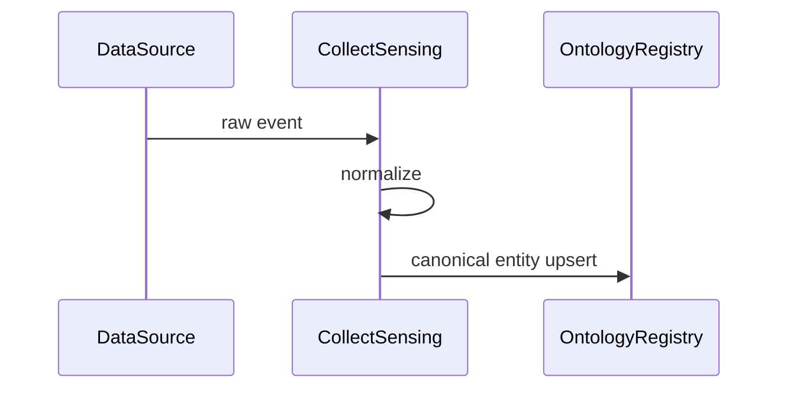
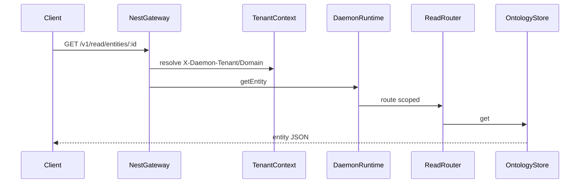

## Ingest → ontology



## Read path



## Write path

```mermaid
sequenceDiagram
  participant Client
  participant GW as NestGateway
  participant RT as DaemonRuntime
  participant LOOP as LoopOrchestrator
  participant Ont as OntologyStore
  participant AUD as AuditPort
  Client->>GW: POST /v1/write
  GW->>RT: runWriteLoop
  RT->>LOOP: execute
  LOOP->>Ont: mutate
  LOOP->>AUD: record
```

Additional flows (propagation, Neo4j sync, NL query): see `docs/07-sequence-flows.md`.
