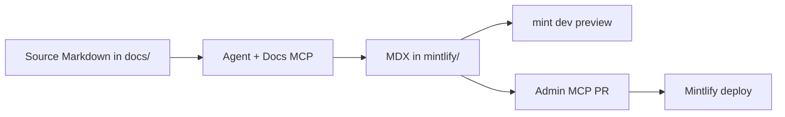

Mintlify gives you **two different MCP endpoints**. Use both in Cursor for professional documentation: one to learn *how* to write Mintlify pages, one to *edit* your connected project.

## Which MCP does what?

| MCP | URL | You already have | Purpose |
|-----|-----|------------------|---------|
| **Docs (search)** | `https://www.mintlify.com/docs/mcp` | `user-Mintlify` — `search_mintlify`, `query_docs_filesystem_mintlify` | Read Mintlify product docs: components, `docs.json`, navigation, MDX patterns |
| **Admin (write)** | `https://mcp.mintlify.com` | Add manually (OAuth) | Edit pages, navigation, `docs.json`; changes land on a **branch + PR** |

<Warning>
  The **admin MCP** can change hundreds of pages in one session. Review every PR before merge. Never point it at content you do not want published.
</Warning>

## Docs MCP (read-only) — already in Cursor

Tools on server `user-Mintlify`:

1. **`search_mintlify`** — conceptual search (“how do Tabs work?”, “monorepo deploy path”).
2. **`query_docs_filesystem_mintlify`** — read full MDX pages, `tree`, `rg` across Mintlify’s virtual doc filesystem.

**Example prompts in Cursor:**

- “Search Mintlify for navigation tabs with groups and OpenAPI.”
- “Show me the first 80 lines of `/components/steps.mdx` from Mintlify docs.”
- “What are Mintlify writing standards for headings and callouts?”

Use this MCP **before** writing MDX so you follow current component APIs (not stale training data).

## Admin MCP (write) — connect once

1. Open **Cursor → MCP settings** (or edit `mcp.json`).
2. Add:

```json
{
  "mcpServers": {
    "mintlify-admin": {
      "url": "https://mcp.mintlify.com"
    }
  }
}
```

3. Reload Cursor and complete **OAuth** when prompted.
4. Link the MCP to your Mintlify project (dashboard project tied to this repo’s `mintlify/` path).

**Typical admin workflow:**

```text
checkout branch slug=daemon-architecture-pages
  → search / read / write_page / edit_page
  → create_node (add pages to navigation)
  → diff
  → save mode=pr
```

**Example prompts:**

- “Check out branch `docs-ontology-overview`. Convert `docs/00-overview.md` into `architecture/overview.mdx` with title, description, and CardGroup. Add the page to docs.json under Architecture.”
- “Find every page mentioning `legacy_token` and replace with `api_key`. Open a PR titled `docs: token rename`.”
- “Add a new group **Extensions** with page `extensions/logistics` from the public PRD stub.”

Open the **`editorUrl`** returned from `checkout` to watch changes live in the Mintlify web editor.

## Recommended workflow for this repo



1. **Authoritative engineering docs** stay in `docs/*.md` (easy diff in PRs).
2. **Published site** lives in `mintlify/` (`docs.json` + `*.mdx`).
3. Use **Docs MCP** for Mintlify syntax and layout decisions.
4. Use **Admin MCP** when you want dashboard-integrated edits and automatic PRs.
5. Run locally before push:

```bash
cd mintlify
npx mint broken-links
npx mint validate
npx mint dev
```

## Monorepo deploy path

In the Mintlify dashboard **Git settings**, set the documentation path to:

```text
/mintlify
```

Do **not** deploy from repo root — that would miss `docs.json`.

## Skills (optional)

Install the Mintlify skill for agents:

```bash
npx skills add https://mintlify.com/docs
```

This repo’s `mintlify/AGENTS.md` summarizes project-specific rules (second person, no marketing filler, root-relative links).

## What not to publish

Keep these **out** of Mintlify navigation and admin MCP sessions unless you explicitly intend to publish them:

- `docs/private/**` — client definitions, charters, extracted reference material
- Credentials, tenant-specific payloads, or partner environment URLs

Use `.mintignore` under `mintlify/` for draft MDX you do not want processed.
