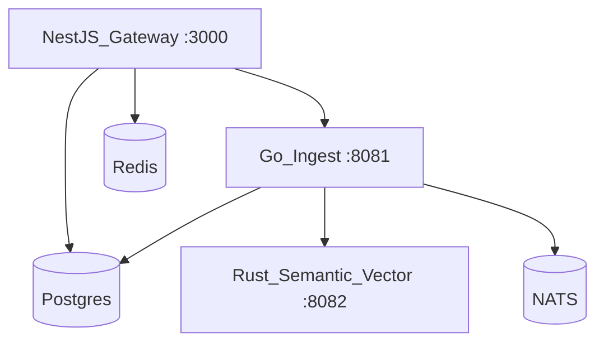

<Card title="Go-live guide" icon="rocket" href="/operations/go-live">
  Ordered cutover checklist: deployment profiles, migrations, smoke tests, and per-domain onboarding for a single production environment.
</Card>



## Postgres durability (gateway)

When `DAEMON_POSTGRES_URL` is set, the gateway treats Postgres as the durable layer:

| Table | Purpose |
|-------|---------|
| `daemon_entity_snapshots` | Write-through journal on register/patch |
| `daemon_audit` | Audit mirror with tenant/domain metadata |
| `daemon_graph_edges` | Scoped graph edges for `Link` entities |
| `daemon_ontology_changes` | Append-only change log |

Row-level security uses session variable `app.tenant_id` via `withTenantSession`.

On startup, `initDaemonRuntime()` applies migrations and replays snapshots into memory. Without Postgres, the gateway uses an in-memory registry (dev default). Production should set `DAEMON_POSTGRES_URL`; memory-only SSOT is rejected in production.

```bash
pnpm run db:migrate
```

See `docs/06-deployment-topology.md` for compose files and port matrix.
