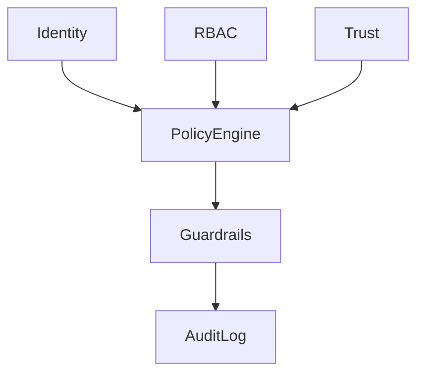

## Policy engine

`security-governance/policy-engine.ts` evaluates `action`/`resource` against policies in `configs/policies/`. Decisions are `allow` or `deny` with an optional `reason`. Denials surface as `ErrorCodes.POLICY_DENIED`.

## Policy sources

| File | Scope |
|------|--------|
| `access-policies.yaml` | Entity read/write access |
| `action-policies.yaml` | Workflow and command execution |
| `data-policies.yaml` | Store access and classification |
| `governance-policies.yaml` | Audit, retention, escalation, approval gates |

## Audit

In-memory backend for unit tests; `PostgresAuditLog` when `DAEMON_POSTGRES_URL` is set. Retention follows `governance-policies.yaml`.

Gateway controllers use `@PolicyCheck` for governed routes. See `docs/05-security-governance.md` for approval flows and guardrails.
