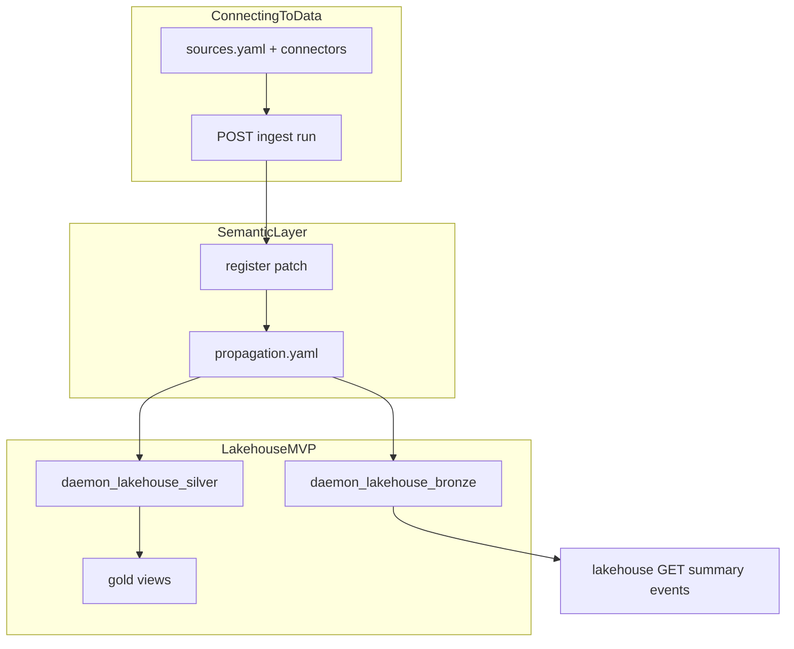

Educational map for developers familiar with **enterprise data integration** documentation (datasets, media sets, streams, branching, builds, schedules, health checks, Iceberg, virtual tables, CDC, views, pipelines, connecting to data). Wording uses “Foundry-style” / “enterprise data OS” in prose only; daemon-sdk is a separate semantic control plane, not API-compatible with any vendor product.

## Topic map

| Foundry-style topic | daemon-sdk today | SDK / HTTP surface | Notes / deferred |
|--------------------|------------------|-------------------|------------------|
| **Connecting to data** | collect-sensing connectors | `POST /v1/ingest/sources/:sourceId/run` | [12-connectors-catalog.md](https://github.com/daemon-blockint-tech/DAEMON/tree/main/docs/12-connectors-catalog.md), `configs/collect-sensing/sources.yaml` |
| **Data pipeline** | ingest → normalize → register (no separate pipeline builder UI) | ingest + gateway `DaemonRuntime` | Bounded context: collect-sensing only; see [02-bounded-contexts.md](https://github.com/daemon-blockint-tech/DAEMON/tree/main/docs/02-bounded-contexts.md) |
| **Datasets** (tabular SSOT) | Postgres entity snapshots + silver latest | read APIs, `listEntities` | Journal: `daemon_entity_snapshots`; not Parquet datasets |
| **Streams** (incremental) | registry `register`/`patch` + propagation | propagation targets on events | Real-time = event-driven propagation, not a separate stream product |
| **Media sets** (unstructured) | `daemon_media_objects` metadata registry | `GET/POST /v1/media/objects` | **Implemented (DSDK MVP)** — URI metadata; presigned upload stub |
| **Branching** (dev/prod dataset branches) | pack `version` + domain/tenant scope | governance policies on schema change | Not git-style dataset branches; use pack versions + env config |
| **Builds** (materialize dataset) | propagation + lakehouse writers | bronze/silver append on register/patch | “Build” ≈ propagation job side effects, not Spark build UI |
| **Schedules** | `daemon_ingest_schedules` + gateway poll | `GET/POST/PATCH /v1/ingest/schedules` | **Implemented (DSDK)** — see [12-connectors-catalog.md](https://github.com/daemon-blockint-tech/DAEMON/tree/main/docs/12-connectors-catalog.md) |
| **Health checks** | `GET /v1/data-health/summary` | `@daemon/sdk` `dataHealthSummary()` | **Implemented (DSDK)** — sources, schedules, lakehouse freshness |
| **Iceberg tables** | JSONL export + Iceberg metadata sidecar | `POST /v1/lakehouse/export` | **Implemented (DSDK MVP)** — not full Iceberg/Parquet engine |
| **Virtual tables** | gold SQL views (`daemon_lakehouse_gold_*`) | read via Postgres / future SQL API | [11-data-platform-lakehouse.md](https://github.com/daemon-blockint-tech/DAEMON/tree/main/docs/11-data-platform-lakehouse.md) gold section |
| **CDC** | bronze `change_type` + entity snapshot journal | `lakehouseEvents({ changeType })` | CDC-like **read** of changes; not JDBC CDC connectors |
| **Views** | materialized views + gold rollups | propagation `materialized-view:*` | Config-driven view names in `configs/governance/propagation.yaml` |

## Flow (connect → semantic → lakehouse)

## SDK pointers

From TypeScript:

- Connectivity and ingest jobs: `ingestRunSource`, `ingestRecords` — see [13-sdk.md](https://github.com/daemon-blockint-tech/DAEMON/tree/main/docs/13-sdk.md).
- Lakehouse read: `lakehouseSummary`, `lakehouseEvents`, `analyticsLakehouseSummary`.
- Connect ops: `listIngestSchedules`, `createIngestSchedule`, `ingestWebhook`.
- Data plane: `dataHealthSummary`, `startLakehouseExport`, `listMediaObjects`, `ontologyPackResolution`.
- Actions: `runPipeline`, `runEvals`, `listEvalRuns`.
- CDC-style filtering: `lakehouseEvents({ changeType: "register" | "patch", since, entityType, ontologyId })`.

Architecture for how data reaches the platform: [15-data-connection-map.md](https://github.com/daemon-blockint-tech/DAEMON/tree/main/docs/15-data-connection-map.md).

## External reference (optional)

Public documentation trees that informed this taxonomy (educational only; no endorsement):

- Foundry data integration: datasets, media sets, streams, branching, builds, schedules, health checks, Iceberg tables, virtual tables, CDC, views, data pipeline, connecting to data.

## Deferred (document only)

Dataset branching UI (git-style), full Parquet/Iceberg engine, JDBC sync agents, Flink streaming, marketplace sync packaging, and private-link agent installers remain **out of scope** for v1; DSDK implements cron ingest, media metadata, JSONL export, pipeline-builder API, and `apps/dsdk-console` instead.

## Related docs

- [16-data-ops-lifecycle-map.md](https://github.com/daemon-blockint-tech/DAEMON/tree/main/docs/16-data-ops-lifecycle-map.md) — Connect → Transform → Model → Analyze and role ownership
- [17-platform-decision-map.md](https://github.com/daemon-blockint-tech/DAEMON/tree/main/docs/17-platform-decision-map.md) — Data / Logic / Actions pillars
- [18-enterprise-platform-map.md](https://github.com/daemon-blockint-tech/DAEMON/tree/main/docs/18-enterprise-platform-map.md) — Foundry-style platform and `products/` map

