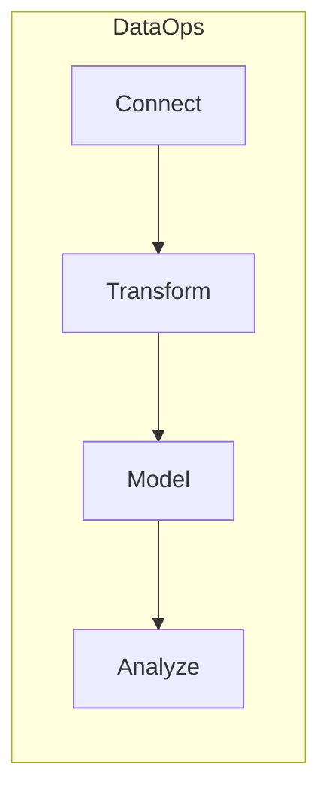
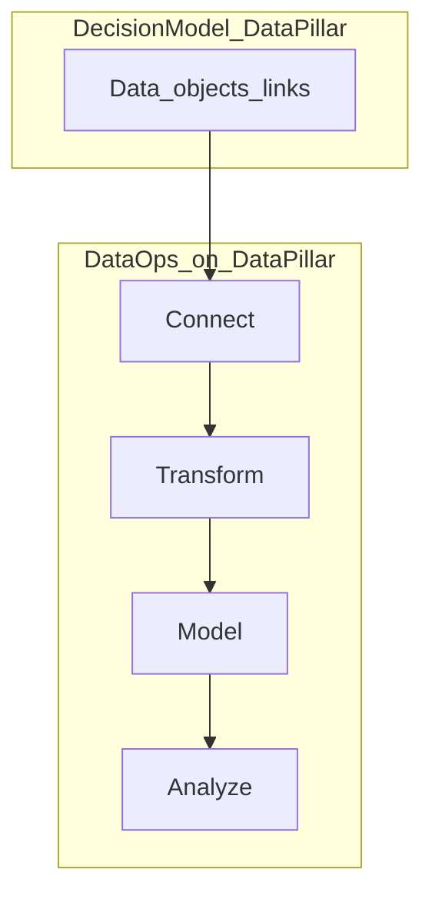

Educational map for **Data Ops** as four phases—**Connect → Transform → Model → Analyze**—mapped to daemon-sdk modules, HTTP surfaces, and role ownership. Complements bounded-context architecture in [01-end-to-end-architecture.md](https://github.com/daemon-blockint-tech/DAEMON/tree/main/docs/01-end-to-end-architecture.md), Foundry-style topic maps in [14-data-integration-map.md](https://github.com/daemon-blockint-tech/DAEMON/tree/main/docs/14-data-integration-map.md) and [15-data-connection-map.md](https://github.com/daemon-blockint-tech/DAEMON/tree/main/docs/15-data-connection-map.md), and the enterprise platform overview in [18-enterprise-platform-map.md](https://github.com/daemon-blockint-tech/DAEMON/tree/main/docs/18-enterprise-platform-map.md).

Wording uses “enterprise data OS” / “Foundry-style” in prose only; there is no API compatibility with Palantir Foundry or Pipeline Builder.

## Lifecycle overview

| Phase | Meaning in daemon-sdk | Key paths / APIs |
|-------|----------------------|------------------|
| **Connect** | Pull or push external data into the platform boundary | [configs/collect-sensing/sources.yaml](https://github.com/daemon-blockint-tech/DAEMON/tree/main/configs/collect-sensing/sources.yaml), [configs/collect-sensing/connectors-catalog.yaml](https://github.com/daemon-blockint-tech/DAEMON/tree/main/configs/collect-sensing/connectors-catalog.yaml), `collect-sensing/connectors/`, `POST /v1/ingest/sources/:sourceId/run`, Pattern A/B in [15-data-connection-map.md](https://github.com/daemon-blockint-tech/DAEMON/tree/main/docs/15-data-connection-map.md) |
| **Transform** | Normalize records, validate against pack, append change stream | `collect-sensing/normalization/`, [api/gateway/src/ingest/ingest-pipeline.service.ts](https://github.com/daemon-blockint-tech/DAEMON/tree/main/api/gateway/src/ingest/ingest-pipeline.service.ts), `register`/`patch` → [configs/governance/propagation.yaml](https://github.com/daemon-blockint-tech/DAEMON/tree/main/configs/governance/propagation.yaml) → bronze per [11-data-platform-lakehouse.md](https://github.com/daemon-blockint-tech/DAEMON/tree/main/docs/11-data-platform-lakehouse.md) |
| **Model** | Semantic SSOT + physical persistence | Pack YAML under [configs/ontology/packs/](https://github.com/daemon-blockint-tech/DAEMON/tree/main/configs/ontology/packs/), [ontology/registry/](https://github.com/daemon-blockint-tech/DAEMON/tree/main/ontology/registry/), Postgres migrations (`daemon_entity_snapshots`, `daemon_lakehouse_*`), silver/gold, optional Neo4j ([10-neo4j-graph-model.md](https://github.com/daemon-blockint-tech/DAEMON/tree/main/docs/10-neo4j-graph-model.md)) |
| **Analyze** | Read paths for humans and agents | `GET /v1/search`, `GET /v1/lakehouse/events` and `summary`, `products/*` via gateway ([18-enterprise-platform-map.md](https://github.com/daemon-blockint-tech/DAEMON/tree/main/docs/18-enterprise-platform-map.md)), competency chain in [09-ontology-competency-questions.md](https://github.com/daemon-blockint-tech/DAEMON/tree/main/docs/09-ontology-competency-questions.md) |

**Clarification:** Pack **entities** are the semantic model (ontology). **Lakehouse silver/gold** are analytical projections over the same tenant/domain scope—not a separate “dataset product” UI like Foundry Contour.

## Foundry-style analogues by phase

| Phase | Foundry-style analogue (educational) | Public reference |
|-------|--------------------------------------|------------------|
| Connect | Connectors, syncs, listeners, agent worker | [Data integration overview](https://www.palantir.com/docs/foundry/data-integration/overview) |
| Transform | Pipeline Builder (Inputs → Transform → Preview → Deliver → Outputs); Code Repositories transforms | [Pipeline Builder overview](https://www.palantir.com/docs/foundry/pipeline-builder/overview) |
| Model | Datasets → clean data → Ontology object/link types | [Ontology overview](https://www.palantir.com/docs/foundry/ontology/overview) |
| Analyze | Quiver, Contour, Insight, Object Explorer, AIP retrieval | [AIP overview](https://www.palantir.com/docs/foundry/aip/overview) |

## Transform phase — Pipeline Builder analogue

[Pipeline Builder](https://www.palantir.com/docs/foundry/pipeline-builder/overview) is Foundry’s primary visual data-integration application: a graph workflow from inputs through transforms to delivered outputs, with backend-generated transform code, schema checks, and optional outputs to datasets, media sets, or ontology components.

| Pipeline Builder concept | daemon-sdk today | Gap |
|--------------------------|------------------|-----|
| Visual graph: Inputs → Transform → Deliver | Linear: ingest run → register/patch → propagation rules | No visual DAG UI |
| Batch / incremental / streaming builds | Batch ingest + bronze append; streaming **deferred** | No Flink-style stream product |
| Outputs to datasets | `daemon_lakehouse_bronze` / silver | Postgres, not Iceberg datasets |
| Outputs to object types | Ingest validates pack, then `register` | No “publish to ontology” wizard |
| Data expectations / health checks | `check:governance-policies`, `check:sources`, integration tests | No Data Health application |
| LLM-assisted transforms | — | — |

For syncs, branching, builds, schedules, Iceberg, CDC, and virtual tables, see the topic table in [14-data-integration-map.md](https://github.com/daemon-blockint-tech/DAEMON/tree/main/docs/14-data-integration-map.md).

### Pipeline Builder documentation topics (index)

Educational index of [Pipeline Builder](https://www.palantir.com/docs/foundry/pipeline-builder/overview) doc-tree headings mapped to daemon-sdk docs (not feature parity):

| Pipeline Builder topic area | daemon-sdk pointer |
|----------------------------|-------------------|
| Connecting to data / Data Connection | [15-data-connection-map.md](https://github.com/daemon-blockint-tech/DAEMON/tree/main/docs/15-data-connection-map.md), [12-connectors-catalog.md](https://github.com/daemon-blockint-tech/DAEMON/tree/main/docs/12-connectors-catalog.md) |
| Datasets, streams, media sets | [14-data-integration-map.md](https://github.com/daemon-blockint-tech/DAEMON/tree/main/docs/14-data-integration-map.md) (rows: datasets, streams, media sets) |
| Branching, builds, schedules | [data integration map](/platform/data-integration-map) (branching, builds, schedules rows) |
| Health checks | [data ops lifecycle](/platform/data-ops-lifecycle) ops checklist; [data integration map](/platform/data-integration-map) health checks row |
| Iceberg tables, virtual tables, CDC, views | [data integration map](/platform/data-integration-map); lakehouse in [11-data-platform-lakehouse.md](https://github.com/daemon-blockint-tech/DAEMON/tree/main/docs/11-data-platform-lakehouse.md) |
| Pipeline Builder application (graph UI) | Transform phase table above |
| Outputs to ontology object types | Model phase + `register` after ingest |

## Data pillar vs Data Ops

The **Data** pillar of the platform decision model (objects, links, backing data) is implemented through all four Data Ops phases. See [17-platform-decision-map.md](https://github.com/daemon-blockint-tech/DAEMON/tree/main/docs/17-platform-decision-map.md) for how **Logic** and **Actions** pillars sit beside Data Ops.

## Role ownership (four skills)

Operational responsibilities by phase. **A** = accountable default; **C** = consult.

| Phase | data-manager | data-warehouse-engineer | database-schema-designer | data-system-ops-lead |
|-------|--------------|-------------------------|--------------------------|----------------------|
| **Connect** | **A** — source roadmap, stakeholder sign-off | C — source-to-target mapping | — | **A** (shared) — run health, Pattern B agent ops, TLS checklist ([15](https://github.com/daemon-blockint-tech/DAEMON/tree/main/docs/15-data-connection-map.md)) |
| **Transform** | **A** — data quality SLAs, ingest acceptance | **A** — ELT idempotency, bronze semantics | C — payload vs table columns | **A** — pipeline failures, freshness breaches |
| **Model** | **A** — stewardship, pack/domain governance | **A** — gold rollups, dimensional read models | **A** — migrations, RLS, indexes on `daemon_*` | C — capacity, replay/search boot checks |
| **Analyze** | **A** — KPIs, stakeholder reviews | C — gold SQL performance | C — read replica paths if added | C — search/lakehouse API SLOs |

### When to use which skill

| Skill | Use for | Not for |
|-------|---------|---------|
| **data-manager** | Program roadmap, governance cadence, cross-functional alignment | Hands-on star-schema SQL only |
| **data-warehouse-engineer** | Dimensional modeling, ELT, gold views over silver | dbt analytics CI (future `analytics-data-engineer`) |
| **database-schema-designer** | OLTP Postgres schema, migrations, indexes | Pack business semantics (ontology/governance docs) |
| **data-system-ops-lead** | Daily health, incidents, runbooks | Enterprise data-mesh ADRs (`data-architect`) |

## Logistics worked example (P0)

Short walkthrough for the **logistics-commercial** extension ([PRD](https://github.com/daemon-blockint-tech/DAEMON/tree/main/docs/PRD-logistics-commercial-extension.md)):

| Phase | Example |
|-------|---------|
| **Connect** | Domain `logistics`; integration tests use tenant `logistics-pilot` ([tests/integration/gateway-http.test.ts](https://github.com/daemon-blockint-tech/DAEMON/tree/main/tests/integration/gateway-http.test.ts)) |
| **Transform** | Register `Shipment` / `Manifest` with propagation to bronze and semantic index |
| **Model** | [configs/ontology/packs/extensions/logistics-commercial/](https://github.com/daemon-blockint-tech/DAEMON/tree/main/configs/ontology/packs/extensions/logistics-commercial/) |
| **Analyze** | LQ-* competency questions + `GET /v1/search` and lakehouse scoped to tenant/domain |

## Implemented (DSDK MVP)

| Enterprise Data Ops expectation | daemon-sdk analogue |
|--------------------------------|---------------------|
| Scheduled ingest cron | `daemon_ingest_schedules`, gateway cron + `/v1/ingest/schedules` |
| Pipeline builder (backend) | `products/pipeline-builder`, `POST /v1/pipelines/:id/run` |
| Data Health summary | `GET /v1/data-health/summary`, product `data-health` |
| Lakehouse export + catalog | `POST /v1/lakehouse/export`, `daemon_dataset_catalog` (JSONL + Iceberg metadata sidecar) |
| Media metadata | `daemon_media_objects`, `/v1/media/*` |
| DSDK console (ops UI) | [apps/dsdk-console](https://github.com/daemon-blockint-tech/DAEMON/tree/main/apps/dsdk-console/) |

## Deferred / gaps

| Enterprise Data Ops expectation | daemon-sdk today | Owner for gap triage |
|--------------------------------|------------------|----------------------|
| Visual pipeline builder UI | DAG YAML/API; console form editor only | data-manager + data-system-ops-lead |
| Full Parquet/Iceberg engine | Postgres bronze + JSONL export sidecar | data-warehouse-engineer |
| dbt marts + tests | Gold SQL views only | data-warehouse-engineer |

## Operational checklist (data-system-ops-lead)

Morning health mapped to repo commands:

1. `pnpm run check:sources` and `pnpm run check:governance-policies`
2. With `DAEMON_POSTGRES_URL`: migrations applied, `pnpm run test:repo` (integration)
3. `GET /v1/lakehouse/summary` — bronze freshness vs SLA
4. Gateway boot: use `initDaemonRuntime()` (not `getDaemonRuntime()` alone) for Postgres durability and search replay — see [CLAUDE.md](https://github.com/daemon-blockint-tech/DAEMON/tree/main/CLAUDE.md)

## Related docs

- [14-data-integration-map.md](https://github.com/daemon-blockint-tech/DAEMON/tree/main/docs/14-data-integration-map.md) — datasets, pipelines, CDC, lakehouse topics
- [15-data-connection-map.md](https://github.com/daemon-blockint-tech/DAEMON/tree/main/docs/15-data-connection-map.md) — Connect phase connectivity
- [17-platform-decision-map.md](https://github.com/daemon-blockint-tech/DAEMON/tree/main/docs/17-platform-decision-map.md) — Data / Logic / Actions
- [18-enterprise-platform-map.md](https://github.com/daemon-blockint-tech/DAEMON/tree/main/docs/18-enterprise-platform-map.md) — Foundry layers and `products/`
- [13-sdk.md](https://github.com/daemon-blockint-tech/DAEMON/tree/main/docs/13-sdk.md) — `DaemonClient` and OSDK ergonomics table

