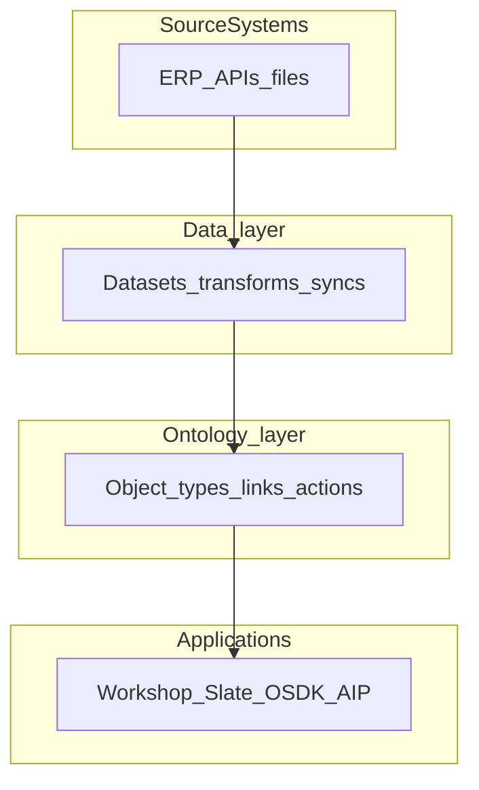
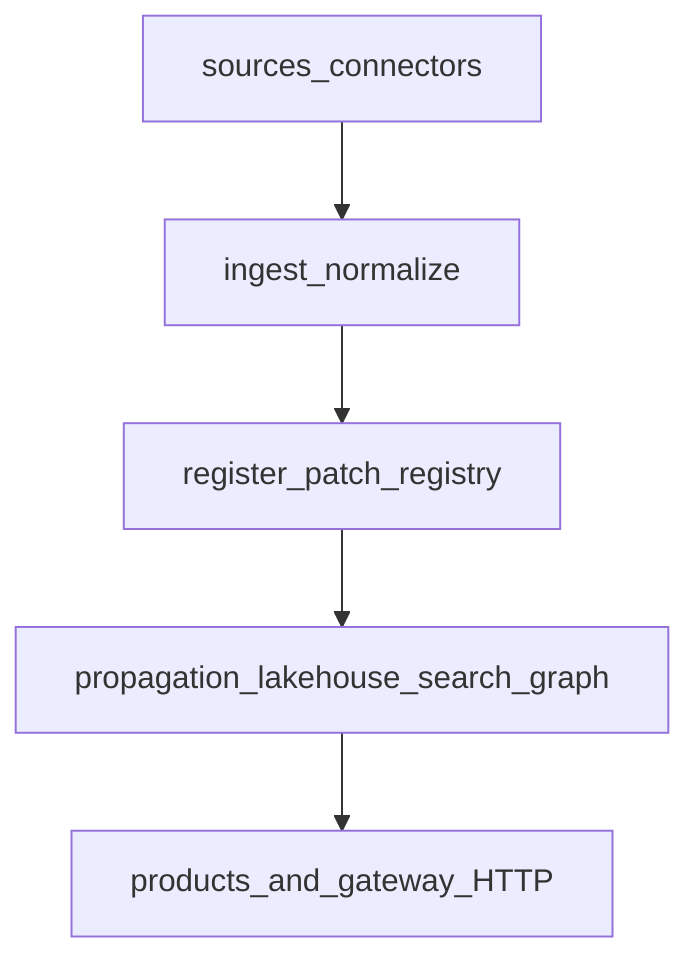

Educational map comparing a **Foundry-style enterprise data operating system** ([Palantir Foundry](https://www.palantir.com/platforms/foundry/)) to daemon-sdk: platform layers, data vs ontology, [Pipeline Builder](https://www.palantir.com/docs/foundry/pipeline-builder/overview), and the [`products/`](https://github.com/daemon-blockint-tech/DAEMON/tree/main/products/) application layer.

Not API-compatible with Foundry, AIP, or OSDK. Use with [14-data-integration-map.md](https://github.com/daemon-blockint-tech/DAEMON/tree/main/docs/14-data-integration-map.md), [16-data-ops-lifecycle-map.md](https://github.com/daemon-blockint-tech/DAEMON/tree/main/docs/16-data-ops-lifecycle-map.md), and [17-platform-decision-map.md](https://github.com/daemon-blockint-tech/DAEMON/tree/main/docs/17-platform-decision-map.md).

## Enterprise operating system (three platforms)

Palantir’s public architecture describes three integrated platforms. daemon-sdk maps them loosely to deploy, data/ontology, and AI surfaces.

| Platform | Foundry role | daemon-sdk analogue |
|----------|--------------|---------------------|
| **Apollo** | Continuous delivery, zero-downtime upgrades | `compose/`, [06-deployment-topology.md](https://github.com/daemon-blockint-tech/DAEMON/tree/main/docs/06-deployment-topology.md), CI (`pnpm run test:repo`, `pnpm run check:architecture`) |
| **Foundry** | Data integration, ontology, operational apps | NestJS gateway, ontology BC, collect-sensing, lakehouse, `products/` |
| **AIP** | LLM connectivity, agents, evals, Logic | `products/customer-gpt`, `products/ontology-query`, hybrid search, optional OpenRouter |

**Forward-deployed engineering** (embedded builders shipping to real environments) is a delivery culture analogue: extension packs (e.g. logistics-commercial), integration tests, and PRD-driven domains—not a separate product module.

## Two layers: data vs ontology

Foundry separates a **data layer** (datasets, transforms, lineage) from an **object layer** (ontology: objects, links, actions).

### daemon-sdk equivalent flow

| Foundry layer | daemon-sdk |
|---------------|------------|
| Datasets / transforms | Bronze/silver/gold Postgres, propagation ([11](https://github.com/daemon-blockint-tech/DAEMON/tree/main/docs/11-data-platform-lakehouse.md)) |
| Ontology objects/links | Pack entities, `Link`, registry journal |
| Applications | `products/*` + `GET/POST /v1/*` ([13-sdk.md](https://github.com/daemon-blockint-tech/DAEMON/tree/main/docs/13-sdk.md)) |

## Data integration — Pipeline Builder

[Pipeline Builder](https://www.palantir.com/docs/foundry/pipeline-builder/overview) workflow: **Inputs → Transform → Preview → Deliver → Outputs**. Outputs may include datasets, media sets, or ontology object types.

| Aspect | Foundry | daemon-sdk |
|--------|---------|------------|
| Authoring | Point-and-click graph + backend codegen | YAML sources, code normalizers, ingest pipeline service |
| Engines | Spark, Flink, single-node (Pandas/Polars/DuckDB) | Go/TS ingest; propagation in-process |
| Ontology publish | Direct from pipeline deliver step | `register` after validated ingest |
| Health | Data Health app, expectations | `check:*`, integration tests, lakehouse summary |

Detail for the **Transform** phase: [16-data-ops-lifecycle-map.md](https://github.com/daemon-blockint-tech/DAEMON/tree/main/docs/16-data-ops-lifecycle-map.md).

## Products layer (`products/`)

Gateway routes **product-router** operations through [products/product-shell/product-router.ts](https://github.com/daemon-blockint-tech/DAEMON/tree/main/products/product-shell/product-router.ts) and `ProductRuntime` (from `DaemonRuntime`). Do not import `globalRegistry` or `CommandGateway` from product modules.

**Related packages outside `ProductId`:** [products/ontology-query/](https://github.com/daemon-blockint-tech/DAEMON/tree/main/products/ontology-query/) powers `POST /v1/query/ask` (gateway `QueryModule`); [customer-gpt](https://github.com/daemon-blockint-tech/DAEMON/tree/main/products/customer-gpt/) imports shared LLM helpers from ontology-query.

### Product registry

| `ProductId` | Module | Foundry-style analogue | Typical gateway surface |
|-------------|--------|------------------------|-------------------------|
| `analytics-workflows` | [products/analytics-workflows/](https://github.com/daemon-blockint-tech/DAEMON/tree/main/products/analytics-workflows/) | Quiver / Contour-style search and dashboard inputs | Analytics controller, QueryWizard, hybrid search |
| `customer-gpt` | [products/customer-gpt/](https://github.com/daemon-blockint-tech/DAEMON/tree/main/products/customer-gpt/) | AIP Chatbot + retrieval context | `POST /v1/products/customer-gpt/chat` |
| `ontology-query` (package, not a `ProductId`) | [products/ontology-query/](https://github.com/daemon-blockint-tech/DAEMON/tree/main/products/ontology-query/) via [api/gateway/src/query/](https://github.com/daemon-blockint-tech/DAEMON/tree/main/api/gateway/src/query/) | Insight / Object Explorer / NL over ontology | `POST /v1/query/ask`, `DaemonClient.queryAsk` ([09](https://github.com/daemon-blockint-tech/DAEMON/tree/main/docs/09-ontology-competency-questions.md)); LangGraph chain is not routed through [product-router.ts](https://github.com/daemon-blockint-tech/DAEMON/tree/main/products/product-shell/product-router.ts) |
| `automations` | [products/automations/](https://github.com/daemon-blockint-tech/DAEMON/tree/main/products/automations/) | Automate (conditions → effects) | `POST /v1/automations/*` |
| `internal-applications` | [products/internal-applications/](https://github.com/daemon-blockint-tech/DAEMON/tree/main/products/internal-applications/) | Internal COP / snapshot dashboards | Snapshot ops via product router |
| `admin-console` | [products/admin-console/](https://github.com/daemon-blockint-tech/DAEMON/tree/main/products/admin-console/) | Admin / inventory views (loose) | List entities admin op |
| `data-health` | [products/data-health/](https://github.com/daemon-blockint-tech/DAEMON/tree/main/products/data-health/) | Data Health monitoring | `GET /v1/data-health/summary` |
| `pipeline-builder` | [products/pipeline-builder/](https://github.com/daemon-blockint-tech/DAEMON/tree/main/products/pipeline-builder/) | Pipeline Builder (DAG) | `POST /v1/pipelines/:pipelineId/run` |
| `aip-evals` | [products/aip-evals/](https://github.com/daemon-blockint-tech/DAEMON/tree/main/products/aip-evals/) | AIP Evals | `POST /v1/evals/run`, `GET /v1/evals/runs` |

**Console:** [apps/dsdk-console](https://github.com/daemon-blockint-tech/DAEMON/tree/main/apps/dsdk-console/) — enterprise shell over `@daemon/sdk` (not OSDK-generated).

### SDK entry points for products

From `@daemon/sdk` `DaemonClient`: `customerGptChat`, `queryAsk`, `automationsRun` / `Evaluate` / `Approve`, `analyticsLakehouseSummary`, `search` — see [13-sdk.md](https://github.com/daemon-blockint-tech/DAEMON/tree/main/docs/13-sdk.md).

### Not implemented (gaps)

| Foundry application | Status in daemon-sdk |
|--------------------|----------------------|
| Workshop / Slate widget composer | DSDK console tabs; no full low-code builder |
| OSDK-generated React apps | HTTP client + codegen + console |
| Pilot (NL app generator) | — |
| Quiver / Contour / Fusion as standalone UIs | Partial via search + lakehouse APIs + console |
| AIP Logic visual blocks | Partial via ontology-query + automations |
| AIP Evals | **Implemented (DSDK MVP):** `aip-evals` product + eval APIs |
| Developer Console / hosted OSDK apps | OpenAPI + `@daemon/sdk` + dsdk-console |

## AIP and automation (summary)

| Foundry | daemon-sdk |
|---------|------------|
| AIP Chatbot Studio | `customer-gpt` |
| AIP Logic | `ontology-query`, automations evaluate paths |
| AIP Assist | — (use external IDE + docs) |
| Automate | `automations` + `action-catalog` `onCommitted` |
| Retrieval context | Hybrid search + lakehouse citations in GPT |

## Multimodal data plane (MMDP) and interoperability

Foundry’s MMDP emphasizes Iceberg, virtual catalogs, streaming compute, and compute modules. daemon-sdk today:

| MMDP theme | daemon-sdk |
|------------|------------|
| Open table format (Iceberg) | Postgres bronze; export job writes JSONL + Iceberg metadata sidecar (MVP) |
| Virtual tables | Gold SQL views |
| Streaming (Flink) | Event-driven propagation; no stream product |
| Bring-your-own compute | Extension point via connectors; no compute modules product |
| LLM model catalog | Env-based OpenRouter; not a hosted model catalog |

## Observability

| Foundry | daemon-sdk |
|---------|------------|
| Data Health monitoring views | `check:sources`, `check:governance-policies` |
| Workflow Lineage / AIP observability | Audit journal, propagation audit-loop, integration tests |
| Metrics export to dataset | Query bronze/summary APIs; no log-export pipeline |

## Public documentation index

Use these for terminology alignment only:

- [Foundry platform](https://www.palantir.com/platforms/foundry/)
- [Getting started / introductory concepts](https://www.palantir.com/docs/foundry/getting-started/introductory-concepts)
- [Pipeline Builder](https://www.palantir.com/docs/foundry/pipeline-builder/overview)
- [Data integration](https://www.palantir.com/docs/foundry/data-integration/overview)
- [Ontology](https://www.palantir.com/docs/foundry/ontology/overview)
- [Workshop](https://www.palantir.com/docs/foundry/workshop/overview)
- [OSDK](https://www.palantir.com/docs/foundry/ontology-sdk/overview)
- [AIP](https://www.palantir.com/docs/foundry/aip/overview)
- [Automate](https://www.palantir.com/docs/foundry/automate/overview)
- [Observability / Data Health](https://www.palantir.com/docs/foundry/observability/data-health)

## Related docs

- [16-data-ops-lifecycle-map.md](https://github.com/daemon-blockint-tech/DAEMON/tree/main/docs/16-data-ops-lifecycle-map.md)
- [17-platform-decision-map.md](https://github.com/daemon-blockint-tech/DAEMON/tree/main/docs/17-platform-decision-map.md)
- [14-data-integration-map.md](https://github.com/daemon-blockint-tech/DAEMON/tree/main/docs/14-data-integration-map.md)
- [15-data-connection-map.md](https://github.com/daemon-blockint-tech/DAEMON/tree/main/docs/15-data-connection-map.md)
- [01-end-to-end-architecture.md](https://github.com/daemon-blockint-tech/DAEMON/tree/main/docs/01-end-to-end-architecture.md)

