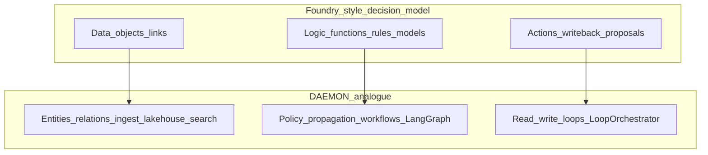
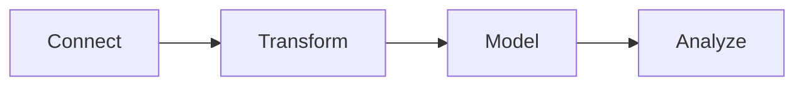
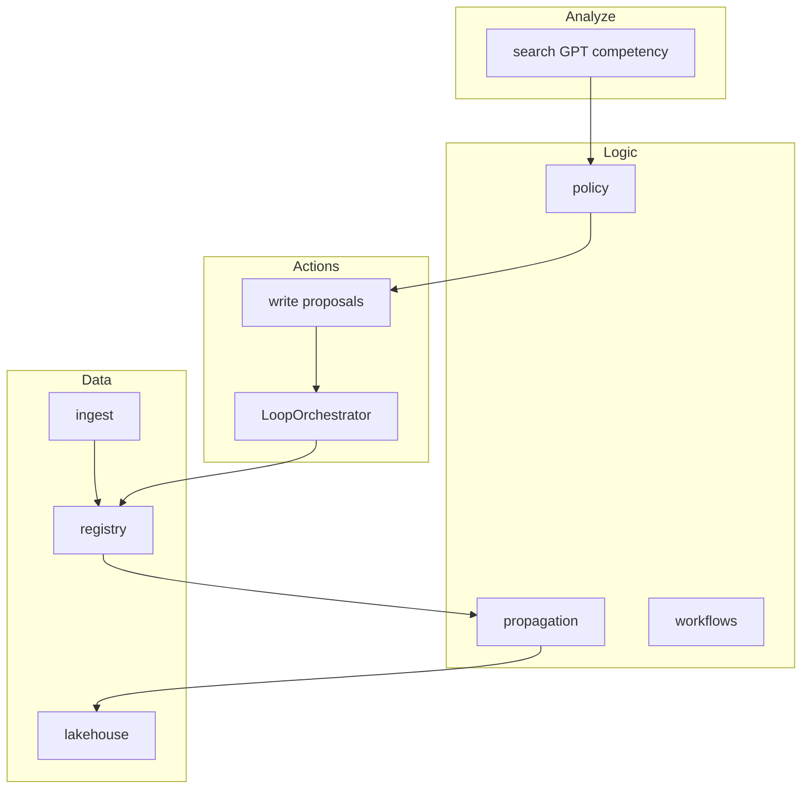

Maps the **enterprise decision model** (Data, Logic, Actions) used in Palantir Foundry-style platforms to daemon-sdk bounded contexts, configs, and HTTP surfaces. Complements the **Data Ops** lifecycle in [16-data-ops-lifecycle-map.md](https://github.com/daemon-blockint-tech/DAEMON/tree/main/docs/16-data-ops-lifecycle-map.md) and the platform layer map in [18-enterprise-platform-map.md](https://github.com/daemon-blockint-tech/DAEMON/tree/main/docs/18-enterprise-platform-map.md).

Educational only; no vendor API compatibility.

## Decision model overview

Foundry describes the Ontology as integrating **data**, **logic**, **action**, and **security** so humans and agents collaborate on operational decisions. daemon-sdk separates similar concerns across bounded contexts while composing them through `DaemonRuntime`.

## Data pillar

**Foundry:** Object types, link types, backing datasets, object sets, materialization.

**daemon-sdk:**

| Concern | Implementation |
|---------|----------------|
| Entity schema | Pack YAML, `ontology/registry`, validators |
| Instances | `register` / `patch`, `daemon_entity_snapshots` journal |
| Relationships | `Link`, junctions, optional Neo4j ([10-neo4j-graph-model.md](https://github.com/daemon-blockint-tech/DAEMON/tree/main/docs/10-neo4j-graph-model.md)) |
| Change history | Propagation → bronze; silver latest; gold rollups ([11](https://github.com/daemon-blockint-tech/DAEMON/tree/main/docs/11-data-platform-lakehouse.md)) |
| Search / object sets | `ScopedOntologySearch`, `GET /v1/search` |
| Ingest path | collect-sensing → gateway ingest pipeline |

**Data Ops breakdown:** Connect → Transform → Model → Analyze on the Data pillar — see [16-data-ops-lifecycle-map.md](https://github.com/daemon-blockint-tech/DAEMON/tree/main/docs/16-data-ops-lifecycle-map.md).

## Logic pillar

**Foundry:** Functions (TypeScript/Python), declarative rules, AIP Logic, Ontology SQL, function-backed columns and actions.

**daemon-sdk:**

| Concern | Implementation |
|---------|----------------|
| Policy / authorization | `security-governance`, `PolicyEngine`, `POST /v1/policy/check` |
| Event-driven rules | [configs/governance/propagation.yaml](https://github.com/daemon-blockint-tech/DAEMON/tree/main/configs/governance/propagation.yaml), `PropagationExecutor` |
| Workflows | `action-runtime`, `WorkflowOrchestrator` |
| NL / graph reasoning | `products/ontology-query` (LangGraph), competency questions ([09](https://github.com/daemon-blockint-tech/DAEMON/tree/main/docs/09-ontology-competency-questions.md)) |
| LLM orchestration | `products/customer-gpt`, optional OpenRouter |
| Governance gates | Breaking schema policies ([08](https://github.com/daemon-blockint-tech/DAEMON/tree/main/docs/08-semantic-governance-alignment.md)) |

Logic does **not** own ontology definitions; it consumes registry and pack SSOT.

## Actions pillar

**Foundry:** Action types (parameters, rules, side effects), user-initiated actions, writeback to external systems, Automate triggers.

**daemon-sdk:**

| Concern | Implementation |
|---------|----------------|
| Governed writes | read-write-loops, `POST /v1/write`, proposals/approvals |
| Action catalog | [configs/governance/action-catalog.yaml](https://github.com/daemon-blockint-tech/DAEMON/tree/main/configs/governance/action-catalog.yaml) |
| Loop execution | `LoopOrchestrator`, `action-runtime` |
| Automations | `products/automations`, `POST /v1/automations/*` |
| Post-commit hooks | `onCommitted` propagation rules |
| Audit | Extended audit columns, propagation `audit-loop` |

External writeback connectors are configuration and integration concerns under collect-sensing / gateway, not a separate “action designer” UI.

## Security (cross-cutting)

Foundry: projects, organizations, roles, markings, row/column security.

daemon-sdk: tenant/domain headers (`X-Daemon-Tenant`, `X-Daemon-Domain`), session RBAC, RLS on Postgres where enabled, audit journal. See [05-security-governance.md](https://github.com/daemon-blockint-tech/DAEMON/tree/main/docs/05-security-governance.md).

## End-to-end flow (decision → writeback)

## Documented gaps

| Foundry capability | daemon-sdk |
|--------------------|------------|
| Workshop / Slate low-code apps | [apps/dsdk-console](https://github.com/daemon-blockint-tech/DAEMON/tree/main/apps/dsdk-console/) modules; no drag-and-drop widget composer |
| Global Branching across apps | `packBranch` + `GET /v1/ontology/pack-resolution` |
| Ontology MCP (consumer agents) | `toolchain/mcp/ontology-mcp/` (search, entity, lakehouse, queryAsk) |
| Function-backed Workshop columns | Deferred |
| Materialization datasets (edits merged) | Silver latest + bronze trail |
| Automate UI | YAML + automations HTTP + console |
| Palantir MCP (ontology builders) | Docs + codegen only |

## Related docs

- [16-data-ops-lifecycle-map.md](https://github.com/daemon-blockint-tech/DAEMON/tree/main/docs/16-data-ops-lifecycle-map.md) — Connect → Transform → Model → Analyze
- [18-enterprise-platform-map.md](https://github.com/daemon-blockint-tech/DAEMON/tree/main/docs/18-enterprise-platform-map.md) — Apollo/Foundry/AIP and `products/`
- [02-bounded-contexts.md](https://github.com/daemon-blockint-tech/DAEMON/tree/main/docs/02-bounded-contexts.md) — BC boundaries
- [08-semantic-governance-alignment.md](https://github.com/daemon-blockint-tech/DAEMON/tree/main/docs/08-semantic-governance-alignment.md) — governance alignment

